# 第七章 线性离散系统的分析与校正

近年来，由于脉冲技术、数字式元部件、数字计算机，特别是微处理器的蓬勃发展，数字控制器在许多场合取代了模拟控制器。基于工程实践的需要，作为分析与设计数字控制系统的基础理论，离散系统理论的发展非常迅速。

离散系统与连续系统相比，既有本质上的不同，又有分析研究方面的相似性。利用 $z$ 变换法研究离散系统，可以把连续系统中的许多概念和方法，推广应用于线性离散系统。

本章主要讨论线性离散系统的分析和校正方法。首先建立信号采样和保持的数学描述，然后介绍 $z$ 变换理论和脉冲传递函数，最后研究线性离散系统稳定性和性能的分析与校正方法。在系统校正部分，我们将主要讨论数字控制系统的校正方法。

# 7-1 离散系统的基本概念

如果控制系统中的所有信号都是时间变量的连续函数，换句话说，这些信号在全部时间上都是已知的，则这样的系统称为连续时间系统，简称连续系统；如果控制系统中有一处或几处信号是一串脉冲或数码，换句话说，这些信号仅定义在离散时间上，则这样的系统称为离散时间系统，简称离散系统。通常，把系统中的离散信号是脉冲序列形式的离散系统，称为采样控制系统或脉冲控制系统；而把数字序列形式的离散系统，称为数字控制系统或计算机控制系统。

# 1. 采样控制系统

一般说来，采样系统是对来自传感器的连续信息在某些规定的时间瞬时上取值。例如，控制系统中的误差信号可以是断续形式的脉冲信号，而相邻两个脉冲之间的误差信息，系统并没有收到。如果在有规律的间隔上，系统取到了离散信息，则这种采样称为周期采样；反之，如果信息之间的间隔是时变的，或随机的，则称为非周期采样，或随机采样。本章仅讨论等周期采样。在这一假定条件下，如果系统中有几个采样器，则它们应该是同步等周期的。

在现代控制技术中，采样系统有许多实际的应用。例如，雷达跟踪系统，其输入信号只能为脉冲序列形式；又如分时系统，其数据传输线在几个系统中按时间分配，以降低信息传输费用。在工业过程控制中，采样系统也有许多成功的应用。

例 7-1 图 7-1 是炉温采样控制系统原理图。其工作原理如下：

当炉温 $\theta$ 偏离给定值时，测温电阻的阻值发生变化，使电桥失去平衡，这时检流计指针发生偏转，其偏角为 $s$ 。检流计是一个高灵敏度的元件，不允许在指针与电位

器之间有摩擦力，故由一套专门的同步电动机通过减速器带动凸轮运转，使检流计指针周期性地上下运动，每隔 $T$ 秒与电位器接触一次，每次接触时间为 $\tau$ 。其中，T 称为采样周期， $\tau$ 称为采样持续时间。当炉温连续变化时，电位器的输出是一串宽度为$\tau$ 的脉冲电压信号 $e _ { \tau } ^ { * } ( t )$ ，如图 7-2(a)所示。 $e _ { \tau } ^ { * }$ 经放大器、电动机及减速器去控制阀门开度 $\varphi$ ，以改变加热气体的进气量，使炉温趋于给定值。炉温的给定值，由给定电位器给出。

  
图 7-1 炉温采样控制系统原理图  
(a)脉动输出序列

  
(b)脉冲输出序列   
图 7-2 电位器的输出电压

在炉温控制过程中，如果采用连续控制方式，则无法解决控制精度与动态性能之间的矛盾。炉温调节是一个大惯性过程，当加大开环增益以提高系统的控制精度时，由于系统的灵敏度相应提高，在炉温低于给定值的情况下，电动机将迅速增大阀门开度，给炉子供应更多的加热气体，但因炉温上升缓慢，在炉温升到给定值时，电动机已将阀门的开度开得更大了，从而炉温继续上升，结果造成反方向调节，引起炉温振荡性调节过程；而在炉温高于给定值情况下，具有类似的调节过程。如果对炉温进行采样控制，只有当检流计的指针与电位器接触时，电动机才在采样信号作用下产生旋转运动，进行炉温调节；而在检流计与电位器脱开时，电动机就停止不动，保持一定的阀门开度，等待炉温缓慢变化。在采样控制情况下，电动机时转时停，所以调节过程中超调现象大为减

小，甚至在采用较大开环增益情况下，不但能保证系统稳定，而且能使炉温调节过程无超调。

由例 7-1 可见，在采样系统中不仅有模拟部件，还有脉冲部件。通常，测量元件、执行元件和被控对象是模拟元件，其输入和输出是连续信号，即时间上和幅值上都连续的信号，称为模拟信号；而控制器中的脉冲元件，其输入和输出为脉冲序列，即时间上离散而幅值上连续的信号，称为离散模拟信号。为了使两种信号在系统中能相互传递，在连续信号和脉冲序列之间要用采样器，而在脉冲序列和连续信号之间要用保持器，以实现两种信号的转换。采样器和保持器，是采样控制系统中的两个特殊环节。

# (1) 信号采样和复现

在采样控制系统中，把连续信号转变为脉冲序列的过程称为采样过程，简称采样。实现采样的装置称为采样器，或称采样开关。用 $T$ 表示采样周期，单位为 s； $f _ { s } { = } 1 / T$ 表示采样频率，单位为 $\mathrm { { s } } ^ { - 1 }$ ； $\omega _ { s } { = } 2 \pi f _ { s } { = } 2 \pi / T$ 表示采样角频率，单位为 rad/s。在实际应用中，采样开关多为电子开关，闭合时间极短，采样持续时间 $\tau$ 远小于采样周期 $T$ ，也远小于系统连续部分的最大时间常数。为了简化系统的分析，可认为 $\tau$ 趋于零，即把采样器的输出近似看成一串强度等于矩形脉冲面积的理想脉冲 $e ^ { * } ( t )$ ，如图 7-2(b)所示。

在采样控制系统中，把脉冲序列转变为连续信号的过程称为信号复现过程。实现复现过程的装置称为保持器。采用保持器不仅因为需要实现两种信号之间的转换，也是因为采样器输出的是脉冲信号 $e ^ { * } ( t )$ ，如果不经滤波将其恢复成连续信号，则 $e ^ { * } ( t )$ 中的高频分量相当于给系统中的连续部分加入了噪声，不但影响控制质量，严重时会加剧机械部

  
图 7-3 保持器的输入与输出信号

件的磨损。因此，需要在采样器后面串联一个信号复现滤波器，以使脉冲信号$e ^ { * } ( t )$ 复原成连续信号，再加到系统的连续部分。最简单的复现滤波器由保持器实现，可把脉冲信号 $e ^ { * } ( t )$ 复现为阶梯信号 $e _ { h } ( t )$ ，如图 7-3 所示。由图可见，当采样频率足够高时， $e _ { h } ( t )$ 接近于连续信号。

# (2) 采样系统的典型结构图

根据采样器在系统中所处的位置不同，可以构成各种采样系统。如果采样器位于系统闭合回路之外，或者系统本身不存在闭合回路，则称为开环采样系统；如果采样器位于系统闭合回路之内，则称为闭环采样系统。在各种采样控制系统中，用得最多的是误差采样控制的闭环采样系统，其典型结构图如图 7-4所示。图中， $S$ 为理想采样开关，其采样瞬时的脉冲幅值，等于相应采样瞬时误差信号 $e ( t )$ 的幅值，且采样持续时间 $\tau$ 趋于零；$G _ { h } ( s )$ 为保持器的传递函数； $G _ { 0 } ( s )$ 为被控对象的传递函数； $H ( s )$ 为测量变送反馈元件的传递函数。

由图 7-4 可见，采样开关 $S$ 的输出 $e ^ { * } ( t )$ 的幅值，与其输入 $e ( t )$ 的幅值之间存在线性关系。当采样开关和系统其余部分的传递函数都具有线性特性时，这样的系统就称为线性采样系统。

  
图 7-4 采样系统典型结构图

# 2. 数字控制系统

数字控制系统是一种以数字计算机为控制器去控制具有连续工作状态的被控对象的闭环控制系统。因此，数字控制系统包括工作于离散状态下的数字计算机和工作于连续状态下的被控对象两大部分。由于数字控制系统具有一系列的优越性，所以在军事、航空及工业过程控制中得到了广泛的应用。

例 7-2 图 7-5 是小口径高炮高精度数字伺服系统原理图。

  
图 7-5 小口径高炮高精度数字伺服系统原理图

现代的高炮伺服系统，已由数字系统模式取代了原来模拟系统的模式，使系统获得了高速、高精度、无超调的特性，其性能大大超过了原有的高炮伺服系统。如美国多管火炮反导系统“密集阵”“守门员”等，均采用了数字伺服系统。

本例系统采用 MCS-96 系列单片机作为数字控制器，并结合 PWM(脉宽调制)直流伺

服系统形成数字控制系统，具有低速性能好、稳态精度高、快速响应性好、抗干扰能力强等特点。整个系统主要由控制计算机、被控对象和位置反馈三部分组成。控制计算机以 16 位单片机 MCS-96 为主体，按最小系统原则设计，具有 3 个输入接口和 5 个输出接口。

数字信号发生器给出的16位数字输入信号 $\theta _ { i }$ 经两片8255A的口A进入控制计算机，系统输出角0(模拟量)经110XFS1/32多极双通道旋转变压器和 $2 { \times } 1 2 { \mathrm { X S Z 7 4 1 ~ A / D } }$ 变换器及其锁存电路完成绝对式轴角编码的任务，将输出角模拟量 $\theta _ { 0 }$ 转换成二进制数码粗、精各 12 位，该数码经锁存后，取粗 12 位、精 12 位由 8255A 的口 B 和口 C 进入控制计算机。经计算机软件运算，将精、粗合并，得到 16 位数字量的系统输出角 $\theta _ { 0 }$ 。

控制计算机的 5 个输出接口分别为主控输出口、前馈输出口和 3 个误差角 $\theta _ { e } { = } \theta _ { i } { - } \theta _ { 0 }$ 显示口。主控输出口由 12 位 D/A 转换芯片 DAC1210 等组成，其中包含与系统误差角 $\theta _ { e }$ 及其一阶差分 $\Delta \theta _ { e }$ 成正比的信号，同时也包含与系统输入角 $\theta _ { i }$ 的一阶差分 $\Delta \theta _ { i }$ 成正比的复合控制信号，从而构成系统的模拟量主控信号，通过 PWM 放大器，驱动伺服电机，带动减速器与小口径高炮，使其输出转角 $\theta _ { 0 }$ 跟踪数字指令 $\theta _ { i }$ 。

前馈输出口由 8 位 D/A 转换芯片 DAC0832 等组成，可将与系统输入角的二阶差分$\Delta ^ { 2 } \theta _ { i }$ 成正比并经数字滤波器滤波后的数字前馈信号转换为相应的模拟信号，再经模拟滤波器滤波后加入 PWM 放大器，作为系统控制量的组成部分作用于系统，主要用来提高系统的控制精度。

误差角显示口主要用于系统运行时的实时观测。粗 $\theta _ { e }$ 显示口由 8 位 D/A 转换芯片DAC0832 等组成，可将数字粗 $\theta _ { e }$ 量转换为模拟粗 $\theta _ { e }$ 量，接入显示器，以实时观测系统误差值。中 $\theta _ { e }$ 和精 $\theta _ { e }$ 显示口也分别由 8 位 D/A 转换芯片 DAC0832 等组成，将数字误差量转换为模拟误差量，以显示不同误差范围下的误差角 $\theta _ { e }$ 。

PWM 放大器(包括前置放大器)、伺服电机 ZK-21G、减速器、负载(小口径高炮)、测速发电机 45CY003，以及速度和加速度无源反馈校正网络，构成了闭环连续被控对象。

上例表明，计算机作为系统的控制器，其输入和输出只能是二进制编码的数字信号，即在时间上和幅值上都离散的信号，而系统中被控对象和测量元件的输入和输出是连续信号，所以在计算机控制系统中，需要应用 A/D(模/数)和 D/A(数/模)转换器，以实现两种信号的转换。计算机控制系统的典型原理图如图 7-6所示。

  
图 7-6 计算机控制系统典型原理图

数字计算机在对系统进行实时控制时，每隔 $T$ 秒进行一次控制修正， $T$ 为采样周期。在每个采样周期中，控制器要完成对于连续信号的采样编码(即 A/D 过程)和按控制律进

行的数码运算，然后将计算结果由输出寄存器经解码网络将数码转换成连续信号(即 D/A过程)。因此，A/D转换器和 D/A转换器是计算机控制系统中的两个特殊环节。

# (1) A/D 转换器

A/D 转换器是把连续的模拟信号转换为离散数字信号的装置。A/D 转换包括两个过程：一是采样过程，即每隔 $T$ 秒对如图 7-7(a)所示的连续信号 $e ( t )$ 进行一次采样，得到采样后的离散信号为 $e ^ { * } ( t )$ ，如图 7-7(b)所示，所以数字计算机中的信号在时间上是断续的；二是量化过程，因为在计算机中，任何数值的离散信号必须表示成最小位二进制的整数倍，成为数字信号，才能进行运算。采样信号 $e ^ { * } ( t )$ 经量化后变成数字信号 $\overline { { e } } ^ { * } ( t )$ 的过程，如图 7-7(c)所示，也称编码过程，所以数字计算机中信号的断续性还表现在幅值上。

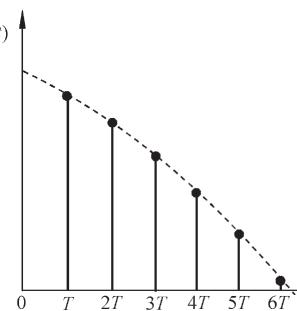

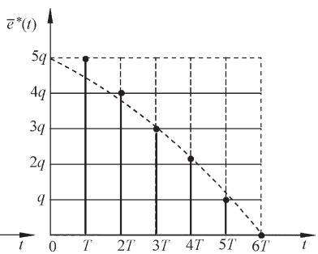  
  
图 7-7 A/D 转换过程

通常，A/D 转换器有足够的字长来表示数码，且量化单位 $q$ 足够小，故由量化引起的幅值的断续性可以忽略。此外，若认为采样编码过程瞬时完成，并用理想脉冲来等效代替数字信号，则数字信号可以看成脉冲信号，A/D 转换器就可以用一个每隔 $T$ 秒瞬时闭合一次的理想采样开关S来表示。

# (2) D/A 转换器

D/A 转换器是把离散的数字信号转换为连续模拟信号的装置。D/A 转换也经历了两个过程：一是解码过程，把离散数字信号转换为离散的模拟信号，如图 7-8(a)所示；二是复现过程，因为离散的模拟信号无法直接控制连续的被控对象，需要经过保持器将离散模拟信号复现为连续的模拟信号，如图 7-8(b)所示。

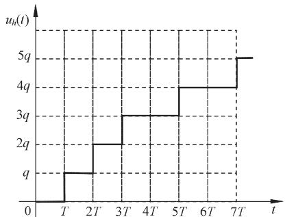  
  
图 7-8 D/A转换过程

计算机的输出寄存器和解码网络起到了信号保持器的作用。显然，在图 7-8(b)中经保持后的 $u _ { h } ( t )$ 只是一个阶梯信号，但是当采样频率足够高时， $u _ { h } ( t )$ 将趋近于连续信号。

# (3) 数字控制系统的典型结构图

通常，假定所选择的 A/D转换器有足够的字长来表示数码，量化单位 $q$ 足够小，所以由量化引起的幅值断续性可以忽略。此外还假定，采样编码过程是瞬时完成的，可用理想脉冲的幅值等效代替数字信号的大小，则A/D转换器可以用周期为 $T$ 的理想开关来代替。同理，将数字量转换为模拟量的 D/A 转换器可以用保持器取代，其传递函数为 $G _ { h } ( s )$ 。图 7-9 中数字控制器的功能是按照一定的控制规律，将采样后的误差信号 $e ^ { * } ( t )$ 加工成所需要的数字信号，并以一定的周期 $T$ 给出运算后的数字信号 $\overline { { u } } ^ { * } ( t )$ ，所以数字控制器实质上是一个数字校正装置，在结构图中可以等效为一个传递函数为 $G _ { c } ( s )$ 的脉冲控制器与一个周期为 $T$ 的理想采样开关相串联，用采样开关每隔 $T$ 秒输出的脉冲强度 $u ^ { * } ( t )$ 来表示数字控制器每隔 $T$ 秒输出的数字量 $\overline { { u } } ^ { * } ( t )$ 。如果再令被控对象的传递函数为 $G _ { 0 } ( s )$ ，测量元件的传递函数为 $H ( s )$ ，则图 7-6 的等效采样系统结构图如图 7-9 所示。实际上，图 7-9 也是数字控制系统的常见典型结构图。

  
图 7-9 数字控制系统典型结构图

# 3. 离散控制系统的特点

采样和数控技术，在自动控制领域中得到了广泛的应用，其主要原因是采样系统，特别是数字控制系统较之相应的连续系统具有一系列的特点。

1) 由数字计算机构成的数字校正装置，控制效果比连续式校正装置好，且由软件实现的控制规律易于改变，控制灵活。  
2) 采样信号，特别是数字信号的传递可以有效地抑制噪声，从而提高了系统的抗扰能力。  
3) 允许采用高灵敏度的控制元件，以提高系统的控制精度。  
4) 用一台计算机分时控制若干个系统，提高了设备的利用率，经济性好。  
5) 对于具有传输延迟，特别是大延迟的控制系统，可以引入采样的方式使系统稳定。

# 4. 离散系统的研究方法

由于在离散系统中存在脉冲或数字信号，如果仍然沿用连续系统中的拉氏变换方法来建立系统各个环节的传递函数，则在运算过程中会出现复变量 $s$ 的超越函数。为了克服这个障碍，需要采用 $z$ 变换法建立离散系统的数学模型。我们将会看到，通过 $z$ 变换处理后的离散系统，可以把用于连续系统中的许多方法，例如，稳定性分析、稳态误差计算、时间响应分析及系统校正方法等，经过适当改变后直接应用于离散系统的分析和

设计之中。至于离散系统的状态空间分析法，将在本书第九章中讨论。

# 7-2 信号的采样与保持

离散系统的特点是，系统中一处或数处的信号是脉冲序列或数字序列。为了把连续信号变换为脉冲信号，需要使用采样器；另一方面，为了控制连续式元部件，又需要使用保持器将脉冲信号变换为连续信号。因此，为了定量研究离散系统，必须对信号的采样过程和保持过程用数学的方法加以描述。

# 1. 采样过程

把连续信号变换为脉冲序列的装置称为采样器，或称为采样开关。采样器的采样过程，可以用一个周期性闭合的采样开关 $S$ 来表示，如图7-10所示。假设采样器每隔 $T$ 秒闭合一次，闭合的持续时间为 $\tau$ ；采样器的输入 $e ( t )$ 为连续信号；输出 $e ^ { * } ( t )$ 为宽度等于 $\tau$ 的调幅脉冲序列，在采样瞬时 $n T ( n { = } 0 , 1 , 2 , \cdots , \infty )$ 时出现。换句话说，在 $\scriptstyle { t = 0 }$ 时，采样器闭合 $\tau$ 秒，此时 $e ^ { * } ( t ) { = } e ( t )$ ； $\scriptstyle { t = \tau }$ 以后，采样器打开，输出 $e ^ { * } ( t ) { = } 0$ ；以后每隔 $T$ 秒重复一次这种过程。显然，采样过程要丢失采样间隔之间的信息。

  
(c)调幅脉冲序列   
图 7-10 实际采样过程

对于具有有限脉冲宽度的采样系统来说，要准确进行数学分析是非常复杂的，且无此必要。考虑到采样开关的闭合时间 $\tau$ 非常小，通常为毫秒到微秒级，一般远小于采样周期 $T$ 和系统连续部分的最大时间常数。因此在分析时，可以认为 $\scriptstyle { \tau = 0 }$ 。这样，采样器就可以用一个理想采样器来代替。采样过程可以看成是一个幅值调制过程。理想采样器好像是一个载波为 $\delta _ { I } ( t )$ 的幅值调制器，如图 7-11(b)所示，其中 $\delta _ { I } ( t )$ 为理想单位脉冲序列。图 7-11(c)所示的理想采样器的输出信号 $e ^ { * } ( t )$ ，可以认为是图 7-11(a)所示的输入连续信号$e ( t )$ 调制在载波 $\delta _ { I } ( t )$ 上的结果，而各脉冲强度(即面积)用其高度来表示，它们等于相应采样瞬时 $t { = } n T$ 时 $e ( t )$ 的幅值。如果用数学形式描述上述调制过程，则有

$$
e ^ {*} (t) = e (t) \delta_ {T} (t) \tag {7-1}
$$

因为理想单位脉冲序列 $\delta _ { I } ( t )$ 可以表示为

$$
\delta_ {T} (t) = \sum_ {n = 0} ^ {\infty} \delta (t - n T) \tag {7-2}
$$

其中 $\delta ( t { - } n T )$ 是出现在时刻 $t { = } n T$ 、强度为 1 的单位脉冲，故式(7-1)可以写为

  
(b)单位脉冲调制序列

  
(c)调幅脉冲序列   
图 7-11 理想采样过程

$$
e ^ {*} (t) = e (t) \sum_ {n = 0} ^ {\infty} \delta (t - n T)
$$

由于 $e ( t )$ 的数值仅在采样瞬时才有意义，所以上式又可表示为

$$
e ^ {*} (t) = \sum_ {n = 0} ^ {\infty} e (n T) \delta (t - n T) \tag {7-3}
$$

值得注意，在上述讨论过程中假设了

$$
e (t) = 0, \quad \forall t <   0
$$

因此脉冲序列从零开始。这个前提在实际控制系统中，通常都是满足的。

# 2. 采样过程的数学描述

采样信号 $e ^ { * } ( t )$ 的数学描述，可分以下两方面讨论。

# (1) 采样信号的拉氏变换

对采样信号 $e ^ { * } ( t )$ 进行拉氏变换，可得

$$
E ^ {*} (s) = \mathscr {S} \left[ e ^ {*} (t) \right] = \mathscr {S} \left[ \sum_ {n = 0} ^ {\infty} e (n T) \delta (t - n T) \right] \tag {7-4}
$$

根据拉氏变换的位移定理，有

$$
\mathscr {S} [ \delta (t - n T) ] = e ^ {- n T s} \int_ {0} ^ {\infty} \delta (t) e ^ {- s t} d t = e ^ {- n T s}
$$

所以，采样信号的拉氏变换

$$
E ^ {*} (s) = \sum_ {n = 0} ^ {\infty} e (n T) \mathrm {e} ^ {- n T s} \tag {7-5}
$$

应当指出，式(7-5)将 $E ^ { ^ { * } } ( s )$ 与采样函数 $e ( n T )$ 联系了起来，可以直接看出 $e ^ { * } ( t )$ 的时间响应。但是，由于 $e ^ { * } ( t )$ 只描述了 $e ( t )$ 在采样瞬时的数值，所以 $E ^ { * } ( s )$ 不能给出连续函数 $e ( t )$ 在采样间隔之间的信息，这是要特别强调指出的。还应当注意的是，式(7-5)描述的采样拉氏变换，与连续信号 $e ( t )$ 的拉氏变换 $E ( s )$ 非常类似。因此，如果 $e ( t )$ 是一个有理函数，则无穷级数 $E ^ { * } ( s )$ 也总是可以表示成 $\mathrm { e } ^ { T s }$ 的有理函数形式。在求 $E ^ { * } ( s )$ 的过程中，初始值通常规定采用 $e ( 0 _ { + } )$ 。

例 7-3 设 $e ( t ) { = } 1 ( t )$ ，试求 $e ^ { * } ( t )$ 的拉氏变换。

解 由式(7-5)，有

$$
E ^ {*} (s) = \sum_ {n = 0} ^ {\infty} e (n T) \mathrm {e} ^ {- n T s} = 1 + \mathrm {e} ^ {- T s} + \mathrm {e} ^ {- 2 T s} + \dots
$$

这是一个无穷等比级数，公比为 $\mathrm { e } ^ { - T s }$ ，求和后得闭合形式

$$
E ^ {*} (s) = \frac {1}{1 - e ^ {- T s}} = \frac {e ^ {T s}}{e ^ {T s} - 1}, \quad \left| e ^ {- T s} \right| <   1
$$

显然， $\boldsymbol { E } ^ { * } ( s )$ 是 $\mathrm { e } ^ { T s }$ 的有理函数。

例 7-4 设 $e ( t ) { = } \mathbf { e } ^ { - a t }$ ， $t { \geqslant } 0$ ， $a$ 为常数，试求 $e ^ { * } ( t )$ 的拉氏变换。

解 由式(7-5)，有

$$
\begin{array}{l} E ^ {*} (s) = \sum_ {n = 0} ^ {\infty} e ^ {- a n T} e ^ {- n T s} = \sum_ {n = 0} ^ {\infty} e ^ {- n (s + a) T} \\ = \frac {1}{1 - e ^ {- (s + a) T}} = \frac {e ^ {T s}}{e ^ {T s} - e ^ {- a T}}, \quad \left| e ^ {- (s + a) T} \right| <   1 \\ \end{array}
$$

上式也是 $\mathrm { e } ^ { T s }$ 的有理函数。

上述分析表明，只要 $E ( s )$ 可以表示为 $s$ 的有限次多项式之比时，总可以用式(7-5)推导出 $E ^ { * } ( s )$ 的闭合形式。然而，如果用拉氏变换法研究离散系统，尽管可以得到 $\mathrm { e } ^ { T s }$ 的有理函数，但却是一个复变量 $s$ 的超越函数，不便于进行分析和设计。为了克服这一困难，通常采用 $z$ 变换法研究离散系统。 $z$ 变换可以把线性离散系统的 $s$ 超越方程，变换为变量$z$ 的代数方程。有关 $z$ 变换理论将在下节介绍。

# (2) 采样信号的频谱

由于采样信号的信息并不等于连续信号的全部信息，所以采样信号的频谱与连续信号的频谱相比，要发生变化。研究采样信号的频谱，目的是找出 $\boldsymbol { E } ^ { * } ( s )$ 与 $E ( s )$ 之间的相互联系。

式(7-2)表明，理想单位脉冲序列 $\delta _ { T } ( t )$ 是一个周期函数，可以展开为如下傅氏级数形式：

$$
\delta_ {T} (t) = \sum_ {n = - \infty} ^ {\infty} c _ {n} \mathrm {e} ^ {\mathrm {j} n \omega_ {i} t} \tag {7-6}
$$

式中， ${ \omega _ { s } } \mathrm { { = } } 2 \pi / T$ ，为采样角频率； $c _ { n }$ 是傅氏系数，其值为

$$
c _ {n} = \frac {1}{T} \int_ {- T / 2} ^ {T / 2} \delta_ {T} (t) e ^ {- j n \omega_ {s} t} d t
$$

由于在[T/2，T/2]区间中， $\delta _ { I } ( t )$ 仅在 $\scriptstyle { t = 0 }$ 时有值，且 $\mathbf { e } ^ { - \mathrm { j } n \omega _ { s } t } \big | _ { t = 0 } = 1$ ，所以

$$
c _ {n} = \frac {1}{T} \int_ {0 _ {-}} ^ {0 _ {+}} \delta (t) \mathrm {d} t = \frac {1}{T} \tag {7-7}
$$

将式(7-7)代入式(7-6)，得

$$
\delta_ {T} (t) = \frac {1}{T} \sum_ {n = - \infty} ^ {\infty} \mathrm {e} ^ {\mathrm {j} n \omega_ {s} t} \tag {7-8}
$$

再把式(7-8)代入式(7-1)，有

$$
e ^ {*} (t) = \frac {1}{T} \sum_ {n = - \infty} ^ {\infty} e (t) \mathrm {e} ^ {\mathrm {j} n \omega_ {s} t} \tag {7-9}
$$

上式两边取拉氏变换，由拉氏变换的复数位移定理，得到

$$
E ^ {*} (s) = \frac {1}{T} \sum_ {n = - \infty} ^ {\infty} E (s + j n \omega_ {s}) \tag {7-10}
$$

式(7-10)在描述采样过程的性质方面是非常重要的，因为该式体现了理想采样器在频

域中的特点。在式(7-10)中，如果 $E ^ { * } ( s )$ 没有右半 $s$ 平面的极点，则可令 $\scriptstyle { s = j \omega }$ ，得到采样信号 $e ^ { * } ( t )$ 的傅氏变换

$$
E ^ {*} (\mathrm {j} \omega) = \frac {1}{T} \sum_ {n = - \infty} ^ {\infty} E [ \mathrm {j} (\omega + n \omega_ {s}) ] \tag {7-11}
$$

其中， $E ( \mathrm { j } \omega )$ 为连续信号 $e ( t )$ 的傅氏变换。

一般说来，连续信号 $e ( t )$ 的频谱 $\mid E ( \mathrm { j } \omega ) \mid$ 是单一的连续频谱，如图 7-12 所示，其中$\omega _ { h }$ 为连续频谱 $\mid E ( \mathrm { j } \omega ) \mid$ 中的最大角频率；而采样信号 $e ^ { * } ( t )$ 的频谱 $\mid E ^ { * } ( \mathrm { j } \omega ) \mid$ ，则是以采样角频率 $\omega _ { s }$ 为周期的无穷多个频谱之和，如图 7-13所示。在图 7-13中， $n { = } 0$ 的频谱称为采样频谱的主分量，如曲线 1所示，它与连续频谱 $\mid E ( \mathrm { j } \omega ) \mid$ 形状一致，仅在幅值上变化为 1/T；其余频谱 $( n { = } { \pm } 1 , { \pm } 2 , \cdots )$ 都是由于采样而引起的高频频谱，称为采样频谱的补分量，如曲线 2所示。图7-13表明的是采样角频率 $\omega _ { s }$ 大于两倍 $\omega _ { h }$ 这一情况。如果加大采样周期T，采样角频率 $\omega _ { s }$ 相应减小，当 $\omega _ { s } < 2 \omega _ { h }$ 时，采样频谱中的补分量相互交叠，致使采样器输出信号发生畸变，如图 7-14 所示。在这种情况下，即使用图 7-15 所示的理想滤波器也无法恢复原来连续信号的频谱。因此不难看出，要想从采样信号 $e ^ { * } ( t )$ 中完全复现出采样前的连续信号 $e ( t )$ ，对采样角频率 $\omega _ { s }$ 应有一定的要求。

  
图 7-12 连续信号频谱

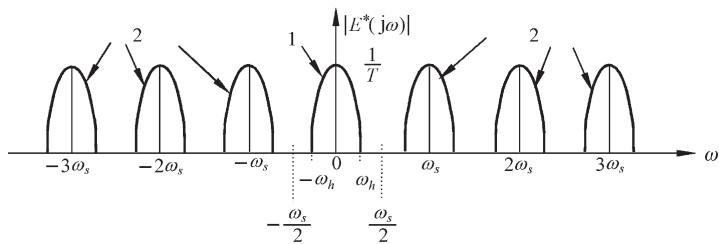  
图 7-13 采样信号频谱( $\omega { > } 2 \omega _ { h } )$

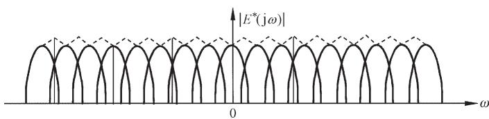  
图 7-14 采样信号频谱 $\omega _ { s } { < } 2 \omega _ { h } )$ )

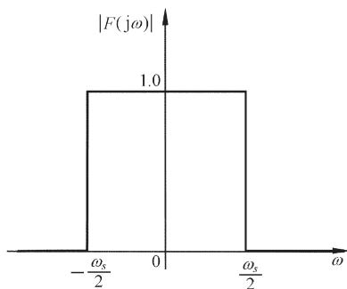  
图 7-15 理想滤波器的频率特性

# 3. 香农采样定理

在设计离散系统时，香农采样定理是必须严格遵守的一条准则，因为它指明了从采样信号中不失真地复现原连续信号所必需的理论上的最大采样周期 $T _ { \circ }$

香农采样定理指出：如果采样器的输入信号 e(t)具有有限带宽，并且有直到 $\pmb { \omega } _ { h }$ 的频率分量，则使信号 e(t)完全从采样信号 $e ^ { ^ { \ast } } ( t )$ 中恢复过来的采样周期 $T ,$ ，满足下列条件：

$$
T \leqslant \frac {2 \pi}{2 \omega_ {h}} \tag {7-12}
$$

采样定理表达式(7-12)与 $\omega _ { s } \geqslant 2 \omega _ { h }$ 是等价的。由图 7-13 可见，在满足香农采样定理

的条件下，要想不失真地复现采样器的输入信号，需要采用图 7-15 所示的理想滤波器，其频率特性的幅值 $\mid F ( \mathrm { j } \omega ) \mid$ 必须在 $\omega \mathrm { = } \omega _ { s } / 2$ 处突然截止，那么在理想滤波器的输出端便可以准确得到 $\mid E ( \mathrm { j } \omega ) \mid / T$ 的连续频谱，除了幅值变化为 $1 / T$ 外，频谱形状没有畸变。在满足香农采样定理条件下，理想采样器的特性如图 7-16 所示。图(a)为连续输入信号及其频谱；图(b)为理想单位脉冲序列及其频谱；图(c)为输出采样信号及其频谱。

应当指出，香农采样定理只是给出了一个选择采样周期 T 或采样频率 fs的指导原则，它给出的是由采样脉冲序列无失真地再现原连续信号所允许的最大采样周期，或最低采样

  
(a)连续输入信号及其频谱

  
(b)理想单位脉冲序列及其频谱

  
(c)输出采样信号及其频谱  
图 7-16 理想采样器特性

频率。在控制工程实践中，一般总是取 $\omega _ { s } > 2 \omega _ { h }$ ，而不取恰好等于 $2 \omega _ { h }$ 的情形。

# 4. 采样周期的选取

采样定理只是给出了采样周期选择的基本原则，并未给出选择采样周期的具体方法。显然，采样周期 $T$ 选得越小，即采样角频率 $\omega _ { s }$ 选得越高，对控制过程的信息便获得越多，控制效果也会越好。但是，采样周期 $T$ 选得过小，将增加不必要的计算负担，造成实现较复杂控制规律的困难，而且采样周期 $T$ 小到一定的程度后，再减小就没有多大实际意义了。反之，采样周期 T 选得过大，又会给控制过程带来较大的误差，降低系统的动态性能，甚至有可能导致整个控制系统失去稳定。

表 7-1 工业过程T的选择  

<table><tr><td>控制过程</td><td>采样周期 T/s</td></tr><tr><td>流量</td><td>1</td></tr><tr><td>压力</td><td>5</td></tr><tr><td>液面</td><td>5</td></tr><tr><td>温度</td><td>20</td></tr><tr><td>成分</td><td>20</td></tr></table>

在一般工业过程控制中，微型计算机所能提供的运算速度，对于采样周期的选择来说，回旋余地较大。工程实践表明，根据表 7-1 给出的参考数据选择采样周期 T，可以取得满意的控制效果。但是，对于快速随动系统，采样周期 $T$ 的选择将是系统设计中必须予以认真考虑的问题。采样周期的选取，在很大程度上取决于系统的性能指标。

从频域性能指标来看，控制系统的闭环频率响应通常具有低通滤波特性，当随动系

统的输入信号的频率高于其闭环幅频特性的谐振频率 $\omega _ { r }$ 时，信号通过系统将会很快衰减，因此可认为通过系统的控制信号的最高频率分量为 $\omega _ { r }$ 。在随动系统中，一般认为开环系统的截止频率 $\omega _ { c }$ 与闭环系统的谐振频率 $\omega _ { \mathrm { \ell } }$ 相当接近，近似有 ${ \omega } _ { c } { = } { \omega } _ { r }$ ，故在控制信号的频率分量中，超过 $\omega _ { c }$ 的分量通过系统后将被大幅度衰减掉。工程实践表明，随动系统的采样角频率可近似取为

$$
\omega_ {s} = 1 0 \omega_ {c} \tag {7-13}
$$

或者 $T = \frac { 1 } { 4 0 } t _ { s }$ (7-14)

应当指出，采样周期选择得当，是连续信号 $e ( t )$ 可以从采样信号 $e ^ { * } ( t )$ 中完全复现的前提。然而，图 7-15所示的理想滤波器实际上并不存在，因此只能用特性接近理想滤波器的低通滤波器来代替，零阶保持器是常用的低通滤波器之一。为此，需要研究信号保持过程。

# 5. 信号保持

用数字计算机作为系统的信息处理机构时，处理结果的输出如同原始信息的获取一样，一般也有两种方式。一种是直接数字输出，如屏幕显示、打印输出，或将数列以二进制形式输入相应的寄存器，图 7-5 中的误差角 $\theta _ { e }$ 显示就属于此种形式；另一种需要把数字信号转换为连续信号。用于这后一种转换过程的装置，称为保持器。从数学上说，保持器的任务是解决各采样点之间的插值问题。

# (1) 保持器的数学描述

由采样过程的数学描述可知，在采样时刻上，连续信号的函数值与脉冲序列的脉冲强度相等。在 $n T$ 时刻，有

$$
\left. e (t) \right| _ {t = n T} = e (n T) = e ^ {*} (n T)
$$

而在 $( n { + } 1 ) T$ 时刻，则有

$$
e (t) \mid_ {t = (n + 1) T} = e [ (n + 1) T ] = e ^ {*} [ (n + 1) T ]
$$

然而，在由脉冲序列 $e ^ { * } ( t )$ 向连续信号 $e ( t )$ 的转换过程中，在 $n T$ 与 $( n { + } 1 ) T$ 时刻之间，即当$0 < \Delta t < T$ 时，连续信号 $e ( n T \mathrm { + } \Delta t )$ 究竟有多大？它与 $e ( n T )$ 的关系如何？这就是保持器要解决的问题。

实际上，保持器是具有外推功能的元件。保持器的外推作用，表现为现在时刻的输出信号取决于过去时刻离散信号的外推。通常，采用如下多项式外推公式描述保持器：

$$
e (n T + \Delta t) = a _ {0} + a _ {1} \Delta t + a _ {2} (\Delta t) ^ {2} + \dots + a _ {m} (\Delta t) ^ {m} \tag {7-15}
$$

式中， $\Delta t$ 是以 $n T$ 时刻为原点的坐标。式(7-15)表示：现在时刻的输出 $e ( n T \mathrm { + } \Delta t )$ 值，取决于 $\Delta t { = } 0$ ， $- T$ ， $- 2 T$ ，…，mT 各过去时刻的离散信号 $e ^ { * } ( n T )$ ， $e ^ { * } [ ( n { - } 1 ) T ]$ ， $e ^ { * } [ ( n - 2 ) T ]$ ，…，$e ^ { * } [ ( n - m ) T ]$ 的 $( m { + } 1 )$ 个值。外推公式中 $( m { + } 1 )$ 个待定系数 $a _ { i } ( i { = } 0 , 1 , \cdots , m )$ ，唯一地由过去各采样时刻 $( m { + } 1 )$ 个离散信号值 $e ^ { * } [ ( n - i ) T ] ( i { = } 0 , 1 , \cdots , m )$ 来确定，故系数 $a _ { i }$ 有唯一解。这种保持器称为 $m$ 阶保持器。若取 $m { = } 0$ ，则称零阶保持器； $m { = } 1$ ，称一阶保持器。在工程实践中，

普遍采用零阶保持器。

# (2) 零阶保持器

零阶保持器的外推公式为

$$
e (n T + \Delta t) = a _ {0}
$$

显然， $\Delta t { = } 0$ 时，上式也成立。所以

$$
a _ {0} = e (n T)
$$

从而，零阶保持器的数学表达式为

$$
e (n T + \Delta t) = e (n T), \quad 0 \leqslant \Delta t <   T \tag {7-16}
$$

上式说明，零阶保持器是一种按常值外推的保持器，它把前一采样时刻 $n T$ 的采样值$e ( n T )$ (因为在各采样点上， $e ^ { * } ( n T ) { = } e ( n T ) )$ 一直保持到下一采样时刻 $( n { + } 1 ) T$ 到来之前，从而使采样信号 $e ^ { * } ( t )$ 变成阶梯信号 $e _ { h } ( t )$ ，如图 7-17 所示。

如果把阶梯信号 $e _ { h } ( t )$ 的中点连接起来，如图 7-17中点划线所示，则可以得到与连续信号 $e ( t )$ 形状一致但在时间上落后 $T / 2$ 的响应 e[t(T/2)]。

  
图 7-17 零阶保持器的输出特性

式(7-16)还表明：零阶保持过程是由于理想脉冲 $e ( n T ) \delta ( t - n T )$ 的作用结果。如果给零阶保持器输入一个理想单位脉冲 $\delta ( t )$ ，则其脉冲过渡函数 $g _ { h } ( t )$ 是幅值为1、持续时间为 T的矩形脉冲，并可分解为两个单位阶跃函数的和

$$
g _ {h} (t) = 1 (t) - 1 (t - T)
$$

对脉冲过渡函数 $g _ { h } ( t )$ 取拉氏变换，可得零阶保持器的传递函数

$$
G _ {h} (s) = \frac {1}{s} - \frac {\mathrm {e} ^ {- T s}}{s} = \frac {1 - \mathrm {e} ^ {- T s}}{s} \tag {7-17}
$$

在式(7-17)中，令 $\scriptstyle { s = j \omega }$ ，得零阶保持器的频率特性

$$
G _ {h} (\mathrm {j} \omega) = \frac {1 - \mathrm {e} ^ {- \mathrm {j} \omega T}}{\mathrm {j} \omega} = \frac {2 \mathrm {e} ^ {- \mathrm {j} \omega T / 2} \left(\mathrm {e} ^ {\mathrm {j} \omega T / 2} - \mathrm {e} ^ {- \mathrm {j} \omega T / 2}\right)}{2 \mathrm {j} \omega} = T \frac {\sin (\omega T / 2)}{(\omega T / 2)} \mathrm {e} ^ {- \mathrm {j} \omega T / 2} \tag {7-18}
$$

若以采样角频率 ${ \omega _ { s } } \mathrm { { = } } 2 \pi / T$ 来表示，则式(7-18)可表示为

$$
G _ {h} (\mathrm {j} \omega) = \frac {2 \pi}{\omega_ {s}} \frac {\sin \pi \left(\omega / \omega_ {s}\right)}{\pi \left(\omega / \omega_ {s}\right)} \mathrm {e} ^ {- \mathrm {j} \pi \left(\omega / \omega_ {s}\right)} \tag {7-19}
$$

根据式(7-19)，可画出零阶保持器的幅频特性 $| G _ { h } ( \mathrm { j } \omega ) |$ 和相频特性 $\underline { { \mathbf { \Pi } } } ( \underline { { \mathbf { \Pi } } } _ { h } ( \mathrm { j } \omega ) $ ，如图 7-18所示。由图可见，零阶保持器具有如下特性。

1) 低通特性。由于幅频特性的幅值随频率值的增大而迅速衰减，说明零阶保持器基本上是一个低通滤波器，但与理想滤波器特性相比，在 $\omega \mathrm { = } \omega _ { s } / 2$ 时，其幅值只有初值的$6 3 . 7 \%$ ，且截止频率不止一个，所以零阶保持器除允许主要频谱分量通过外，还允许部分

高频频谱分量通过，从而造成数字控制系统的输出中存在纹波。

  
图 7-18 零阶保持器的幅频特性和相频特性(T=4，MATLAB)

2) 相角滞后特性。由相频特性可见，零阶保持器要产生相角滞后，且随 $\omega$ 的增大而加大，在 $\omega { = } \omega _ { s }$ 处，相角滞后可达 $- 1 8 0 ^ { \circ }$ ，从而使闭环系统的稳定性变差。  
3) 时间滞后特性。零阶保持器的输出为阶梯信号 $e _ { h } ( t )$ ，其平均响应为 $e [ t - ( T / 2 ) ]$ ，表明其输出比输入在时间上要滞后 T/2，相当于给系统增加了一个延迟时间为 T/2 的延迟环节，使系统总的相角滞后增大，对系统的稳定性不利；此外，零阶保持器的阶梯输出也同时增加了系统输出中的纹波。

与零阶保持器相比，一阶保持器复现原信号的准确度较高。然而，一阶保持器的幅频特性普遍较大，允许通过的信号高频分量

较多，更易造成纹波。此外，一阶保持器的相角滞后比零阶保持器大，在 $\omega { = } \omega _ { s }$ 时，可达$- 2 8 0 ^ { \circ }$ ，对系统的稳定性更加不利，因此在数字控制系统中，一般很少采用一阶保持器，更不采用高阶保持器，而普遍采用零阶保持器。

在工程实践中，零阶保持器可用输出寄存器实现。在正常情况下，还应附加模拟滤波器(如例 7-2)，以有效地去除在采样频率及其谐波频率附近的高频分量。

# 7-3 $z$ 变换理论

$z$ 变换的思想来源于连续系统。线性连续控制系统的动态及稳态性能，可以应用拉氏变换的方法进行分析。与此相似，线性离散系统的性能，可以采用 $z$ 变换的方法来获得。$z$ 变换是从拉氏变换直接引申出来的一种变换方法，它实际上是采样函数拉氏变换的变形。因此， $z$ 变换又称为采样拉氏变换，是研究线性离散系统的重要数学工具。

# 1. z 变换定义

设连续函数 $e ( t )$ 是可拉氏变换的，则拉氏变换定义为

$$
E (s) = \int_ {0} ^ {\infty} e (t) \mathrm {e} ^ {- s t} \mathrm {d} t
$$

由于 $t { < } 0$ 时，有 $e ( t ) { = } 0$ ，故上式亦可写为

$$
E (s) = \int_ {- \infty} ^ {\infty} e (t) \mathrm {e} ^ {- s t} \mathrm {d} t
$$

对于采样信号 $e ^ { * } ( t )$ ，其表达式为

$$
e ^ {*} (t) = \sum_ {n = 0} ^ {\infty} e (n T) \delta (t - n T)
$$

故采样信号 $e ^ { * } ( t )$ 的拉氏变换

$$
\begin{array}{l} E ^ {*} (s) = \int_ {- \infty} ^ {\infty} e ^ {*} (t) \mathrm {e} ^ {- s t} \mathrm {d} t = \int_ {- \infty} ^ {\infty} \left[ \sum_ {n = 0} ^ {\infty} e (n T) \delta (t - n T) \right] \mathrm {e} ^ {- s t} \mathrm {d} t \tag {7-20} \\ = \sum_ {n = 0} ^ {\infty} e (n T) \left[ \int_ {- \infty} ^ {\infty} \delta (t - n T) \mathrm {e} ^ {- s t} \mathrm {d} t \right] \\ \end{array}
$$

由广义脉冲函数的筛选性质

$$
\int_ {- \infty} ^ {\infty} \delta (t - n T) f (t) d t = f (n T)
$$

故有 $\int _ { - \infty } ^ { \infty } \delta ( t - n T ) \mathrm { e } ^ { - s t } \mathrm { d } t = \mathrm { e } ^ { - s n T }$ 

于是，采样拉氏变换(7-20)可以写为

$$
E ^ {*} (s) = \sum_ {n = 0} ^ {\infty} e (n T) \mathrm {e} ^ {- n s T} \tag {7-21}
$$

在上式中，各项均含有 $\mathrm { e } ^ { s T }$ 因子，故上式为 $s$ 的超越函数。为便于应用，令变量

$$
z = \mathrm {e} ^ {s T} \tag {7-22}
$$

式中， $T$ 为采样周期； $z$ 是在复数平面上定义的一个复变量，通常称为 $z$ 变换算子。

将式(7-22)代入式(7-21)，则采样信号 $e ^ { * } ( t )$ 的 $z$ 变换定义为

$$
E (z) = E ^ {*} (s) \left| _ {s = \frac {1}{T} \ln z} = \sum_ {n = 0} ^ {\infty} e (n T) z ^ {- n} \right. \tag {7-23}
$$

记为 $E ( z ) = \mathcal { Z } \Big [ e ^ { * } ( t ) \Big ] = \mathcal { Z } \big [ e ( t ) \big ]$ (7-24)

后一记号是为了书写方便，并不意味着是连续信号 $e ( t )$ 的 $z$ 变换，而是仍指采样信号 $e ^ { * } ( t )$ 的 $z$ 变换。

应当指出， $z$ 变换仅是一种在采样拉氏变换中，取 $z { = } \mathrm { e } ^ { s T }$ 的变量置换。通过这种置换，可将 $s$ 的超越函数转换为 $z$ 的幂级数或 $z$ 的有理分式。

# 2. z 变换方法

求离散时间函数的 $z$ 变换有多种方法，下面只介绍常用的两种主要方法。

# (1) 级数求和法

级数求和法是直接根据 $z$ 变换的定义，将式(7-23)写成展开形式：

$$
E (z) = e (0) + e (T) z ^ {- 1} + e (2 T) z ^ {- 2} + \dots + e (n T) z ^ {- n} + \dots \tag {7-25}
$$

上式是离散时间函数 $e ^ { * } ( t )$ 的一种无穷级数表达形式。显然，根据给定的理想采样开关的输入连续信号 $e ( t )$ 或其输出采样信号 $e ^ { * } ( t )$ ，以及采样周期 $T$ ，由式(7-25)立即可得 $z$ 变换的级数展开式。通常，对于常用函数 $z$ 变换的级数形式，都可以写出其闭合形式。

例 7-5 试求单位阶跃函数 $1 ( t )$ 的 $z$ 变换。

解 由于 $e ( t ) { = } 1 ( t )$ 在所有采样时刻上的采样值均为 1，即 $e ( n T ) { = } 1 ( n { = } 0 , 1 , 2 , \cdots , \infty )$ ，故由式(7-25)，有

$$
E (z) = 1 + z ^ {- 1} + z ^ {- 2} + \dots + z ^ {- n} + \dots
$$

在上式中，若 $\mid z ^ { - 1 } \mid < 1$ ，则无穷级数是收敛的，利用等比级数求和公式，可得 1(t)的 $z$ 变换的闭合形式为

$$
E (z) = \frac {1}{1 - z ^ {- 1}} = \frac {z}{z - 1}
$$

因为 $\mid z ^ { - 1 } \mid = \mid \mathrm { e } ^ { - s T } \mid = \mathrm { e } ^ { - \sigma T }$ ，式中 $\scriptstyle { \boldsymbol { \sigma } } = { \mathrm { R e } } ( s )$ ，所以条件 $\mid z ^ { - 1 } \mid < 1$ 意味着条件 $\sigma > 0$ 。这也是单位阶跃函数可进行拉氏变换的条件。本例结果与例7-3一致。

例 7-6 设

$$
e (t) = \delta_ {T} (t) = \sum_ {n = 0} ^ {\infty} \delta (t - n T)
$$

试求理想脉冲序列 $\delta _ { T } ( t )$ 的 $z$ 变换。

解 因为 $T$ 为采样周期，故

$$
e ^ {*} (t) = \delta_ {T} (t) = \sum_ {n = 0} ^ {\infty} \delta (t - n T)
$$

由拉氏变换知

$$
E ^ {*} (s) = \sum_ {n = 0} ^ {\infty} e ^ {- n s T}
$$

因此 $E ( z ) = \sum _ { n = 0 } ^ { \infty } z ^ { - n } = 1 + z ^ { - 1 } + z ^ { - 2 } + \cdots$

将上式写成闭合形式，得 $\delta _ { I } ( t )$ 的 $z$ 变换为

$$
E (z) = \frac {1}{1 - z ^ {- 1}} = \frac {z}{z - 1}, \quad \left| z ^ {- 1} \right| <   1
$$

从例 7-5和例 7-6可见，相同的 $z$ 变换 $E ( z )$ 对应于相同的采样函数 $e ^ { * } ( t )$ ，但是不一定对应于相同的连续函数 $e ( t )$ ，这是利用 $z$ 变换法分析离散系统时特别要注意的一个问题。

# (2) 部分分式法

利用部分分式法求 $z$ 变换时，先求出已知连续时间函数 $e ( t )$ 的拉氏变换 $E ( s )$ ，然后将有理分式函数 $E ( s )$ 展成部分分式之和的形式，使每一部分分式对应简单的时间函数，因其相应的 $z$ 变换是已知的，于是可方便地求出 $E ( s )$ 对应的 $z$ 变换 $E ( z )$ 。

例 7-7 设 $e ( t ) { = } \sin \omega t$ ，试求其 $E ( z )$ 。

解 对 $e ( t ) { = } \sin \omega t$ 取拉氏变换，得

$$
E (s) = \frac {\omega}{s ^ {2} + \omega^ {2}}
$$

将上式展开为部分分式

$$
E (s) = \frac {1}{2 \mathrm {j}} \left(\frac {1}{s - \mathrm {j} \omega} - \frac {1}{s + \mathrm {j} \omega}\right)
$$

根据指数函数的 $z$ 变换表达式，可以得到

$$
E (z) = \frac {1}{2 \mathrm {j}} \left(\frac {z}{z - \mathrm {e} ^ {\mathrm {j} \omega T}} - \frac {z}{z - \mathrm {e} ^ {- \mathrm {j} \omega T}}\right) = \frac {1}{2 \mathrm {j}} \left[ \frac {z \left(\mathrm {e} ^ {\mathrm {j} \omega T} - \mathrm {e} ^ {- \mathrm {j} \omega T}\right)}{z ^ {2} - z \left(\mathrm {e} ^ {\mathrm {j} \omega T} + \mathrm {e} ^ {- \mathrm {j} \omega T}\right) + 1} \right]
$$

化简后得

$$
E (z) = \frac {z \sin \omega T}{z ^ {2} - 2 z \cos \omega T + 1}
$$

常用时间函数的 $z$ 变换表如表 7-2所示。由表可见，这些函数的 $z$ 变换都是 $z$ 的有理分式，且分母多项式的次数大于或等于分子多项式的次数。值得指出，表中各 $z$ 变换有理分式中，分母 $z$ 多项式的最高次数与相应传递函数分母 $s$ 多项式的最高次数相等。

表 7-2 z 变换表  

<table><tr><td>序号</td><td>拉氏变换E(s)</td><td>时间函数e(t)</td><td>z变换E(z)</td></tr><tr><td>1</td><td>e-nsT</td><td>δ(t-nT)</td><td>z^n</td></tr><tr><td>2</td><td>1</td><td>δ(t)</td><td>1</td></tr><tr><td>3</td><td>1/s</td><td>1(t)</td><td>z/z-1</td></tr><tr><td>4</td><td>1/s²</td><td>t</td><td>Tz/(z-1)²</td></tr><tr><td>5</td><td>1/s³</td><td>t²/2!</td><td>T²z(z+1)/2(z-1)³</td></tr><tr><td>6</td><td>1/s⁴</td><td>t³/3!</td><td>T³z(z²+4z+1)/6(z-1)⁴</td></tr><tr><td>7</td><td>1/s-(1/T)lna</td><td>at/T(ain)</td><td>z/z-a</td></tr><tr><td>8</td><td>1/s+a</td><td>e-att</td><td>z/z-e-aT</td></tr><tr><td>9</td><td>1/(s+a)²</td><td>te-att</td><td>Tze-aT/(z-e-aT)²</td></tr><tr><td>10</td><td>1/(s+a)³</td><td>1/2t²e-att</td><td>T²ze-aT/2(z-e-aT)² + T²ze-2aT/(z-e-aT)³</td></tr><tr><td>11</td><td>a/s(s+a)</td><td>1-e-att</td><td>(1-e-aT)z/(z-1)(z-e-aT)</td></tr><tr><td>12</td><td>a/s²(s+a)</td><td>t-1/a(1-e-aT)</td><td>Tz/(z-1)² - (1-e-aT)z/a(z-1)(z-e-aT)</td></tr><tr><td>13</td><td>1/(s+a)(s+b)(s+c)</td><td>e-att/(b-a)(c-a)+(a-b)(c-b)+e-ct/(a-c)(b-c)</td><td>z/(b-a)(c-a)(z-e-aT)+(a-b)(c-b)(z-e-bT)+(a-c)(b-c)(z-e-cT)</td></tr><tr><td>14</td><td>s+d/(s+a)(s+b)(s+c)</td><td>(d-a)/(b-a)(c-a)e-att+(d-b)/(a-b)(c-b)e-bt+(d-c)/(a-c)(b-c)e-ct</td><td>(d-a)z/(b-a)(c-a)(z-e-aT)+(d-b)z/(a-b)(c-b)(z-e-bT)+(d-c)z/(a-c)(b-c)(z-e-cT)</td></tr><tr><td>15</td><td>abc/s(s+a)(s+b)(s+c)</td><td>1-bc/(b-a)(c-a)e-att-ca/(c-b)(a-b)e-bt-ab/(a-c)(b-c)e-ct</td><td>z/z-1-bcz/(b-a)(c-a)(z-e-aT)-caz/(c-b)(a-b)(z-e-bT)-abz/(a-c)(b-c)(z-e-cT)</td></tr><tr><td>16</td><td>ω/s2+ω2</td><td>sin ωt</td><td>z sin ωT/z2-2z cos ωT+1</td></tr><tr><td>17</td><td>s/s2+ω2</td><td>cos ωt</td><td>z(z-cos ωT)/z2-2z cos ωT+1</td></tr><tr><td>18</td><td>ω/s2-ω2</td><td>sinh ωt</td><td>z sinh ωT/z2-2z cosh ωT+1</td></tr><tr><td>19</td><td>s/s2-ω2</td><td>cosh ωt</td><td>z(z-cosh ωT)/z2-2z cosh ωT+1</td></tr><tr><td>20</td><td>ω2/s(s2+ω2)</td><td>1-cos ωt</td><td>z/z-1-z(z-cos ωT)/z2-2z cos ωT+1</td></tr><tr><td>21</td><td>ω/(s+a)2+ω2</td><td>e-at sin ωt</td><td>ze-aTsin ωT/z2-2z e-aT cos ωT+e-2aT</td></tr><tr><td>22</td><td>s+a/(s+a)2+ω2</td><td>e-at cos ωt</td><td>z2-ze-aT cos ωT/z2-2z e-aT cos ωT+e-2aT</td></tr><tr><td>23</td><td>b-a/(s+a)(s+b)</td><td>e-at - e-bt</td><td>z/z-e-aT - z/z-e-bT</td></tr><tr><td>24</td><td>a2b2/s2(s+a)(s+b)</td><td>abt-(a+b)-b2/a-be-at+ a2/a-be-bt</td><td>abTz/(z-1)2-(a+b)z/z-1-b2z/(a-b)(z-e-aT)+a2z/(a-b)(z-e-bT)</td></tr></table>

# 3. z变换性质

$z$ 变换有一些基本定理，可以使 $z$ 变换的应用变得简单和方便，其内容在许多方面与拉氏变换的基本定理有相似之处。

# (1) 线性定理

若 $E _ { 1 } ( z ) = \mathcal { X } [ e _ { 1 } ( t ) ]$ ， $E _ { 2 } ( z ) = \mathcal { X } [ e _ { 2 } ( t ) ]$ ， $a$ 为常数，则

$$
\mathcal {K} \left[ e _ {1} (t) \pm e _ {2} (t) \right] = E _ {1} (z) \pm E _ {2} (z) \tag {7-26}
$$

$$
\mathcal {X} [ a e (t) ] = a E (z) \tag {7-27}
$$

其中， $E ( z ) { = } \mathcal { X } [ e ( t ) ]$ 。

证明 由 $z$ 变换定义

$$
\mathscr {X} \left[ e _ {1} (t) \pm e _ {2} (t) \right] = \sum_ {n = 0} ^ {\infty} \left[ e _ {1} (n T) \pm e _ {2} (n T) \right] z ^ {- n} = \sum_ {n = 0} ^ {\infty} e _ {1} (n T) z ^ {- n} \pm \sum_ {n = 0} ^ {\infty} e _ {2} (n T) z ^ {- n} = E _ {1} (z) \pm E _ {2} (z)
$$

以及 $\mathcal { Z } \big [ a e ( t ) \big ] = a \sum _ { n = 0 } ^ { \infty } e ( n T ) z ^ { - n } = a E ( z )$

式(7-26)和式(7-27)表明， $z$ 变换是一种线性变换，其变换过程满足齐次性与均匀性。

# (2) 实数位移定理

实数位移定理又称平移定理。实数位移的含义，是指整个采样序列在时间轴上左右平移若干采样周期，其中向左平移为超前，向右平移为滞后。实数位移定理如下：

如果函数 $e ( t )$ 是可拉氏变换的，其 $z$ 变换为 $E ( z )$ ，则有

$$
\mathcal {X} [ e (t - k T) ] = z ^ {- k} E (z) \tag {7-28}
$$

以及 ${ \mathcal { Z } } { \big [ } e ( t + k T ) { \big ] } = z ^ { k } { \Bigg [ } E ( z ) - \sum _ { n = 0 } ^ { k - 1 } e ( n T ) z ^ { - n } { \Bigg ] }$ (7-29)

其中 $k$ 为正整数。

证明 由 $z$ 变换定义

$$
\mathcal {X} [ e (t - k T) ] = \sum_ {n = 0} ^ {\infty} e (n T - k T) z ^ {- n} = z ^ {- k} \sum_ {n = 0} ^ {\infty} e [ (n - k) T ] z ^ {- (n - k)}
$$

令 $m { = } n { - } k$ ，则有

$$
\mathcal {X} \left[ e (t - k T) \right] = z ^ {- k} \sum_ {m = - k} ^ {\infty} e (m T) z ^ {- m}
$$

由于 $z$ 变换的单边性，当 $m < 0$ 时，有 $e ( m T ) { = } 0$ ，所以上式可写为

$$
\mathcal {X} \left[ e (t - k T) \right] = z ^ {- k} \sum_ {m = 0} ^ {\infty} e (m T) z ^ {- m}
$$

再令 $m { = } n$ ，立即证得式(7-28)。

为了证明式(7-29)，取 $k { = } 1$ ，得

$$
\mathcal {X} \left[ e (t + T) \right] = \sum_ {n = 0} ^ {\infty} e (n T + T) z ^ {- n} = z \sum_ {n = 0} ^ {\infty} e [ (n + 1) T ] z ^ {- (n + 1)}
$$

令 $\scriptstyle { m = n + 1 }$ ，上式可写为

$$
\mathcal {X} [ e (t + T) ] = z \sum_ {m = 1} ^ {\infty} e (m T) z ^ {- m} = z \left[ \sum_ {m = 0} ^ {\infty} e (m T) z ^ {- m} - e (0) \right] = z [ E (z) - e (0) ]
$$

取 $k { = } 2$ ，同理得

$$
\mathcal {X} \left[ e (t + 2 T) \right] = z ^ {2} \sum_ {m = 2} ^ {\infty} e (m T) z ^ {- m} = z ^ {2} \left[ \sum_ {m = 0} ^ {\infty} e (m T) z ^ {- m} - e (0) - z ^ {- 1} e (T) \right] = z ^ {2} \left[ E (z) - \sum_ {n = 0} ^ {1} e (n T) z ^ {- n} \right]
$$

取 $k { = } k$ 时，必有

$$
\mathcal {X} [ e (t + k T) ] = z ^ {k} \left[ E (z) - \sum_ {n = 0} ^ {k - 1} e (n T) z ^ {- n} \right]
$$

在实数位移定理中，式(7-28)称为滞后定理；式(7-29)称为超前定理。显然可见，算子 $z$ 有明确的物理意义： $z ^ { - k }$ 代表时域中的滞后环节，它将采样信号滞后 $k$ 个采样周期；同理， $z ^ { k }$ 代表超前环节，它把采样信号超前 $k$ 个采样周期。但是， $z ^ { k }$ 仅用于运算，在物理系统中并不存在。

实数位移定理是一个重要定理，其作用相当于拉氏变换中的微分和积分定理。应用实数位移定理，可将描述离散系统的差分方程转换为 $z$ 域的代数方程。有关差分方程的概念将在下节介绍。

例 7-8 试用实数位移定理计算滞后一个采样周期的指数函数 $\mathrm { e } ^ { - a ( t - T ) }$ 的 $z$ 变换，其中$a$ 为常数。

解 由式(7-28)

$$
\mathcal {X} \left[ e ^ {- a (t - T)} \right] = z ^ {- 1} \mathcal {X} \left[ e ^ {- a t} \right] = z ^ {- 1} \cdot \frac {z}{z - e ^ {- a T}} = \frac {1}{z - e ^ {- a T}}
$$

# (3) 复数位移定理

如果函数 $e ( t )$ 是可拉氏变换的，其 $z$ 变换为 $E ( z )$ ，则有

$$
\mathcal {X} \left[ e ^ {\mp a t} e (t) \right] = E \left(z e ^ {\pm a T}\right) \tag {7-30}
$$

证明 由 $z$ 变换定义

$$
\mathcal {X} \left[ e ^ {\mp a t} e (t) \right] = \sum_ {n = 0} ^ {\infty} e ^ {\mp a n T} e (n T) z ^ {- n} = \sum_ {n = 0} ^ {\infty} e (n T) \left(z e ^ {\pm a T}\right) ^ {- n}
$$

1 e aT z z   $z _ { 1 } = z \mathbf { e } ^ { \pm a T }$

则有 $\mathcal { Z } \Big [ \mathrm { e } ^ { \mp a t } e ( t ) \Big ] = \sum _ { n = 0 } ^ { \infty } e ( n T ) z _ { 1 } ^ { - n } = E ( z \mathrm { e } ^ { \pm a T } )$ 0n

复数位移定理是仿照拉氏变换的复数位移定理导出的，其含义是函数 $e ^ { * } ( t )$ 乘以指数序列 $\mathrm { e } ^ { \mp a n T }$ 的 $z$ 变换，就等于在 $e ^ { * } ( t )$ 的 $z$ 变换表达式 $E ( z )$ 中，以 $z \mathrm { e } ^ { \mp a T }$ 取代原算子 $z$ 。

例 7-9 试用复数位移定理计算函数 $t \mathrm { e } ^ { - a T }$ 的 $z$ 变换。

解 令 $e ( t ) { = } t$ ，由表 7-2 知

$$
E (z) = \mathcal {X} [ t ] = \frac {T z}{(z - 1) ^ {2}}
$$

根据复数位移定理(7-30)，有

$$
E (z \mathrm {e} ^ {a T}) = \mathcal {Z} \left[ t \mathrm {e} ^ {- a t} \right] = \frac {T (z \mathrm {e} ^ {a T})}{(z \mathrm {e} ^ {a T} - 1) ^ {2}} = \frac {T z \mathrm {e} ^ {- a T}}{(z - \mathrm {e} ^ {- a T}) ^ {2}}
$$

# (4) 终值定理

如果函数 $e ( t )$ 的 $z$ 变换为 $E ( z )$ ，函数序列 $e ( n T )$ 为有限值 $( n { = } 0 , 1 , 2 , \cdots )$ ，且极限 $\operatorname* { l i m } _ { n \to \infty } e ( n T )$ 存在，则函数序列的终值

$$
\lim  _ {n \rightarrow \infty} e (n T) = \lim  _ {z \rightarrow 1} (z - 1) E (z) \tag {7-31}
$$

证明 由 $z$ 变换线性定理，有

$$
\mathcal {X} ^ {\prime} [ e (t + T) ] - \mathcal {X} [ e (t) ] = \sum_ {n = 0} ^ {\infty} \left\{e [ (n + 1) T ] - e (n T) \right\} z ^ {- n}
$$

由平移定理

$$
\mathcal {X} [ e (t + T) ] = z E (z) - z e (0)
$$

于是 $( z - 1 ) E ( z ) - z e ( 0 ) = \sum _ { n = 0 } ^ { \infty } \bigl \{ e \bigl [ ( n + 1 ) T \bigr ] - e ( n T ) \bigr \} z ^ { - n }$

上式两边取 $z { \longrightarrow } 1$ 时的极限，得

$$
\lim  _ {z \rightarrow 1} (z - 1) E (z) - e (0) = \lim  _ {z \rightarrow 1} \sum_ {n = 0} ^ {\infty} \left\{e [ (n + 1) T ] - e (n T) \right\} z ^ {- n} = \sum_ {n = 0} ^ {\infty} \left\{e [ (n + 1) T ] - e (n T) \right\}
$$

当取 $n { = } N$ 为有限项时，上式右端可写为

$$
\sum_ {n = 0} ^ {N} \left\{e [ (n + 1) T ] - e (n T) \right\} = e [ (N + 1) T ] - e (0)
$$

令 $N { \longrightarrow } \infty$ ，有

$$
\sum_ {n = 0} ^ {\infty} \left\{e [ (n + 1) T ] - e (n T) \right\} = \lim  _ {N \rightarrow \infty} \left\{e [ (N + 1) T ] - e (0) \right\} = \lim  _ {n \rightarrow \infty} e (n T) - e (0)
$$

所以 $\operatorname* { l i m } _ { n  \infty } e ( n T ) = \operatorname* { l i m } _ { z  1 } ( z - 1 ) E ( z )$

$z$ 变换的终值定理形式亦可表示为

$$
e (\infty) = \lim  _ {n \rightarrow \infty} e (n T) = \lim  _ {z \rightarrow 1} \left(1 - z ^ {- 1}\right) E (z) \tag {7-32}
$$

读者不妨自行论证。在离散系统分析中，常采用终值定理求取系统输出序列的终值误差，或称稳态误差。

例 7-10 设 $z$ 变换函数为

$$
E (z) = \frac {0 . 7 9 2 z ^ {2}}{(z - 1) \left(z ^ {2} - 0 . 4 1 6 z + 0 . 2 0 8\right)}
$$

试利用终值定理确定 $e ( n T )$ 的终值。

解 由终值定理(7-31)得

$$
e (\infty) = \lim  _ {z \rightarrow 1} (z - 1) \cdot \frac {0 . 7 9 2 z ^ {2}}{(z - 1) \left(z ^ {2} - 0 . 4 1 6 z + 0 . 2 0 8\right)} = \lim  _ {z \rightarrow 1} \frac {0 . 7 9 2 z ^ {2}}{z ^ {2} - 0 . 4 1 6 z + 0 . 2 0 8} = 1
$$

(5) 卷积定理

设 $x ( n T )$ 和 $y ( n T )$ 为两个采样函数，其离散卷积定义为

$$
x (n T) * y (n T) = \sum_ {k = 0} ^ {\infty} x (k T) y [ (n - k) T ] \tag {7-33}
$$

则由卷积定理，若

$$
g (n T) = x (n T) * y (n T)
$$

必有

$$
G (z) = X (z) \cdot Y (z) \tag {7-34}
$$

证明 由 z 变换

$$
X (z) = \sum_ {k = 0} ^ {\infty} x (k T) z ^ {- k}, \quad Y (z) = \sum_ {n = 0} ^ {\infty} y (n T) z ^ {- n}
$$

再由定理已知条件

$$
G (z) = \mathcal {X} [ g (n T) ] = \mathcal {X} [ x (n T) * y (n T) ] \tag {7-35}
$$

所以 $X ( z ) \cdot Y ( z ) = \sum _ { k = 0 } ^ { \infty } x ( k T ) z ^ { - k } Y ( z )$

根据平移定理及 $z$ 变换定义，有

$$
z ^ {- k} Y (z) = \mathscr {X} \left\{y (n - k) T \right\} = \sum_ {n = 0} ^ {\infty} y [ (n - k) T ] z ^ {- n}
$$

故 $X ( z ) \cdot Y ( z ) = \sum _ { k = 0 } ^ { \infty } x ( k T ) \sum _ { n = 0 } ^ { \infty } y \big [ ( n - k ) T \big ] z ^ { - n }$

交换求和次序并代入式(7-33)，上式可写为

$$
X (z) \cdot Y (z) = \sum_ {n = 0} ^ {\infty} \left\{\sum_ {k = 0} ^ {\infty} x (k T) y [ (n - k) T ] \right\} z ^ {- n} = \sum_ {n = 0} ^ {\infty} [ x (n T) * y (n T) ] z ^ {- n}
$$

最后，由定理已知条件及式(7-35)证得

$$
G (z) = X (z) \cdot Y (z)
$$

卷积定理指出，两个采样函数卷积的 $z$ 变换，就等于该两个采样函数相应 $z$ 变换的乘积。在离散系统分析中，卷积定理是沟通时域与 $z$ 域的桥梁。

# 4. z反变换

在连续系统中，应用拉氏变换的目的，是把描述系统的微分方程转换为 $s$ 的代数方程，然后写出系统的传递函数，即可用拉氏反变换法求出系统的时间响应，从而简化了系统的研究。与此类似，在离散系统中应用 $z$ 变换，也是为了把 $s$ 的超越方程或者描述离散系统的差分方程转换为 $z$ 的代数方程，然后写出离散系统的脉冲传递函数 $( z$ 域传递函数)，再用 $z$ 反变换法求出离散系统的时间响应。

所谓 $z$ 反变换，是已知 $z$ 变换表达式 $E ( z )$ ，求相应离散序列 $e ( n T )$ 的过程。记为

$$
e (n T) = \mathscr {X} ^ {- 1} [ E (z) ]
$$

进行 $z$ 反变换时，信号序列仍是单边的，即当 $n < 0$ 时， $e ( n T ) { = } 0$ 。常用的 $z$ 反变换法有如下三种。

# (1) 部分分式法

部分分式法又称查表法，其基本思想是根据已知的 $E ( z )$ ，通过查 $z$ 变换表找出相应的 $e ^ { * } ( t )$ ，或者 $e ( n T )$ 。然而， $z$ 变换表内容毕竟是有限的，不可能包含所有的复杂情况。因此需要把 $E ( z )$ 展开成部分分式以便查表。考虑到 $z$ 变换表中，所有 $z$ 变换函数 $E ( z )$ 在其分子上普遍都有因子 $z$ ，所以应将 $E ( z ) / z$ 展开为部分分式，然后将所得结果的每一项都乘以 $z$ ，即得 $E ( z )$ 的部分分式展开式。

设已知的 $z$ 变换函数 $E ( z )$ 无重极点，先求出 $E ( z )$ 的极点 $z _ { 1 } , z _ { 2 } , \cdots , z _ { n }$ ，再将 $E ( z ) / z$ 展开成如下部分分式之和：

$$
\frac {E (z)}{z} = \sum_ {i = 1} ^ {n} \frac {A _ {i}}{z - z _ {i}}
$$

其中 $A _ { i }$ 为 $E ( z ) / z$ 在极点 $z _ { i }$ 处的留数，再由上式写出 $E ( z )$ 的部分分式之和

$$
E (z) = \sum_ {i = 1} ^ {n} \frac {A _ {i} z}{z - z _ {i}}
$$

然后逐项查 $z$ 变换表，得到

$$
e _ {i} (n T) = \mathcal {X} ^ {- 1} \left[ \frac {A _ {i} z}{z - z _ {i}} \right], \quad i = 1, 2, \dots , n
$$

最后写出已知 $E ( z )$ 对应的采样函数

$$
e ^ {*} (t) = \sum_ {n = 0} ^ {\infty} \sum_ {i = 1} ^ {n} e _ {i} (n T) \delta (t - n T) \tag {7-36}
$$

例 7-11 设 $z$ 变换函数为

$$
E (z) = \frac {(1 - \mathrm {e} ^ {- a T}) z}{(z - 1) (z - \mathrm {e} ^ {- a T})}
$$

试求其 $z$ 反变换。

解 因为

$$
\frac {E (z)}{z} = \frac {1 - \mathrm {e} ^ {- a T}}{(z - 1) (z - \mathrm {e} ^ {- a T})} = \frac {1}{z - 1} - \frac {1}{z - \mathrm {e} ^ {- a T}}
$$

所以 $E ( z ) = \frac { z } { z - 1 } - \frac { z } { z - \mathrm { e } ^ { - a T } }$

查 $z$ 变换表 7-2 中的第 3 项及第 8 项知，在采样瞬时相应的信号序列为

$$
e (n T) = 1 - \mathrm {e} ^ {- a n T}
$$

故由式(7-36)得

$$
e ^ {*} (t) = \sum_ {n = 0} ^ {\infty} (1 - e ^ {- a n T}) \delta (t - n T)
$$

相应有 $e ( 0 ) = 1$

$$
e (T) = 1 - \mathrm {e} ^ {- a T}
$$

$$
e (2 T) = 1 - \mathrm {e} ^ {- 2 a T}
$$

# (2) 幂级数法

幂级数法又称综合除法。由表 7-2 知， $z$ 变换函数 $E ( z )$ 通常可以表示为按 $z ^ { - 1 }$ 升幂排列的两个多项式之比：

$$
E (z) = \frac {b _ {0} + b _ {1} z ^ {- 1} + b _ {2} z ^ {- 2} + \cdots + b _ {m} z ^ {- m}}{1 + a _ {1} z ^ {- 1} + a _ {2} z ^ {- 2} + \cdots + a _ {n} z ^ {- n}}, \quad m \leqslant n \tag {7-37}
$$

其中 $a _ { i } ( i { = } 1 , 2 , \cdots , n )$ 和 $b _ { j } ( j { = } 0 , 1 , \cdots , m )$ 均为常系数。通过对式(7-37)直接作综合除法，得到按$z ^ { - 1 }$ 升幂排列的幂级数展开式

$$
E (z) = c _ {0} + c _ {1} z ^ {- 1} + c _ {2} z ^ {- 2} + \dots + c _ {n} z ^ {- n} + \dots = \sum_ {n = 0} ^ {\infty} c _ {n} z ^ {- n} \tag {7-38}
$$

如果所得到的无穷幂级数是收敛的，则按 $z$ 变换定义可知，式(7-38)中的系数 $c _ { n } ( n { = } 0 , 1 , \cdots$ ，$\infty _ { , }$ )就是采样脉冲序列 $e ^ { * } ( t )$ 的脉冲强度 $e ( n T )$ 。根据式(7-38)可以直接写出 $e ^ { * } ( t )$ 的脉冲序列表达式

$$
e ^ {*} (t) = \sum_ {n = 0} ^ {\infty} c _ {n} \delta (t - n T) \tag {7-39}
$$

在实际应用中，常常只需要计算有限的几项就够了。因此用幂级数法计算 $e ^ { * } ( t )$ 最简便，这是 $z$ 变换法的优点之一。但是，要从一组 $e ( n T )$ 值中求出通项表达式，一般是比较困难的。

例 7-12 设 $z$ 变换函数

$$
E (z) = \frac {z ^ {3} + 2 z ^ {2} + 1}{z ^ {3} - 1 . 5 z ^ {2} + 0 . 5 z}
$$

试用幂级数法求 $E ( z )$ 的 $z$ 反变换。

解 将给定的 $E ( z )$ 表示为

$$
E (z) = \frac {1 + 2 z ^ {- 1} + z ^ {- 3}}{1 - 1 . 5 z ^ {- 1} + 0 . 5 z ^ {- 2}}
$$

利用综合除法得

$$
E (z) = 1 + 3. 5 z ^ {- 1} + 4. 7 5 z ^ {- 2} + 6. 3 7 5 z ^ {- 3} + \dots
$$

由式(7-39)得采样函数

$$
e ^ {*} (t) = \delta (t) + 3. 5 \delta (t - T) + 4. 7 5 \delta (t - 2 T) + 6. 3 7 5 \delta (t - 3 T) + \dots
$$

应当指出，只要表示函数 $z$ 变换的无穷幂级数 $E ( z )$ 在 $z$ 平面的某个区域内是收敛的，则在应用 $z$ 变换法解决离散系统问题时，就不需要指出 $E ( z )$ 在什么 $z$ 值上收敛。

# (3) 反演积分法

反演积分法又称留数法。采用反演积分法求取 $z$ 反变换的原因是： 在实际问题中遇到的 $z$ 变换函数 $E ( z )$ ，除了有理分式外，也可能是超越函数，此时无法应用部分分式法及幂级数法来求 $z$ 反变换，而只能采用反演积分法。当然，反演积分法对 $E ( z )$ 为有理分式的情况也是适用的。由于 $E ( z )$ 的幂级数展开形式为

$$
E (z) = \sum_ {n = 0} ^ {\infty} e (n T) z ^ {- n} = e (0) + e (T) z ^ {- 1} + e (2 T) z ^ {- 2} + \dots + e (n T) z ^ {- n} + \dots \tag {7-40}
$$

所以函数 $E ( z )$ 可以看成是 $z$ 平面上的劳伦级数。级数的各系数 $e ( n T ) ( n { = } 0 , 1 , \cdots )$ 可以由积分的方法求出，因为在求积分值时要用到柯西留数定理，故也称之为留数法。

为了推导反演积分公式，用 $z ^ { n - 1 }$ 乘以式(7-40)两端，得到

$$
E (z) z ^ {n - 1} = e (0) z ^ {n - 1} + e (T) z ^ {n - 2} + \dots + e (n T) z ^ {- 1} + \dots \tag {7-41}
$$

设 $\varGamma$ 为 $z$ 平面上包围 $E ( z ) z ^ { n - 1 }$ 全部极点的封闭曲线，且设沿 $_ { T }$ 反时针方向对式(7-41)的两端同时积分，可得

$$
\oint_ {\Gamma} E (z) z ^ {n - 1} \mathrm {d} z = \oint_ {\Gamma} e (0) z ^ {n - 1} \mathrm {d} z + \oint_ {\Gamma} e (T) z ^ {n - 2} \mathrm {d} z + \dots + \oint_ {\Gamma} e (n T) z ^ {- 1} \mathrm {d} z + \dots \tag {7-42}
$$

由复变函数论可知，对于围绕原点的积分闭路，有如下关系式：

$$
\oint_ {\Gamma} z ^ {k - n - 1} \mathrm {d} z = \left\{ \begin{array}{l l} 0, & k \neq n \\ 2 \pi \mathrm {j}, & k = n \end{array} \right.
$$

故在式(7-42)右端中，除

$$
\oint_ {\Gamma} e (n T) z ^ {- 1} \mathrm {d} z = e (n T) \cdot 2 \pi \mathrm {j}
$$

外，其余各项均为零。由此得到反演积分公式

$$
e (n T) = \frac {1}{2 \pi \mathrm {j}} \oint_ {\Gamma} E (z) z ^ {n - 1} \mathrm {d} z \tag {7-43}
$$

根据柯西留数定理，设函数 $E ( z ) z ^ { n - 1 }$ 除有限个极点 $z _ { 1 }$ ， $z _ { 2 }$ ，…， $z _ { k }$ 外，在域 $G$ 上是解析的。如果有闭合路径 $\varGamma$ 包含了这些极点，则有

$$
e (n T) = \frac {1}{2 \pi \mathrm {j}} \oint_ {\Gamma} E (z) z ^ {n - 1} \mathrm {d} z = \sum_ {i = 1} ^ {k} \operatorname {R e s} \left[ E (z) z ^ {n - 1} \right] _ {z \rightarrow z _ {i}} \tag {7-44}
$$

式中， $\mathrm { R e s } [ E ( z ) z ^ { n - 1 } ] _ { z  z _ { i } }$ 表示函数 $E ( z ) z ^ { n - 1 }$ 在极点 $z _ { i }$ 处的留数。

例 7-13 设 $z$ 变换函数

$$
E (z) = \frac {z ^ {2}}{(z - 1) (z - 0 . 5)}
$$

试用留数法求其 $z$ 反变换。

解 因为函数

$$
E (z) z ^ {n - 1} = \frac {z ^ {n + 1}}{(z - 1) (z - 0 . 5)}
$$

有 $z _ { 1 } { = } 1$ 和 $z _ { 2 } { = } 0 . 5$ 两个极点，极点处留数

$$
\operatorname {R e s} \left[ \frac {z ^ {n + 1}}{(z - 1) (z - 0 . 5)} \right] _ {z \rightarrow 1} = \lim  _ {z \rightarrow 1} \left[ \frac {(z - 1) z ^ {n + 1}}{(z - 1) (z - 0 . 5)} \right] = 2
$$

$$
\operatorname {R e s} \left[ \frac {z ^ {n + 1}}{(z - 1) (z - 0 . 5)} \right] _ {z \rightarrow 0. 5} = \lim  _ {z \rightarrow 0. 5} \left[ \frac {(z - 0 . 5) z ^ {n + 1}}{(z - 1) (z - 0 . 5)} \right] = - (0. 5) ^ {n}
$$

所以由式(7-44)得

$$
e (n T) = 2 - (0. 5) ^ {n}
$$

相应的采样函数

$$
\begin{array}{l} e ^ {*} (t) = \sum_ {n = 0} ^ {\infty} e (n T) \delta (t - n T) = \sum_ {n = 0} ^ {\infty} \left[ 2 - (0. 5) ^ {n} \right] \delta (t - n T) \\ = \delta (t) + 1. 5 \delta (t - T) + 1. 7 5 \delta (t - 2 T) + 1. 8 7 5 \delta (t - 3 T) + \dots \\ \end{array}
$$

顺便指出，关于函数 $E ( z ) z ^ { n - 1 }$ 在极点处的留数计算方法如下：若 $z _ { i } ( i { = } 1 , 2 , \cdots , k )$ 为单极点，则

$$
\operatorname {R e s} \left[ E (z) z ^ {n - 1} \right] _ {z \rightarrow z _ {i}} = \lim  _ {z \rightarrow z _ {i}} \left[\left(z - z _ {i}\right) E (z) z ^ {n - 1} \right] \tag {7-45}
$$

若 $E ( z ) z ^ { n - 1 }$ 有 $n$ 阶重极点 $z _ { i }$ ，则

$$
\operatorname {R e s} \left[ E (z) z ^ {n - 1} \right] _ {z \rightarrow z _ {i}} = \frac {1}{(n - 1) !} \lim  _ {z \rightarrow z _ {i}} \frac {\mathrm {d} ^ {n - 1} \left[ (z - z _ {i}) ^ {n} E (z) z ^ {n - 1} \right]}{\mathrm {d} z ^ {n - 1}} \tag {7-46}
$$

# 5. 关于 $Z$ 变换的说明

$z$ 变换与拉氏变换相比，在定义、性质和计算方法等方面，有许多相似的地方，但是$z$ 变换也有其特殊规律。

(1) $z$ 变换的非唯一性

$z$ 变换是对连续信号的采样序列进行变换，因此 $z$ 变换与其原连续时间函数并非一一对应，而只是与采样序列相对应。与此类似，对于任一给定的 $z$ 变换函数 $E ( z )$ ，由于采样信号 $e ^ { * } ( t )$ 可以代表在采样瞬时具有相同数值的任何连续时间函数 $e ( t )$ ，所以求出的 $E ( z )$ 反变换也不可能是唯一的。于是，对于连续时间函数而言， $z$ 变换和 $z$ 反变换都不是唯一的。图 7-19就表明了这样的事实，其中连续时间函数 $e _ { 1 } ( t )$ 和 $e _ { 2 } ( t )$ 的采样信号序列是相同的，即 $e _ { 1 } ^ { \ast } ( t ) { = } e _ { 2 } ^ { \ast } ( t )$ ；它们的 $z$ 变换函数也是相等的，即 $\scriptstyle { E _ { 1 } ( z ) = E _ { 2 } ( z ) }$ ；然而，这两个时间函数却是极不相同的，即 $e _ { 1 } ( t ) \neq e _ { 2 } ( t )$ 。

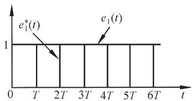

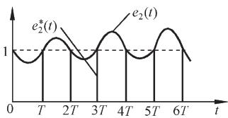  
  
图 7-19 具有相同 $z$ 变换式的两个时间函数

$( 2 ) z$ 变换的收敛区间

对于拉氏变换，其存在性条件是下列绝对值积分收敛：

$$
\int_ {0} ^ {\infty} \left| e (t) \mathrm {e} ^ {- a T} \right| \mathrm {d} t <   \infty
$$

相应地， $z$ 变换也有存在性问题。为此，需要研究 $z$ 变换的收敛区间。通常， $z$ 变换定义为

$$
E (z) = \sum_ {n = - \infty} ^ {\infty} e (n T) z ^ {- n}
$$

称为双边 $z$ 变换。由于 $z { = } \mathbf { e } ^ { s T }$ ，令 $s { = } \sigma { + } \mathrm { j } \omega$ ，则 $z { = } \mathrm { e } ^ { \sigma T } \mathrm { e } ^ { \mathrm { j } \omega T }$ 。若令 $r = \rvert \boldsymbol z \rvert = \mathrm e ^ { \sigma T }$ ，则有

$$
z = r \mathrm {e} ^ {\mathrm {j} \omega T}
$$

于是，双边 $z$ 变换可以写为

$$
E (z) = \sum_ {n = - \infty} ^ {\infty} e (n T) r ^ {- n} \mathrm {e} ^ {- \mathrm {j} n \omega T}
$$

显然，上述无穷级数收敛的条件是

$$
\sum_ {n = - \infty} ^ {\infty} \left| e (n T) r ^ {- n} \right| <   \infty \tag {7-47}
$$

若上式满足，则双边 $z$ 变换一致收敛，即 $e ( n T )$ 的 $z$ 变换存在。

在大多数工程问题中，因为 $n { < } 0$ 时， $e ( n T ) { = } 0$ ，所以 $z$ 变换是单边的，其定义式为

$$
E (z) = \sum_ {n = 0} ^ {\infty} e (n T) z ^ {- n}
$$

且 $E ( z )$ 为有理分式函数，因而 $z$ 变换的收敛区间与 $E ( z )$ 的零极点分布有关。例如序列

$$
e (n T) = a ^ {n} 1 (n T)
$$

其 $z$ 变换

$$
E (z) = \sum_ {n = 0} ^ {\infty} a ^ {n} z ^ {- n} = \sum_ {n = 0} ^ {\infty} \left(\frac {a}{z}\right) ^ {n}
$$

上式为一无穷等比级数，其公比为 $a z ^ { - 1 }$ ，只有当 $\scriptstyle | z | = r > | a |$ 时，该无穷级数才是收敛的，其收敛区间为 $| z | > | a |$ 。故有

$$
E (z) = \frac {z}{z - a}, \quad | z | > | a |
$$

不难看出， $E ( z )$ 的零点是 $z { = } 0$ ，极点是 $z { = } a$ ，收敛区如图 7-20所示。

由于大多数工程问题中的 $z$ 变换都存在，因此今后对 $z$ 变换的收敛区间不再特别指出。

  
图 7-20 $E ( z ) = \frac { z } { z - a }$ 的收敛区

# 7-4 离散系统的数学模型

为了研究离散系统的性能，需要建立离散系统的数学模型。与连续系统的数学模型类似，线性离散系统的数学模型有差分方程、脉冲传递函数和离散状态空间表达式三种。本节主要介绍差分方程及其解法，脉冲传递函数的基本概念，以及开环脉冲传递函数和闭环脉冲传递函数的建立方法。有关离散状态空间表达式及其求解，将在本书第九章介绍。

# 1. 离散系统的数学定义

在离散时间系统理论中，所涉及的数字信号总是以序列的形式出现。因此，可以把离散系统抽象为如下数学定义：

将输入序列 r(n)，n=0, 1, 2, …，变换为输出序列 $c ( n )$ 的一种变换关系，称为离散系统。记为

$$
c (n) = F [ r (n) ] \tag {7-48}
$$

其中， $r ( n )$ 和 $c ( n )$ 可以理解为 $t { = } n T$ 时，系统的输入序列 $r ( n T )$ 和输出序列 $c ( n T )$ ， $T$ 为采样周期。

如果式(7-48)所示的变换关系是线性的，则称为线性离散系统；如果这种变换关系是

非线性的，则称为非线性离散系统。

# (1) 线性离散系统

如果离散系统(7-48)满足叠加原理，则称为线性离散系统，即有如下关系式：

若 $c _ { 1 } ( n ) { = } F [ r _ { 1 } ( n ) ]$ ， $c _ { 2 } ( n ) { = } F [ r _ { 2 } ( n ) ]$ ，且有 $r ( n ) { = } a r _ { 1 } ( n ) { \pm } b r _ { 2 } ( n )$ ，其中 $a$ 和 $^ { b }$ 为任意常数，则

$$
\begin{array}{l} c (n) = F [ r (n) ] = F [ a r _ {1} (n) \pm b r _ {2} (n) ] \\ = a F \left[ r _ {1} (n) \right] \pm b F \left[ r _ {2} (n) \right] = a c _ {1} (n) \pm b c _ {2} (n) \\ \end{array}
$$

# (2) 线性定常离散系统

输入与输出关系不随时间而改变的线性离散系统，称为线性定常离散系统。例如，当输入序列为 $r ( n )$ 时，输出序列为 $c ( n )$ ；如果输入序列变为 $r ( n { - } k )$ ，相应的输出序列为$c ( n { - } k )$ ，其中 $k { = } 0 , \pm 1 , \pm 2 , \ \cdots$ ，则这样的系统称为线性定常离散系统。

本章所研究的离散系统为线性定常离散系统，可以用线性定常(常系数)差分方程描述。

# 2. 线性常系数差分方程及其解法

对于一般的线性定常离散系统， $k$ 时刻的输出 $c ( k )$ 不但与 $k$ 时刻的输入 $r ( k )$ 有关，而且与 $k$ 时刻以前的输入 $r ( k { - } 1 )$ , $r ( k { - } 2 )$ , …有关，同时还与 $k$ 时刻以前的输出 $c ( k { - } 1 )$ ,$c ( k { - } 2 )$ , …有关。这种关系一般可以用下列 $n$ 阶后向差分方程来描述：

$$
\begin{array}{l} c (k) + a _ {1} c (k - 1) + a _ {2} c (k - 2) + \dots + a _ {n - 1} c (k - n + 1) + a _ {n} c (k - n) \\ = b _ {0} r (k) + b _ {1} r (k - 1) + \dots + b _ {m - 1} r (k - m + 1) + b _ {m} r (k - m) \\ \end{array}
$$

上式亦可表示为

$$
c (k) = - \sum_ {i = 1} ^ {n} a _ {i} c (k - i) + \sum_ {j = 0} ^ {m} b _ {j} r (k - j) \tag {7-49}
$$

式中， $a _ { i } ( i { = } 1 , 2 , \cdots , n )$ 和 $b _ { j } ( j { = } 0 , 1 , \ \cdots , m )$ 为常系数， $m \leqslant n$ 。式(7-49)称为 $n$ 阶线性常系数差分方程，它在数学上代表一个线性定常离散系统。

线性定常离散系统也可以用如下 $n$ 阶前向差分方程来描述：

$$
\begin{array}{l} c (k + n) + a _ {1} c (k + n - 1) + \dots + a _ {n - 1} c (k + 1) + a _ {n} c (k) \\ = b _ {0} r (k + m) + b _ {1} r (k + m - 1) + \dots + b _ {m - 1} r (k + 1) + b _ {m} r (k) \\ \end{array}
$$

上式也可写为

$$
c (k + n) = - \sum_ {i = 1} ^ {n} a _ {i} c (k + n - i) + \sum_ {j = 0} ^ {m} b _ {j} r (k + m - j) \tag {7-50}
$$

常系数线性差分方程的求解方法有经典法、迭代法和 $z$ 变换法。与微分方程的经典解法类似，差分方程的经典解法也要求出齐次方程的通解和非齐次方程的一个特解，非常不便。这里仅介绍工程上常用的后两种解法。

# (1) 迭代法

若已知差分方程(7-49)或(7-50)，并且给定输出序列的初值，则可以利用递推关系，在计算机上一步一步地算出输出序列。

例 7-14 已知差分方程

$$
c (k) = r (k) + 5 c (k - 1) - 6 c (k - 2)
$$

输入序列 $r ( k ) { = } 1$ ，初始条件为 $c ( 0 ) { = } 0$ ， $c ( 1 ) { = } 1$ ，试用迭代法求输出序列 ${ \mathfrak { c } } ( k ) , k { = } 0 , 1 , 2 , \cdots , 6 \mathrm { ~ _ { \circ ~ } ~ }$

解 根据初始条件及递推关系，得

$$
c (0) = 0
$$

$$
c (1) = 1
$$

$$
c (2) = r (2) + 5 c (1) - 6 c (0) = 6
$$

$$
c (3) = r (3) + 5 c (2) - 6 c (1) = 2 5
$$

$$
c (4) = r (4) + 5 c (3) - 6 c (2) = 9 0
$$

$$
c (5) = r (5) + 5 c (4) - 6 c (3) = 3 0 1
$$

$$
c (6) = r (6) + 5 c (5) - 6 c (4) = 9 6 6
$$

(2) z 变换法

设差分方程如式(7-50)所示，则用 $z$ 变换法解差分方程的实质，是对差分方程两端取$z$ 变换，并利用 $z$ 变换的实数位移定理，得到以 $z$ 为变量的代数方程，然后对代数方程的解 $C ( z )$ 取 $z$ 反变换，求得输出序列 $c ( k )$ 。

例 7-15 试用 $z$ 变换法解下列二阶差分方程：

$$
c ^ {*} (t + 2 T) + 3 c ^ {*} (t + T) + 2 c ^ {*} (t) = 0
$$

或 $c ( k + 2 ) + 3 c ( k + 1 ) + 2 c ( k ) = 0$

设初始条件 $c ( 0 ) { = } 0$ ， $c ( 1 ) { = } 1$ 。

解 对差分方程的每一项进行 $z$ 变换，根据实数位移定理：

$$
\mathscr {K} [ c (k + 2) ] = z ^ {2} C (z) - z ^ {2} c (0) - z c (1) = z ^ {2} C (z) - z
$$

$$
\mathcal {X} \left[ 3 c (k + 1) \right] = 3 z C (z) - 3 z c (0) = 3 z C (z)
$$

$$
\mathcal {X} [ 2 c (k) ] = 2 C (z)
$$

于是，差分方程变换为如下 $z$ 代数方程

$$
\left(z ^ {2} + 3 z + 2\right) C (z) = z
$$

解出 $C ( z ) = { \frac { z } { z ^ { 2 } + 3 z + 2 } } = { \frac { z } { z + 1 } } - { \frac { z } { z + 2 } }$

查 $z$ 变换表 7-2，求出 $z$ 反变换

$$
c ^ {*} (t) = \sum_ {n = 0} ^ {\infty} \left[ (- 1) ^ {n} - (- 2) ^ {n} \right] \delta (t - n T)
$$

或写成 $c ( k ) = ( - 1 ) ^ { k } - ( - 2 ) ^ { k } , \qquad k = 0 , 1 , 2 , \cdots$

差分方程的解，可以提供线性定常离散系统在给定输入序列作用下的输出序列响应特性，但不便于研究系统参数变化对离散系统性能的影响。因此，需要研究线性定常离散系统的另一种数学模型——脉冲传递函数。

# 3. 脉冲传递函数

如果把 $z$ 变换的作用仅仅理解为求解线性常系数差分方程，显然是不够的。 $z$ 变换更

为重要的意义在于导出线性离散系统的脉冲传递函数，给线性离散系统的分析和校正带来极大的方便。

# (1) 脉冲传递函数定义

众所周知，利用传递函数研究线性连续系统的特性，有公认的方便之处。对于线性连续系统，传递函数定义为在零初始条件下，输出量的拉氏变换与输入量的拉氏变换之

  
图 7-21 开环离散系统结构图

比。对于线性离散系统，脉冲传递函数的定义与线性连续系统传递函数的定义类似。

设开环离散系统如图 7-21 所示，如果系统的初始条件为零，输入信号为 $r ( t )$ ，采样后$r ^ { * } ( t )$ 的 $z$ 变换函数为 $R ( z )$ ，系统连续部分的输出为 $c ( t )$ ，采样后 $c ^ { * } ( t )$ 的 $z$ 变换函数为 $C ( z )$ ，则线性定常离散系统的脉冲传递函数定义为

系统输出采样信号的 $z$ 变换与输入采样信号的z变换之比，记为

$$
G (z) = \frac {C (z)}{R (z)} = \frac {\sum_ {n = 0} ^ {\infty} c (n T) z ^ {- n}}{\sum_ {n = 0} ^ {\infty} r (n T) z ^ {- n}} \tag {7-51}
$$

所谓零初始条件，是指在 $t { < } 0$ 时，输入脉冲序列各采样值 $r ( - T ) , r ( - 2 T ) .$ , …以及输出脉冲序列各采样值 $c ( - T ) , c ( - 2 T ) .$ , …均为零。

式(7-51)表明，如果已知 $R ( z )$ 和 $G ( z )$ ，则在零初始条件下，线性定常离散系统的输出采样信号为

$$
c ^ {*} (t) = \mathscr {X} ^ {- 1} [ C (z) ] = \mathscr {X} ^ {- 1} [ G (z) R (z) ]
$$

由于 $R ( z )$ 是已知的，因此求 $c ^ { * } ( t )$ 的关键在于求出系统的脉冲传递函数 $G ( z )$ 。

然而，对大多数实际系统来说，输出往往是连续信号 $c ( t )$ ，而不是采样信号 $c ^ { * } ( t )$ ，如图 7-22 所示。此时，可以在系统输出端虚设一个理想采样开关，如图中虚线所示，它与输入采样开关同步工作，并具有相同的采样周期。如果系统的实际输出 $c ( t )$ 比较平滑，

且采样频率较高，则可用 $c ^ { * } ( t )$ 近似描述 $c ( t )$ 。必须指出，虚设的采样开关是不存在的，它只表明了脉冲传递函数所能描述的，只是输出连续函数 $c ( t )$ 在采样时刻上的离散值 $c ^ { * } ( t )$ 。

  
图 7-22 实际开环离散系统结构图

# (2) 脉冲传递函数意义

对于线性定常离散系统，如果输入为单位脉冲序列

$$
r (n T) = \delta (n T) = \left\{ \begin{array}{l l} 1, & n = 0 \\ 0, & n \neq 0 \end{array} \right.
$$

则系统输出称为单位脉冲响应序列，记为

$$
c (n T) = K (n T)
$$

由于线性定常离散系统的位移不变性(即定常性)，当输入单位脉冲序列沿时间轴后移$k$ 个采样周期，成为 $\delta [ ( n { - } k ) T$ ]时，输出单位脉冲响应序列亦相应后移 $k$ 个采样周期，成为 $K [ ( n { - } k ) T ]$ 。在离散系统理论中， $K ( n T )$ 和 $K [ ( n { - } k ) T$ ]有个专有名称，称为“加权序列”。“加权”的含义是：当对一个连续信号采样时，每一采样时刻的脉冲值，就等于该时刻的函数值。可见，任何一个采样序列，都可以认为是被加了“权”的脉冲序列。

在线性定常离散系统中，如果输入采样信号

$$
r ^ {*} (t) = \sum_ {n = 0} ^ {\infty} r (n T) \delta (t - n T)
$$

是任意的，各采样时刻的输入脉冲值分别为 $r ( 0 ) \delta ( n T ) , r ( T ) \delta \bigl [ ( n - 1 ) T \bigr ] , \cdots , r ( k T )$ $\delta \big [ ( n - k ) T \big ] , \cdots$ ，则相应的输出脉冲值为 $r ( 0 ) K ( n T ) , r ( T ) K \bigl [ ( n - 1 ) T \bigr ] , \cdots , r ( k T ) K \bigl [ ( n - k ) T \bigr ] , \cdots \circ$ 由 $z$ 变换的线性定理可知，系统的输出响应序列可表示为

$$
c (n T) = \sum_ {k = 0} ^ {\infty} K [ (n - k) T ] r (k T) = \sum_ {k = 0} ^ {\infty} K (k T) r [ (n - k) T ]
$$

根据式(7-33)，上式为离散卷积表达式，因而

$$
c (n T) = K (n T) * r (n T)
$$

若令加权序列的 $z$ 变换

$$
K (z) = \sum_ {n = 0} ^ {\infty} K (n T) z ^ {- n}
$$

则由 $z$ 变换的卷积定理

$$
C (z) = K (z) R (z)
$$

或者 $K ( z ) = { \frac { C ( z ) } { R ( z ) } }$ (7-52)

比较式(7-51)与式(7-52)，可知

$$
C (z) = K (z) = \sum_ {n = 0} ^ {\infty} K (n T) z ^ {- n} \tag {7-53}
$$

因此，脉冲传递函数的含义是：系统脉冲传递函数 $G ( z )$ ，就等于系统加权序列 K(nT)的 z变换。

如果描述线性定常离散系统的差分方程为

$$
c (n T) = - \sum_ {k = 1} ^ {n} a _ {k} c [ (n - k) T ] + \sum_ {k = 0} ^ {m} b _ {k} r [ (n - k) T ]
$$

在零初始条件下，对上式进行 $z$ 变换，并应用 $z$ 变换的实数位移定理，可得

$$
C (z) = - \sum_ {k = 1} ^ {n} a _ {k} C (z) z ^ {- k} + \sum_ {k = 0} ^ {m} b _ {k} R (z) z ^ {- k}
$$

整理得 $G ( z ) = { \frac { C ( z ) } { R ( z ) } } = { \frac { \displaystyle \sum _ { k = 0 } ^ { m } b _ { k } z ^ { - k } } { 1 + \displaystyle \sum _ { k = 1 } ^ { n } a _ { k } z ^ { - k } } }$ (7-54) 

这就是脉冲传递函数与差分方程的关系。

由上可见，差分方程、加权序列 $K ( n T )$ 和脉冲传递函数 $G ( z )$ ，都是对系统物理特性的不同数学描述。它们的形式虽然不同，但实质不变，并且可以根据以上关系相互转化。

# (3) 脉冲传递函数求法

连续系统或元件的脉冲传递函数 $G ( z )$ ，可以通过其传递函数 $G ( s )$ 来求取。根据式(7-53)可知，由 $G ( s )$ 求 $G ( z )$ 的方法是：先求 $G ( s )$ 的拉氏反变换，得到脉冲过渡函数 $K ( t )$ ，即

$$
K (t) = \mathscr {S} ^ {- 1} [ G (s) ] \tag {7-55}
$$

再将 $K ( t )$ 按采样周期离散化，得加权序列 $K ( n T )$ ；最后将 $K ( n T )$ 进行 $z$ 变换，按式(7-53)求出 $G ( z )$ 。这一过程比较复杂。其实，如果把 $z$ 变换表 7-2 中的时间函数 $e ( t )$ 看成 $K ( t )$ ，那么表中的 $E ( s )$ 就是 $G ( s )$ (见式(7-55))，而 $E ( z )$ 则相当于 $G ( z )$ 。因此，根据 $z$ 变换表 7-2，可以直接从 $G ( s )$ 得到 $G ( z )$ ，而不必逐步推导。

如果 $G ( s )$ 为阶次较高的有理分式函数，在 $z$ 变换表中找不到相应的 $G ( z )$ ，则需将 $G ( s )$ 展成部分分式，使各部分分式对应的 $z$ 变换都是表中可以查到的形式，同样可以由 $G ( s )$ 直接求出 $G ( z )$ 。

顺便指出，在图 7-22 中，虚设采样开关的输出为采样输出

$$
c ^ {*} (t) = K ^ {*} (t) = \sum_ {n = 0} ^ {\infty} c (n T) \delta (t - n T)
$$

式中， $c ( n T ) { = } K ( n T )$ 为加权序列。对上式取拉氏变换，得脉冲过渡函数的采样拉氏变换

$$
G ^ {*} (s) = \mathscr {L} \left[ K ^ {*} (t) \right] = \sum_ {n = 0} ^ {\infty} K (n T) \mathrm {e} ^ {- n s T}
$$

若令 ${ \boldsymbol { z } } { = } \mathbf { e } ^ { s T }$ ，得脉冲传递函数

$$
G (z) = G ^ {*} (s) \big | _ {s = \frac {1}{T} \ln z} = \sum_ {n = 0} ^ {\infty} K (n T) z ^ {- n}
$$

记为 $G ( z ) = \mathcal { Z } \Big [ G ^ { * } ( s ) \Big ]$ (7-56)

上式表明了加权序列 $K ( n T )$ 的采样拉氏变换与其 $z$ 变换的关系。习惯上，常把式(7-56)表示为

$$
G (z) = \mathscr {X} [ G (s) ]
$$

并称之为 $G ( s )$ 的 $z$ 变换，这时应理解为根据 $G ( s )$ 按式(7-53)求出所对应的 $G ( z )$ ，但不能理解为 $G ( s )$ 的 $z$ 变换就是 $G ( z )$ 。

例 7-16 设某环节的差分方程为

$$
c (n T) = r \left[ (n - k) T \right]
$$

试求其脉冲传递函数 $G ( z )$ 。

解 对差分方程取 $z$ 变换，并由实数位移定理得

$$
C (z) = z ^ {- k} R (z), \quad G (z) = z ^ {- k}
$$

当 $k { = } 1$ 时， $G ( z ) { = } z ^ { - 1 }$ ，在离散系统中其物理意义是代表一个延迟环节。它把其输入序列右移一个采样周期后再输出。

例 7-17 设图 7-22 所示开环系统中的

$$
G (s) = \frac {a}{s (s + a)}
$$

试求相应的脉冲传递函数 $G ( z )$ 。

解 将 $G ( s )$ 展成部分分式形式

$$
G (s) = \frac {1}{s} - \frac {1}{s + a}
$$

查 $z$ 变换表得

$$
G (z) = \frac {z}{z - 1} - \frac {z}{z - \mathrm {e} ^ {- a T}} = \frac {z \left(1 - \mathrm {e} ^ {- a T}\right)}{\left(z - 1\right) \left(z - \mathrm {e} ^ {- a T}\right)}
$$

# 4. 开环系统脉冲传递函数

当开环离散系统由几个环节串联组成时，其脉冲传递函数的求法与连续系统情况不完全相同。即使两个开环离散系统的组成环节完全相同，但由于采样开关的数目和位置不同，求出的开环脉冲传递函数也会截然不同。为了便于求出开环脉冲传递函数，需要了解采样函数拉氏变换 $G ^ { * } ( s )$ 的有关性质。

(1) 采样拉氏变换的两个重要性质   
1) 采样函数的拉氏变换具有周期性，即

$$
G ^ {*} (s) = G ^ {*} \left(s + j k \omega_ {s}\right) \tag {7-57}
$$

其中， $\omega _ { s }$ 为采样角频率。

证明 由式(7-10)知

$$
G ^ {*} (s) = \frac {1}{T} \sum_ {n = - \infty} ^ {\infty} G (s + j n \omega_ {s}) \tag {7-58}
$$

其中 $T$ 为采样周期。因此，令 $\scriptstyle s = s + \mathrm { j } k \omega _ { s }$ ，必有

$$
G ^ {*} (s + \mathrm {j} k \omega_ {s}) = \frac {1}{T} \sum_ {n = - \infty} ^ {\infty} G [ s + \mathrm {j} (n + k) \omega_ {s} ]
$$

在上式中，令 $l { = } n { + } k$ ，可得

$$
G ^ {*} (s + \mathrm {j} k \omega_ {s}) = \frac {1}{T} \sum_ {l = - \infty} ^ {\infty} G (s + \mathrm {j} l \omega_ {s})
$$

由于求和与符号无关，再令 $l { = } n$ ，证得

$$
G ^ {*} (s + \mathrm {j} k \omega_ {s}) = \frac {1}{T} \sum_ {n = - \infty} ^ {\infty} G (s + \mathrm {j} n \omega_ {s}) = G ^ {*} (s)
$$

2) 若采样函数的拉氏变换 $E ^ { * } ( s )$ 与连续函数的拉氏变换 $G ( s )$ 相乘后再离散化，则 $\boldsymbol { E } ^ { * } ( s )$ 可以从离散符号中提出来，即

$$
\left[ G (s) E ^ {*} (s) \right] ^ {*} = G ^ {*} (s) E ^ {*} (s) \tag {7-59}
$$

证明 根据式(7-58)，有

$$
\left[ G (s) E ^ {*} (s) \right] ^ {*} = \frac {1}{T} \sum_ {n = - \infty} ^ {\infty} \left[ G (s + j n \omega_ {s}) E ^ {*} (s + j n \omega_ {s}) \right]
$$

  
脉冲传递

再由式(7-57)知

$$
E ^ {*} (s + \mathrm {j} n \omega_ {s}) = E ^ {*} (s)
$$

于是

$$
\left[ G (s) E ^ {*} (s) \right] ^ {*} = \frac {1}{T} \sum_ {n = - \infty} ^ {\infty} \left[ G (s + \mathrm {j} n \omega_ {s}) E ^ {*} (s) \right] = E ^ {*} (s) \cdot \frac {1}{T} \sum_ {n = - \infty} ^ {\infty} G (s + \mathrm {j} n \omega_ {s})
$$

再由式(7-58)，即证得

$$
\left[ G (s) E ^ {*} (s) \right] ^ {*} = G ^ {*} (s) E ^ {*} (s)
$$

# (2) 有串联环节时的开环系统脉冲传递函数

如果开环离散系统由两个串联环节构成，则开环系统脉冲传递函数的求法与连续系统情况不完全相同。这是因为在两个环节串联时，有两种不同的情况。

1) 串联环节之间有采样开关。设开环离散系统如图 7-23(a)所示，在两个串联连续环节 $G _ { 1 } ( s )$ 和 $G _ { 2 } ( s )$ 之间，有理想采样开关隔开。根据脉冲传递函数定义，由图 7-23(a)可得

$$
D (z) = G _ {1} (z) R (z), \qquad C (z) = G _ {2} (z) D (z)
$$

其中， $G _ { 1 } ( z )$ 和 $G _ { 2 } ( z )$ 分别为 $G _ { 1 } ( s )$ 和 $G _ { 2 } ( s )$ 的脉冲传递函数。于是有

$$
C (z) = G _ {2} (z) G _ {1} (z) R (z)
$$

因此，开环系统脉冲传递函数

$$
G (z) = \frac {C (z)}{R (z)} = G _ {1} (z) G _ {2} (z) \tag {7-60}
$$

式(7-60)表明，有理想采样开关隔开的两个线性连续环节串联时的脉冲传递函数，等于这两个环节各自的脉冲传递函数之积。这一结论，可以推广到类似的 $n$ 个环节相串联时的情况。

  
(a)串联环节之间有采样开关

  
(b)串联环节之间无采样开关   
图 7-23 环节串联时的开环离散系统脉冲传递函数

2) 串联环节之间无采样开关。设开环离散系统如图 7-23(b)所示，在两个串联连续环节 $G _ { 1 } ( s )$ 和 $G _ { 2 } ( s )$ 之间，没有理想采样开关隔开。显然，系统连续信号的拉氏变换为

$$
C (s) = G _ {1} (s) G _ {2} (s) R ^ {*} (s)
$$

式中， $\boldsymbol { R } ^ { * } ( s )$ 为输入采样信号 $r ^ { * } ( t )$ 的拉氏变换，即

$$
R ^ {*} (s) = \sum_ {n = 0} ^ {\infty} r (n T) e ^ {- n s T}
$$

对输出 $C ( s )$ 离散化，并根据采样拉氏变换性质(7-59)，有

$$
C ^ {*} (s) = \left[ G _ {1} (s) G _ {2} (s) R ^ {*} (s) \right] ^ {*} = \left[ G _ {1} (s) G _ {2} (s) \right] ^ {*} R ^ {*} (s) = G _ {1} G _ {2} ^ {*} (s) R ^ {*} (s) \tag {7-61}
$$

式中 ${ G _ { 1 } } { G _ { 2 } } ^ { * } ( s ) = \lbrack { G _ { 1 } } ( s ) G _ { 2 } ( s ) \rbrack ^ { * } = \frac { 1 } { T } \sum _ { n = - \infty } ^ { \infty } G _ { 1 } ( s + \mathrm { j } n \omega _ { s } ) G _ { 2 } ( s + \mathrm { j } n \omega _ { s } )$

通常

$$
G _ {1} G _ {2} ^ {*} (s) \neq G _ {1} ^ {*} (s) G _ {2} ^ {*} (s)
$$

对式(7-61)取 $z$ 变换，得

$$
C (z) = G _ {1} G _ {2} (z) R (z)
$$

式中， $G _ { 1 } G _ { 2 } ( z )$ 定义为 $G _ { 1 } ( s )$ 和 $G _ { 2 } ( s )$ 乘积的 $z$ 变换。于是，开环系统脉冲传递函数

$$
G (z) = \frac {C (z)}{R (z)} = G _ {1} G _ {2} (z) \tag {7-62}
$$

式(7-62)表明，没有理想采样开关隔开的两个线性连续环节串联时的脉冲传递函数，等于这两个环节传递函数乘积后的相应 $z$ 变换。这一结论也可以推广到类似的 $n$ 个环节相串联时的情况。

显然，式(7-60)与式(7-62)是不等的，即

$$
G _ {1} (z) G _ {2} (z) \neq G _ {1} G _ {2} (z)
$$

从这种意义上说， $z$ 变换无串联性。下例可以说明这一点。

例 7-18 设开环离散系统如图 7-23(a)及(b)所示，其中 $G _ { 1 } ( s ) { = } 1 / s$ ， $\scriptstyle { G _ { 2 } ( s ) = a / ( s + a ) }$ ，输入信号 ${ \boldsymbol { r } } ( t ) { = } 1 ( t )$ ，试求系统(a)和(b)的脉冲传递函数 $G ( z )$ 和输出的 $z$ 变换 $C ( z )$ 。

解 查 $z$ 变换表，输入 ${ \boldsymbol { r } } ( t ) { = } 1 ( t )$ 的 $z$ 变换为

$$
R (z) = \frac {z}{z - 1}
$$

对于系统(a)

$$
G _ {1} (z) = \mathcal {X} \left[ \frac {1}{s} \right] = \frac {z}{z - 1}, \quad G _ {2} (z) = \mathcal {X} \left[ \frac {a}{s + a} \right] = \frac {a z}{z - e ^ {- a T}}
$$

有 $G ( z ) = G _ { 1 } ( z ) G _ { 2 } ( z ) = { \frac { a z ^ { 2 } } { ( z - 1 ) ( z - \mathrm { e } ^ { - a T } ) } }$

$$
C (z) = G (z) R (z) = \frac {a z ^ {3}}{(z - 1) ^ {2} (z - e ^ {- a T})}
$$

对于系统(b)

$$
G _ {1} (s) G _ {2} (s) = \frac {a}{s (s + a)}
$$

有 $G ( z ) = G _ { 1 } G _ { 2 } ( z ) = \mathcal { Z } \left[ \frac { a } { s ( s + a ) } \right] = \frac { z ( 1 - \mathrm { e } ^ { - a T } ) } { ( z - 1 ) ( z - \mathrm { e } ^ { - a T } ) }$

$$
C (z) = G (z) R (z) = \frac {z ^ {2} \left(1 - e ^ {- a T}\right)}{\left(z - 1\right) ^ {2} \left(z - e ^ {- a T}\right)}
$$

显然，在串联环节之间有无同步采样开关隔离时，其总的脉冲传递函数和输出 $z$ 变换是不相同的。但是，不同之处仅表现在其零点不同，极点仍然一样。这也是离散系统特有的现象。

# (3) 有零阶保持器时的开环系统脉冲传递函数

设有零阶保持器的开环离散系统如图 7-24(a)所示。图中， $G _ { h } ( s )$ 为零阶保持器传递函数， $G _ { o } ( s )$ 为连续部分传递函数，两个串联环节之间无同步采样开关隔离。由于 $G _ { h } ( s )$ 不是$s$ 的有理分式函数，因此不便于用求串联环节脉冲传递函数的式(7-62)求出开环系统脉冲传递函数。如果将图 7-24(a)变换为图 7-24(b)所示的等效开环系统，则有零阶保持器时的开环系统脉冲传递函数的推导将是比较简单的。

  
(a)开环离散系统  
(b)等效开环离散系统  
图 7-24 有零阶保持器的开环离散系统结构图

由图 7-24(b)可得

$$
C (s) = \left[ \frac {G _ {o} (s)}{s} - \mathrm {e} ^ {- s T} \frac {G _ {o} (s)}{s} \right] R ^ {*} (s) \tag {7-63}
$$

因为 $\mathbf { e } ^ { - s T }$ 为延迟一个采样周期的延迟环节，所以 $\mathrm { e } ^ { - s T } G _ { o } ( s ) / s$ 对应的采样输出比 $G _ { o } ( s ) / s$ 对应的采样输出延迟一个采样周期。对式(7-63)进行 $z$ 变换，根据实数位移定理及采样拉氏变换性质式(7-59)，可得

$$
C (z) = \mathcal {X} \left[ \frac {G _ {o} (s)}{s} \right] R (z) - z ^ {- 1} \mathcal {X} \left[ \frac {G _ {o} (s)}{s} \right] R (z)
$$

于是，有零阶保持器时，开环系统脉冲传递函数

$$
G (z) = \frac {C (z)}{R (z)} = \left(1 - z ^ {- 1}\right) \mathcal {X} \left[ \frac {G _ {o} (s)}{s} \right] \tag {7-64}
$$

当 $G _ { o } ( s )$ 为 $s$ 有理分式函数时，式(7-64)中的 $z$ 变换 $\mathcal { Z } [ G _ { o } ( s ) / s ]$ 也必然是 $z$ 的有理分式函数。

例 7-19 设离散系统如图 7-24(a)所示，已知

$$
G _ {o} (s) = \frac {a}{s (s + a)}
$$

试求系统的脉冲传递函数 $G ( z )$ 。

解 因为

$$
\frac {G _ {o} (s)}{s} = \frac {a}{s ^ {2} (s + a)} = \frac {1}{s ^ {2}} - \frac {1}{a} \left(\frac {1}{s} - \frac {1}{s + a}\right)
$$

查 $z$ 变换表 7-2，有

$$
\begin{array}{l} \mathcal {X} \left[ \frac {G _ {o} (s)}{s} \right] = \frac {T z}{(z - 1) ^ {2}} - \frac {1}{a} \left(\frac {z}{z - 1} - \frac {z}{z - e ^ {- a T}}\right) \\ = \frac {\frac {1}{a} z \left[ \left(\mathrm {e} ^ {- a T} + a T - 1\right) z + \left(1 - a T \mathrm {e} ^ {- a T} - \mathrm {e} ^ {- a T}\right) \right]}{\left(z - 1\right) ^ {2} \left(z - \mathrm {e} ^ {- a T}\right)} \\ \end{array}
$$

因此，有零阶保持器的开环系统脉冲传递函数

$$
\begin{array}{l} G (z) = \left(1 - z ^ {- 1}\right) \mathcal {K} \left[ \frac {G _ {o} (s)}{s} \right] \\ = \frac {\frac {1}{a} \left[ \left(\mathrm {e} ^ {- a T} + a T - 1\right) z + \left(1 - a T \mathrm {e} ^ {- a T} - \mathrm {e} ^ {- a T}\right) \right]}{(z - 1) (z - \mathrm {e} ^ {- a T})} \\ \end{array}
$$

现在，把上述结果与例 7-17所得结果作一比较。在例 7-17中，连续部分的传递函数与本例相同，但是没有零阶保持器。比较两例的开环系统脉冲传递函数可知，两者极点完全相同，仅零点不同。所以说，零阶保持器不影响离散系统脉冲传递函数的极点。

# 5. 闭环系统脉冲传递函数

由于采样器在闭环系统中可以有多种配置的可能性，因此闭环离散系统没有唯一的

结构图形式。图 7-25是一种比较常见的误差采样闭环离散系统结构图。图中，虚线所示的理想采样开关是为了便于分析而虚设的，输入采样信号 $r ^ { * } ( t )$ 和反馈采样信号$b ^ { * } ( t )$ 事实上并不存在。图中所有理想采样开关都同步工作，采样周期为 $T _ { \varsigma }$ 。

由图 7-25 可见，连续输出信号和误差信号的拉氏变换为

$$
\begin{array}{l} C (s) = G (s) E ^ {*} (s) \\ E (s) = R (s) - H (s) C (s) \\ \end{array}
$$

  
图 7-25 闭环离散系统结构图

因此有

$$
E (s) = R (s) - H (s) G (s) E ^ {*} (s)
$$

于是，误差采样信号 $e ^ { * } ( t )$ 的拉氏变换

$$
E ^ {*} (s) = R ^ {*} (s) - H G ^ {*} (s) E ^ {*} (s)
$$

整理得 $\boldsymbol { E } ^ { * } ( \boldsymbol { s } ) = \frac { \boldsymbol { R } ^ { * } ( \boldsymbol { s } ) } { 1 + H \boldsymbol { G } ^ { * } ( \boldsymbol { s } ) }$ (7-65)

由于 $C ^ { ^ { * } } ( s ) = \Bigl [ G ( s ) E ^ { ^ * } ( s ) \Bigr ] ^ { * } = G ^ { ^ * } ( s ) E ^ { ^ * } ( s ) = { \frac { G ^ { ^ * } ( s ) } { 1 + H G ^ { ^ * } ( s ) } } R ^ { ^ * } ( s )$ * ( )  R s (7-66)

所以对式(7-65)及式(7-66)取 $z$ 变换，可得

$$
E (z) = \frac {1}{1 + H G (z)} R (z) \tag {7-67}
$$

$$
C (z) = \frac {G (z)}{1 + H G (z)} R (z) \tag {7-68}
$$

根据式(7-67)，定义

$$
\Phi_ {e} (z) = \frac {E (z)}{R (z)} = \frac {1}{1 + H G (z)} \tag {7-69}
$$

为闭环离散系统对于输入量的误差脉冲传递函数。根据式(7-68)，定义

$$
\Phi (z) = \frac {C (z)}{R (z)} = \frac {G (z)}{1 + H G (z)} \tag {7-70}
$$

为闭环离散系统对于输入量的脉冲传递函数。

式(7-69)和式(7-70)是研究闭环离散系统时经常用到的两个闭环脉冲传递函数。与连续系统相类似，令 $\phi ( z )$ 或 $\phi _ { e } ( z )$ 的分母多项式为零，便可得到闭环离散系统的特征方程

$$
D (z) = 1 + G H (z) = 0 \tag {7-71}
$$

式中， $G H ( z )$ 为离散系统开环脉冲传递函数。

需要指出，闭环离散系统脉冲传递函数不能从 $\phi ( s )$ 和 $\phi _ { e } ( s )$ 求 $z$ 变换得来，即

$$
\Phi (z) \neq \mathscr {X} [ \Phi (s) ], \quad \Phi_ {e} (z) \neq \mathscr {X} [ \Phi_ {e} (s) ]
$$

这种原因，也是由于采样器在闭环系统中有多种配置之故。

通过与上面类似的方法，还可以推导出采样器为不同配置形式的其他闭环系统的脉冲传递函数。但是，只要误差信号 $e ( t )$ 处没有采样开关，输入采样信号 $r ^ { * } ( t )$ (包括虚构的$r ^ { * } ( t ) )$ 便不存在，此时不可能求出闭环离散系统对于输入量的脉冲传递函数，而只能求出输出采样信号的 $z$ 变换函数 $C ( z )$ 。

例 7-20 设闭环离散系统结构图如图 7-26 所示，试证其闭环脉冲传递函数为

$$
\Phi (z) = \frac {G _ {1} (z) G _ {2} (z)}{1 + G _ {1} (z) H G _ {2} (z)}
$$

证明 由图 7-26 得

$$
C (s) = G _ {2} (s) E _ {1} ^ {*} (s), \quad E _ {1} (s) = G _ {1} (s) E ^ {*} (s)
$$

对 $E _ { 1 } ( s )$ 离散化，有

$$
E _ {1} ^ {*} (s) = G _ {1} ^ {*} (s) E ^ {*} (s), \quad C (s) = G _ {2} (s) G _ {1} ^ {*} (s) E ^ {*} (s)
$$

考虑到

$$
E (s) = R (s) - H (s) C (s) = R (s) - H (s) G _ {2} (s) G _ {1} ^ {*} (s) E ^ {*} (s)
$$

  
图 7-26 闭环离散系统结构图

离散化后，有

$E ^ { ^ { * } } ( s ) = R ^ { ^ { * } } ( s ) - H G _ { 2 } ^ { ^ { * } } ( s ) G _ { 1 } ^ { ^ { * } } ( s ) E ^ { ^ { * } } ( s )$ 即 * ( ) E s  $\boldsymbol { E } ^ { * } ( s ) = \frac { \boldsymbol { R } ^ { * } ( s ) } { 1 + \boldsymbol { G } _ { 1 } ^ { * } ( s ) H \boldsymbol { G } _ { 2 } ^ { * } ( s ) }$

所以，输出信号的采样拉氏变换

$$
C ^ {*} (s) = G _ {2} ^ {*} (s) G _ {1} ^ {*} (s) E ^ {*} (s) = \frac {G _ {1} ^ {*} (s) G _ {2} ^ {*} (s) R ^ {*} (s)}{1 + G _ {1} ^ {*} (s) H G _ {2} ^ {*} (s)}
$$

对上式进行 $z$ 变换，证得

$$
\Phi (z) = \frac {C (z)}{R (z)} = \frac {G _ {1} (z) G _ {2} (z)}{1 + G _ {1} (z) H G _ {2} (z)}
$$

对于采样器在闭环系统中具有各种配置的闭环离散系统典型结构图，及其输出采样信号的 $z$ 变换函数 $C ( z )$ ，可参见表 7-3。

表 7-3 典型闭环离散系统及输出 $Z$ 变换函数  

<table><tr><td>序号</td><td>系统结构图</td><td>C(z)计算式</td></tr><tr><td>1</td><td>R(s)G(s)C(s)H(s)</td><td>G(z)R(z)/1+GH(z)</td></tr><tr><td>2</td><td>R(s)G1(s)G2(s)C(s)H(s)</td><td>RG1(z)G2(z)/1+G2HG1(z)</td></tr><tr><td>3</td><td>R(s)G(s)C(s)H(s)</td><td>G(z)R(z)/1+G(z)H(z)</td></tr><tr><td>4</td><td>R(s)G1(s)G2(s)C(s)H(s)</td><td>G1(z)G2(z)R(z)/1+G1(z)G2H(z)</td></tr><tr><td>5</td><td>R(s)G1(s)G2(s)C(s)H(s)</td><td>RG1(z)G2(z)G3(z)/1+G2(z)G1G3H(z)</td></tr><tr><td>6</td><td>R(s)G(s)C(s)H(s)</td><td>RG(z)/1+HG(z)</td></tr><tr><td>7</td><td>R(s)G(s)C(s)H(s)</td><td>R(z)G(z)/1+G(z)H(z)</td></tr><tr><td>8</td><td>R(s)G1(s)G2(s)C(s)H(s)</td><td>G1(z)G2(z)R(z)/1+G1(z)G2(z)H(z)</td></tr></table>

# 6. z变换法的局限性

$z$ 变换法是研究线性定常离散系统的一种有效工具，但是 $z$ 变换法也有其本身的局限性，应用 $z$ 变换法分析线性定常离散系统时，必须注意以下几方面问题。

(1) $z$ 变换的推导是建立在假定采样信号可以用理想脉冲序列来近似的基础上，每个理想脉冲的面积，等于采样瞬时上的时间函数。这种假定，只有当采样持续时间与系统的最大时间常数相比是很小的时候，才能成立。  
(2) 输出 $z$ 变换函数 $C ( z )$ ，只确定了时间函数 $c ( t )$ 在采样瞬时上的数值，不能反映 $c ( t )$ 在采样间隔中的信息。因此对于任何 $C ( z )$ ， $z$ 反变换 $c ( n T )$ 只能代表 $c ( t )$ 在采样瞬时$t { = } n T ( n { = } 0 , 1 , 2 , \cdots )$ 时的数值。  
(3) 用 $z$ 变换法分析离散系统时，系统连续部分传递函数 $G ( s )$ 的极点数至少要比其零点数多两个，即 $G ( s )$ 的脉冲过渡函数 $K ( t )$ 在 $\scriptstyle { t = 0 }$ 时必须没有跳跃，或者满足

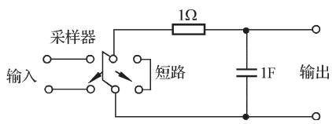  
图 7-27 RC 积分网络

$$
\lim  _ {s \rightarrow \infty} s G (s) = 0 \tag {7-72}
$$

否则，用 $z$ 变换法得到的系统采样输出 $c ^ { * } ( t )$ 与实际连续输出 $c ( t )$ 差别较大，甚至完全不符。

例 7-21 设 RC 积分网络如图 7-27 所示，其输入 ${ \boldsymbol { r } } ( t ) { = } 1 ( t )$ ，采样周期 $T { = } 1 \mathrm { s }$ ，试比较 $c ^ { * } ( t )$ 与 $c ( t )$ 。

解 网络传递函数

$$
G _ {o} (s) = \frac {1}{s + 1}
$$

相应的 $z$ 变换为

$$
G (z) = \frac {z}{z - e ^ {- T}} = \frac {z}{z - 0 . 3 6 8}
$$

而输入 $z$ 变换

$$
R (z) = \frac {z}{z - 1}
$$

因此，网络输出 $z$ 变换函数

$$
\begin{array}{l} C (z) = G (z) R (z) = \frac {z ^ {2}}{(z - 1) (z - 0 . 3 6 8)} \\ = 1 + 1. 3 6 8 z ^ {- 1} + 1. 5 z ^ {- 2} + 1. 5 5 z ^ {- 3} + 1. 5 6 z ^ {- 4} + \dots \\ \end{array}
$$

上式取 $z$ 反变换，得输出采样信号

$$
c ^ {*} (t) = \delta (t) + 1. 3 6 8 \delta (t - 1) + 1. 5 \delta (t - 2) + 1. 5 5 \delta (t - 3) + 1. 5 6 \delta (t - 4) + \dots
$$

于是，可以画出 $c ( t )$ 在采样瞬时的值 $c ( n T ) ( T { = } 1 , n { = } 0 , 1 , 2 , \cdots )$ ，如图 7-28(a)所示。如果采用拉氏变换的方法，可以求出当连续部分的输入为 $r ^ { * } ( t ) { = } \delta _ { T } ( t )$ 时，系统的连续输出 $c ( t )$ ，如图 7-28(b)所示。

由图可见，在 $c ^ { * } ( t )$ 曲线中，将其采样瞬时的幅值连接起来所画出的光滑曲线，与实际的 $c ( t )$ 有显著差别，这是因为此时 $G ( s )$ 不满足式(7-72)。

  
  
图 7-28 积分网络的采样输出响应和连续输出响应(MATLAB)

# 7-5 离散系统的稳定性与稳态误差

正如在线性连续系统分析中的情况一样，稳定性和稳态误差也是线性定常离散系统分析的重要内容。本节主要讨论如何在 $z$ 域和 $w$ 域中分析离散系统的稳定性，同时给出计算离散系统在采样瞬时稳态误差的方法。

为了把连续系统在 $s$ 平面上分析稳定性的结果移植到在 $z$ 平面上分析离散系统的稳定性，首先需要研究 $s$ 平面与 $z$ 平面的映射关系。

# $1 . s$ 域到 $Z$ 域的映射

在 $z$ 变换定义中， $z { = } \mathrm { e } ^ { s T }$ 给出了 $s$ 域到 $z$ 域的关系。 $s$ 域中的任意点可表示为 $s { = } \sigma { + } \mathrm { j } \omega$ ，映射到 $z$ 域则为

$$
z = \mathrm {e} ^ {(\sigma + \mathrm {j} \omega) T} = \mathrm {e} ^ {\sigma T} \mathrm {e} ^ {\mathrm {j} \omega T}
$$

于是， $s$ 域到 $z$ 域的基本映射关系式为

$$
\left| z \right| = \mathrm {e} ^ {\sigma T}, \quad \angle z = \omega T \tag {7-73}
$$

令 $\sigma { = } 0$ ，相当于取 $s$ 平面的虚轴，当从 $- \infty$ 变到 $\infty$ 时，由式(7-73)知，映射到 $z$ 平面的轨迹是以原点为圆心的单位圆。只是当 $s$ 平面上的点沿虚轴从 $- \infty$ 移到 $\infty$ 时， $z$ 平面上的相应点已经沿着单位圆转过了无穷多圈。这是因为当 $s$ 平面上的点沿虚轴从s/2 移动到$\omega _ { s } / 2$ 时,其中 $\omega _ { s }$ 为采样角频率， $z$ 平面上的相应点沿单位圆从 $- \pi$ 逆时针变化到π(见式(7-73)中 $\angle z$ 计算式)，正好转了一圈；而当 $s$ 平面上的点在虚轴上从 $\omega _ { s } / 2$ 移动到 $3 \omega _ { s } / 2$ 时， $z$ 平面上的相应点又将逆时针沿单位圆转过一圈。以此类推，如图 7-29所示。由图可见，可以把 $s$ 平面划分为无穷多条平行于实轴的周期带，其中从 $- \omega _ { s } / 2$ 到 $\omega _ { s } / 2$ 的周期带称为主要带，其余的周期带称为次要带。为了研究 $s$ 平面上的主要带在 $z$ 平面上的映射，可分以下几种情况讨论。

# (1) 等 $\sigma$ 线映射

$s$ 平面上的等 $\sigma$ 垂线，映射到 $z$ 平面上的轨迹，是以原点为圆心，以 $\vert z \vert { = } \mathrm { e } ^ { \sigma T }$ 为半径的圆，其中 $T$ 为采样周期，如图 7-30 所示。由于 $s$ 平面上的虚轴映射为 $z$ 平面上的单位圆，所以左半 $s$ 平面上的等 $\sigma$ 线映射为 $z$ 平面上的同心圆，在单位圆内；右半 $s$ 平面上的等$\sigma$ 线映射为 $z$ 平面上的同心圆，在单位圆外。

  
图 7-29 $s$ 平面虚轴在 $z$ 平面上的映射

  
图 7-30 $s$ 平面和 $z$ 平面上的等轨迹

# (2) 等 $\omega$ 线映射

在特定采样周期 $T$ 情况下，由式(7-73)可知， $s$ 平面上的等 $\omega$ 水平线映射到 $z$ 平面上

的轨迹，是一簇从原点出发的射线，其相角 ${ \angle { z } } { = } { \omega } T$ 从正实轴计量，如图 7-31 所示。由图可见， $s$ 平面上$\omega \mathrm { = } \omega _ { s } / 2$ 水平线，在 $z$ 平面上正好映射为负实轴。

# (3) 等 线映射

$s$ 平面上的等线可用下式描述：

$$
s = - \omega \tan \beta + j \omega
$$

其中， $\beta$ 为 线与虚轴之间的夹角。

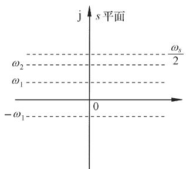

  
  
图 7-31 $s$ 平面和 $z$ 平面上的等 $\omega$ 轨迹

于是

$$
z = \mathrm {e} ^ {s T} = \mathrm {e} ^ {(- \omega \tan \beta + j \omega) T}
$$

因此，等 $\zeta$ 线从 $s$ 域到 $z$ 域的映射关系式为

$$
\left| z \right| = \mathrm {e} ^ {- \left(2 \pi / \omega_ {s}\right) \omega \tan \beta}, \quad \angle z = \frac {2 \pi \omega}{\omega_ {s}} \tag {7-74}
$$

由式(7-74)可见，除 $\beta = 0 ^ { \circ }$ 和 $\beta { = } 9 0 ^ { \circ }$ 外，当 $\beta$ 为常数时，左半 $s$ 平面上的等 线，映射为 $z$ 平面上单位圆内一簇收敛的对数螺旋线，其起点为 $z$ 平面上正实轴的1处，终点为 $z$ 平面的原点。图 7-32表示了 $\beta { = } 3 0 ^ { \circ }$ 的等 $\zeta$ 线映射关系。

有了以上映射关系，现在可以讨论 $s$ 平面上周期带在 $z$ 平面上的映射。设 $s$ 平面上的主要带如图7-33(a)所示，通过 $z { = } \mathrm { e } ^ { s T }$ 变换，映射为 $z$ 平面上的单位圆及单位圆内的负实轴，如图 7-33(b)所示。类似地，由于

$$
\mathrm {e} ^ {(s + j n \omega_ {s}) T} = \mathrm {e} ^ {s T} \mathrm {e} ^ {j 2 n \pi} = \mathrm {e} ^ {s T} = z
$$

因此 $s$ 平面上所有的次要带，在 $z$ 平面上均映射为相同的单位圆及单位圆内的负实轴。

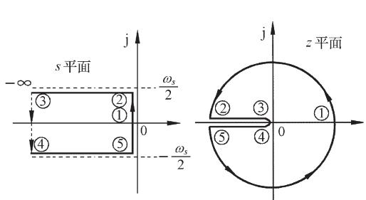  
  
  
图 7-32 $s$ 平面和 $z$ 平面上的等 轨迹 $\beta { = } 3 0 ^ { \circ }$ )  
图 7-33 左半 $s$ 平面上的主要带在 $z$ 平面上的映射

# 2. 离散系统稳定的充分必要条件

定义 若离散系统在有界输入序列作用下，其输出序列也是有界的，则称该离散系统是稳定的。

众所周知，在线性定常连续系统中，系统稳定的充分必要条件是指：系统齐次微分方程的解是收敛的，或者系统特征方程式的根均具有负实部，或者系统传递函数的极点均位于左半 $s$ 平面。连续系统这种在时域或 $s$ 域描述系统稳定性的方法同样可以推广到离散系统。对于线性定常离散系统，时域中的数学模型是线性定常差分方程， $z$ 域中的数学模型是脉冲传递函数，因此线性定常离散系统稳定的充分必要条件，可以从以下两方面进行研究。

(1) 时域中离散系统稳定的充分必要条件

设线性定常差分方程如式(7-49)所示，即

$$
c (k) = - \sum_ {i = 1} ^ {n} a _ {i} c (k - i) + \sum_ {j = 0} ^ {m} b _ {j} r (k - j)
$$

其齐次差分方程为

$$
c (k) + \sum_ {i = 1} ^ {n} a _ {i} c (k - i) = 0
$$

设通解为 $A d$ ，代入齐次方程，得

或

$$
A \alpha^ {l} + a _ {1} A \alpha^ {l - 1} + \dots + a _ {n} A \alpha^ {l - n} = 0
$$

$$
A \alpha^ {l} \left(\alpha^ {0} + a _ {1} \alpha^ {- 1} + \dots + a _ {n} \alpha^ {- n}\right) = 0
$$

因 $A d ^ { l } \neq 0$ ，故必有

$$
\alpha^ {0} + a _ {1} \alpha^ {- 1} + \dots + a _ {n} \alpha^ {- n} = 0
$$

以 $\alpha ^ { n }$ 乘以上式，得差分方程的特征方程

$$
\alpha^ {n} + a _ {1} \alpha^ {n - 1} + a _ {2} \alpha^ {n - 2} + \dots + a _ {n} = 0 \tag {7-75}
$$

不失一般性，设特征方程(7-75)有各不相同的特征根 $\alpha _ { 1 }$ ， $\alpha _ { 2 }$ ，…， $\alpha _ { n }$ ，则差分方程(7-49)的通解为

$$
c (k) = A _ {1} \alpha_ {1} ^ {l} + A _ {2} \alpha_ {2} ^ {l} + \dots + A _ {n} \alpha_ {n} ^ {l} = \sum_ {i = 1} ^ {n} A _ {i} \alpha_ {i} ^ {l}, \quad k = 0, 1, 2, \dots
$$

式中，系数 $A _ { i }$ 可由给定的 $n$ 个初始条件决定。

当特征方程(7-75)的根 $\vert \alpha _ { i } \vert { < } 1 ( i { = } 1 , 2 , \cdots , n )$ 时，必有 $\operatorname* { l i m } _ { k  \infty } c ( k ) = 0$ ，故系统稳定的充分必要条件是：当且仅当差分方程(7-49)所有特征根的模 $| \alpha _ { i } | { < } 1 ( i { = } 1 , 2 , \cdots , n )$ ，相应的线性定常离散系统是稳定的。

$( 2 ) z$ 域中离散系统稳定的充分必要条件

设典型离散系统结构图如图 7-25 所示，其特征方程为式(7-71)，即

$$
D (z) = 1 + G H (z) = 0
$$

不失一般性，设特征方程(7-71)的根或闭环脉冲传递函数(7-70)的极点为各不相同的 $z _ { 1 } ,$ ,$z _ { 2 }$ , …, $z _ { n }$ 。由 $s$ 域到 $z$ 域的映射关系知： $s$ 左半平面映射为 $z$ 平面上的单位圆内的区域，对应稳定区域； $s$ 右半平面映射为 $z$ 平面上的单位圆外的区域，对应不稳定区域； $s$ 平面上的虚轴，映射为 $z$ 平面上的单位圆周，对应临界稳定情况。因此，在 $z$ 域中，线性定常离散系统稳定的充分必要条件是：

当且仅当离散系统特征方程(7-71)的全部特征根均分布在 z平面上的单位圆内，或者所有特征根的模均小于 1， $\scriptstyle  \lceil | z _ { i } | < 1 ( i { = } 1 , 2 , \ { \cdots } , n ) $ ，相应的线性定常离散系统是稳定的。

应当指出：上述稳定条件虽然是从特征方程无重特征根情况下推导出来的，但是对于有重根的情况，也是正确的。此外，在现实系统中，不存在临界稳定情况，设若 $\lvert z _ { i } \rvert = 1$ 或 $\lvert \alpha _ { i } \rvert = 1$ ，在经典控制理论中，系统也属于不稳定范畴。

例 7-22 设一离散系统可用下列差分方程描述：

$$
c (n + 1) - a c (n) = b r (n), \quad c (0) \neq 0
$$

试分析系统稳定的充分必要条件。

解 给定系统相应的齐次方程为

$$
c (n + 1) - a c (n) = 0
$$

利用迭代法，可求出通解

$$
c (n + 1) = a ^ {n + 1} c (0)
$$

由于 $c ( 0 ) \neq 0$ ，因此当 $| a | { < } 1$ 时，才有 $\operatorname* { l i m } _ { n \to \infty } c ( n ) = 0$ 。故系统稳定的充分必要条件是 $| a | { < } 1$ 。

例 7-23 设离散系统如图 7-25 所示，其中 $G ( s ) { = } 1 0 / s ( s { + } 1 )$ ， $H ( s ) { = } 1$ ， $T { = } 1$ 。试分析该系统的稳定性。

解 由已知 $G ( s )$ 可求出开环脉冲传递函数

$$
G (z) = \frac {1 0 \left(1 - e ^ {- 1}\right) z}{(z - 1) \left(z - e ^ {- 1}\right)}
$$

根据式(7-71)，本例闭环特征方程

$$
1 + G (z) = 1 + \frac {1 0 \left(1 - e ^ {- 1}\right) z}{(z - 1) \left(z - e ^ {- 1}\right)} = 0
$$

即 $z ^ { 2 } + 4 . 9 5 2 z + 0 . 3 6 8 = 0$

解出特征方程的根

$$
z _ {1} = - 0. 0 7 6, \quad z _ {2} = - 4. 8 7 6
$$

因为 $| z _ { 2 } | { > } 1$ ，所以该离散系统不稳定。

应当指出，当例 7-23中无采样器时，二阶连续系统总是稳定的，但是引入采样器后，二阶离散系统却有可能变得不稳定，这说明采样器的引入一般会降低系统的稳定程度。如果提高采样频率(减小采样周期)，或者降低开环增益，离散系统的稳定性将得到改善。

当离散系统阶数较高时，直接求解差分方程或 $z$ 特征方程的根总是不方便的，所以人们还是希望有间接的稳定判据可供利用，这对于研究离散系统结构、参数、采样周期等对于稳定性的影响，也是必要的。

# 3. 离散系统的稳定性判据

连续系统的劳斯-赫尔维茨稳定判据，是通过系统特征方程的系数及其符号来判别系统稳定性的。这种对特征方程系数和符号以及系数之间满足某些关系的判据，实质是判断系统特征方程的根是否都在左半 $s$ 平面。但是，在离散系统中需要判断系统特征方程的根是否都在 $z$ 平面上的单位圆内。因此，连续系统中的劳斯判据不能直接套用，必须引入另一种 $z$ 域到 $w$ 域的线性变换，使 $z$ 平面上的单位圆内区域，映射成 $w$ 平面上的左半平面，这种新的坐标变换，称为双线性变换，或称为 $w$ 变换。

(1) $w$ 变换与劳斯稳定判据

如果令

$$
z = \frac {w + 1}{w - 1} \tag {7-76}
$$

则有

$$
w = \frac {z + 1}{z - 1} \tag {7-77}
$$

式(7-76)与式(7-77)表明，复变量 $z$ 与 $w$ 互为线性变换，故 $w$ 变换又称双线性变换。令复变量

$$
z = x + \mathrm {j} v, \quad w = u + \mathrm {j} v
$$

  
离散系统的

代入式(7-77)，得

$$
u + j v = \frac {\left(x ^ {2} + y ^ {2}\right) - 1}{\left(x - 1\right) ^ {2} + y ^ {2}} - j \frac {2 y}{\left(x - 1\right) ^ {2} + y ^ {2}}
$$

显然 u  $u = \frac { ( x ^ { 2 } + y ^ { 2 } ) - 1 } { ( x - 1 ) ^ { 2 } + y ^ { 2 } }$

由于上式的分母 $( x { - } 1 ) ^ { 2 } { + } y ^ { 2 }$ 始终为正，因而 $u { = } 0$ 等价为 $x ^ { 2 } + y ^ { 2 } = 1$ ，表明 $w$ 平面的虚轴对应于$z$ 平面上的单位圆周； $u { < } 0$ 等价为 $x ^ { 2 } + y ^ { 2 } < 1$ ，表明左半 $w$ 平面对应于 $z$ 平面上单位圆内的区域； $u { > } 0$ 等价为 $x ^ { 2 } + y ^ { 2 } > 1$ ，表明右半 $w$ 平面对应于 $z$ 平面上单位圆外的区域。 $z$ 平面和 $w$ 平面的这种对应关系，如图 7-34 所示。

  
图 7-34 z 平面与 $w$ 平面的对应关系

由 $w$ 变换可知，通过式(7-76)，可将线性定常离散系统在 $z$ 平面上的特征方程 $1 + G H ( z ) { = } 0$ ，转换为在 $w$ 平面上的特征方程 $1 + G H ( w ) { = } 0$ 。于是，离散系统稳定的充分必要条件，由特征方程$1 + G H ( z ) { = } 0$ 的所有根位于 $z$ 平面上的单位圆内，转换为特征方程 $1 + G H ( w ) { = } 0$ 的所有根位于左半 $w$ 平面。这后一种情况正好与在 $s$ 平面上应用劳斯稳定判据的情况一样，所以根据 $w$ 域中的特征方

程系数，可以直接应用劳斯表判断离散系统的稳定性，并相应称为 $w$ 域中的劳斯稳定判据。

例 7-24 设闭环离散系统如图 7-35 所示，其中采样周期 $T { = } 0 . 1 { \mathrm { s } }$ ，试求系统稳定时 $K$ 的临界值。

解 求出 $G ( s )$ 的 $z$ 变换

$$
G (z) = \frac {0 . 6 3 2 K z}{z ^ {2} - 1 . 3 6 8 z + 0 . 3 6 8}
$$

因闭环脉冲传递函数

$$
\Phi (z) = \frac {G (z)}{1 + G (z)}
$$

  
图 7-35 闭环离散系统结构图

故闭环特征方程

$$
1 + G (z) = z ^ {2} + (0. 6 3 2 K - 1. 3 6 8) z + 0. 3 6 8 = 0
$$

令 $z = \left( w + 1 \right) / \left( w - 1 \right)$ ，得

$$
\left(\frac {w + 1}{w - 1}\right) ^ {2} + (0. 6 3 2 K - 1. 3 6 8) \left(\frac {w + 1}{w - 1}\right) + 0. 3 6 8 = 0
$$

化简后，得 $w$ 域特征方程

$$
0. 6 3 2 K w ^ {2} + 1. 2 6 4 w + (2. 7 3 6 - 0. 6 3 2 K) = 0
$$

列出劳斯表

$$
\begin{array}{c c c} w ^ {2} & 0. 6 3 2 K & 2. 7 3 6 - 0. 6 3 2 K \\ w ^ {1} & 1. 2 6 4 & 0 \\ w ^ {0} & 2. 7 3 6 - 0. 6 3 2 K & 0 \end{array}
$$

从劳斯表第一列系数可以看出，为保证系统稳定，必须使 $K { > } 0$ 和 2.7360.632K>0，即$0 { < } K { < } 4 . 3 3$ 。故系统稳定的临界增益 $K _ { c } { = } 4 . 3 3$ 。

对于线性定常离散系统，除了采用 $w$ 变换，在 $w$ 域中利用劳斯判据判断系统的稳定性外，还可以在 $z$ 域中应用朱利判据判断离散系统的稳定性。

# (2) 朱利稳定判据

朱利判据是直接在 $z$ 域内应用的稳定性判据，类似于连续系统中的赫尔维茨判据，朱利判据是根据离散系统的闭环特征方程 $D ( z ) { = } 0$ 的系数，判别其根是否位于 $z$ 平面上的单位圆内，从而判断该离散系统是否稳定。

设离散系统 $n$ 阶闭环特征方程可以写为

$$
D (z) = a _ {0} + a _ {1} z + a _ {2} z ^ {2} + \dots + a _ {n} z ^ {n} = 0, \quad a _ {n} > 0
$$

利用特征方程的系数，按照下述方法构造(2n3)行、 $( n { + } 1 )$ )列朱利阵列，如表 7-4 所示。

表 7-4 朱利阵列  

<table><tr><td>行数</td><td>z0</td><td>z1</td><td>z2</td><td>z3</td><td>...</td><td>zn-k</td><td>...</td><td>zn-1</td><td>zn</td></tr><tr><td>1</td><td>a0</td><td>a1</td><td>a2</td><td>a3</td><td>...</td><td>a_{n-k}</td><td>...</td><td>a_{n-1}</td><td>a_n</td></tr><tr><td>2</td><td>a_n</td><td>a_{n-1}</td><td>a_{n-2}</td><td>a_{n-3}</td><td>...</td><td>a_k</td><td>...</td><td>a_1</td><td>a_0</td></tr><tr><td>3</td><td>b_0</td><td>b_1</td><td>b_2</td><td>b_3</td><td>...</td><td>b_{n-k}</td><td>...</td><td>b_{n-1}</td><td></td></tr><tr><td>4</td><td>b_{n-1}</td><td>b_{n-2}</td><td>b_{n-3}</td><td>b_{n-4}</td><td>...</td><td>b_{k-1}</td><td>...</td><td>b_0</td><td></td></tr><tr><td>5</td><td>c_0</td><td>c_1</td><td>c_2</td><td>c_3</td><td>...</td><td>c_{n-2}</td><td></td><td></td><td></td></tr><tr><td>6</td><td>c_{n-2}</td><td>c_{n-3}</td><td>c_{n-4}</td><td>c_{n-5}</td><td>...</td><td>c_0</td><td></td><td></td><td></td></tr><tr><td>\(\vdots\)</td><td>\(\vdots\)</td><td>\(\vdots\)</td><td>\(\vdots\)</td><td>\(\vdots\)</td><td></td><td></td><td></td><td></td><td></td></tr><tr><td>2n-5</td><td>p_0</td><td>p_1</td><td>p_2</td><td>p_3</td><td></td><td></td><td></td><td></td><td></td></tr><tr><td>2n-4</td><td>p_3</td><td>p_2</td><td>p_1</td><td>p_0</td><td></td><td></td><td></td><td></td><td></td></tr><tr><td>2n-3</td><td>q_0</td><td>q_1</td><td>q_2</td><td></td><td></td><td></td><td></td><td></td><td></td></tr></table>

在朱利阵列中，第 $2 k { + } 2$ 行各元是 $2 k { + } 1$ 行各元的反序排列。从第三行起，阵列中各元的定义如下：

$$
b _ {k} = \left| \begin{array}{c c} a _ {0} & a _ {n - k} \\ a _ {n} & a _ {k} \end{array} \right|, \qquad \qquad k = 0, 1, \dots , n - 1
$$

$$
c _ {k} = \left| \begin{array}{c c} b _ {0} & b _ {n - k - 1} \\ b _ {n - 1} & b _ {k} \end{array} \right|, \qquad k = 0, 1, \dots , n - 2
$$

$$
d _ {k} = \left| \begin{array}{c c} c _ {0} & c _ {n - k - 2} \\ c _ {n - 2} & c _ {k} \end{array} \right|, \qquad k = 0, 1, \dots , n - 3
$$

$$
q _ {0} = \left| \begin{array}{c c} p _ {0} & p _ {3} \\ p _ {3} & p _ {0} \end{array} \right|, \hskip 2 8. 4 5 2 7 5 6 p t q _ {1} = \left| \begin{array}{c c} p _ {0} & p _ {2} \\ p _ {3} & p _ {1} \end{array} \right|, \hskip 2 8. 4 5 2 7 5 6 p t q _ {2} = \left| \begin{array}{c c} p _ {0} & p _ {1} \\ p _ {3} & p _ {2} \end{array} \right|
$$

朱利稳定判据 特征方程 $D ( z ) { = } 0$ 的根，全部位于 $z$ 平面上单位圆内的充分必要条件是

$$
D (1) > 0, \quad D (- 1) \left\{ \begin{array}{l l} > 0, & \text {当} n \text {为 偶 数 时} \\ <   0, & \text {当} n \text {为 奇 数 时} \end{array} \right.
$$

以及下列 n1个约束条件成立

$$
\left| a _ {0} \right| <   a _ {n}, \quad \left| b _ {0} \right| > \left| b _ {n - 1} \right|, \quad \left| c _ {0} \right| > \left| c _ {n - 2} \right|
$$

$$
\left| d _ {0} \right| > \left| d _ {n - 3} \right|, \dots , \left| q _ {0} \right| > \left| q _ {2} \right|
$$

只有当上述诸条件均满足时，离散系统才是稳定的，否则系统不稳定。

例 7-25 已知离散系统闭环特征方程为

$$
D (z) = z ^ {4} - 1. 3 6 8 z ^ {3} + 0. 4 z ^ {2} + 0. 0 8 z + 0. 0 0 2 = 0
$$

试用朱利判据判断系统的稳定性。

解 由于 $n { = } 4 , 2 n { - } 3 { = } 5$ ，故朱利阵列有5行5列。根据给定的 $D ( z )$ 知： $a _ { 0 } { = } 0 . 0 0 2$ ， $a _ { 1 } { = } 0 . 0 8$ ，$a _ { 2 } { = } 0 . 4$ ， $a _ { 3 } { = } { - } 1 . 3 6 8$ ， $a _ { 4 } { = } 1$ 。

计算朱利阵列中的元素 $b _ { k }$ 和 $c _ { k }$

$$
b _ {0} = \left| \begin{array}{c c} a _ {0} & a _ {4} \\ a _ {4} & a _ {0} \end{array} \right| = - 1,
$$

$$
b _ {1} = \left| \begin{array}{l l} a _ {0} & a _ {3} \\ a _ {4} & a _ {1} \end{array} \right| = 1. 3 6 8
$$

$$
b _ {2} = \left| \begin{array}{c c} a _ {0} & a _ {2} \\ a _ {4} & a _ {2} \end{array} \right| = - 0. 3 9 9,
$$

$$
b _ {3} = \left| \begin{array}{l l} a _ {0} & a _ {1} \\ a _ {4} & a _ {3} \end{array} \right| = - 0. 0 8 2
$$

$$
c _ {0} = \left| \begin{array}{c c} b _ {0} & b _ {3} \\ b _ {3} & b _ {0} \end{array} \right| = 0. 9 9 3,
$$

$$
c _ {1} = \left| \begin{array}{l l} b _ {0} & b _ {2} \\ b _ {3} & b _ {1} \end{array} \right| = - 1. 4 0 1
$$

$$
c _ {2} = \left| \begin{array}{l l} b _ {0} & b _ {1} \\ b _ {3} & b _ {2} \end{array} \right| = 0. 5 1 1
$$

作出如下朱利阵列：

<table><tr><td>行数</td><td>z0</td><td>z1</td><td>z2</td><td>z3</td><td>z4</td></tr><tr><td>1</td><td>0.002</td><td>0.08</td><td>0.4</td><td>-1.368</td><td>1</td></tr><tr><td>2</td><td>1</td><td>-1.368</td><td>0.4</td><td>0.08</td><td>0.002</td></tr><tr><td>3</td><td>-1</td><td>1.368</td><td>-0.399</td><td>-0.082</td><td></td></tr><tr><td>4</td><td>-0.082</td><td>-0.399</td><td>1.368</td><td>-1</td><td></td></tr><tr><td>5</td><td>0.993</td><td>-1.401</td><td>0.511</td><td></td><td></td></tr></table>

因为 $D ( 1 ) = 0 . 1 1 4 > 0 , \qquad D ( - 1 ) = 2 . 6 9 > 0$

$$
\left| a _ {0} \right| = 0. 0 0 2,
$$

$$
a _ {4} = 1,
$$

$$
\mathrm {满 足} \left| a _ {0} \right| <   a _ {4}
$$

$$
\left| b _ {0} \right| = 1,
$$

$$
\left| b _ {3} \right| = 0. 0 8 2,
$$

$$
\text {满 足} \left| b _ {0} \right| > \left| b _ {3} \right|
$$

$$
\left| c _ {0} \right| = 0. 9 9 3,
$$

$$
\left| c _ {2} \right| = 0. 5 1 1,
$$

$$
\text {满 足} \left| c _ {0} \right| > \left| c _ {2} \right|
$$

故由朱利稳定判据知，该离散系统是稳定的。

# 4. 采样周期与开环增益对稳定性的影响

众所周知，连续系统的稳定性取决于系统的开环增益 $K$ 、系统的零极点分布和传输延迟等因素。但是，影响离散系统稳定性的因素，

除与连续系统相同的上述因素外，还有采样周期$T$ 的数值。先看一个具体的例子。

  
图 7-36 离散系统结构图

例 7-26 设有零阶保持器的离散系统如图 7-36所示，试求：

1) 当采样周期 $T$ 分别为 1s 和 0.5s 时，系统的临界开环增益 $K _ { c }$ ；  
2) 当 ${ \boldsymbol { r } } ( t ) { = } 1 ( t )$ ， $K { = } 1$ ， $T$ 分别为 0.1s，1s，2s，4s 时，系统的输出响应 $c ( k T )$ 。

解 不难求出，系统的开环脉冲传递函数

$$
G (z) = \left(1 - z ^ {- 1}\right) \mathcal {K} \left[ \frac {K}{s ^ {2} (s + 1)} \right] = K \frac {\left(\mathrm {e} ^ {- T} + T - 1\right) z + \left(1 - \mathrm {e} ^ {- T} - T \mathrm {e} ^ {- T}\right)}{(z - 1) \left(z - \mathrm {e} ^ {- T}\right)}
$$

相应的闭环特征方程为

$$
D (z) = 1 + G (z) = 0
$$

当 $T { = } 1 \mathrm { s }$ 时，有

$$
D (z) = z ^ {2} + (0. 3 6 8 K - 1. 3 6 8) z + (0. 2 6 4 K + 0. 3 6 8) = 0
$$

令 $z { = } ( w { + } 1 ) / ( w { - } 1 )$ ，得 $w$ 域特征方程

$$
D (w) = 0. 6 3 2 K w ^ {2} + (1. 2 6 4 - 0. 5 2 8 K) w + (2. 7 3 6 - 0. 1 0 4 K) = 0
$$

根据劳斯判据，得 $K _ { c } { = } 2 . 4$ 。

当 $T { = } 0 . 5 \mathrm { s }$ 时， $w$ 域特征方程为

$$
D (w) = 0. 1 9 7 K w ^ {2} + (0. 7 8 6 - 0. 1 8 K) w + (3. 2 1 4 - 0. 0 1 7 K) = 0
$$

根据劳斯判据，得 $K _ { c } { = } 4 . 3 7$ 。

由于闭环系统脉冲传递函数

$$
\begin{array}{l} \Phi (z) = \frac {C (z)}{R (z)} = \frac {G (z)}{1 + G (z)} \\ = \frac {K \left[ \left(\mathrm {e} ^ {- T} + T - 1\right) z + \left(1 - \mathrm {e} ^ {- T} - T \mathrm {e} ^ {- T}\right) \right]}{z ^ {2} + \left[ K \left(\mathrm {e} ^ {- T} + T - 1\right) - \left(1 + \mathrm {e} ^ {- T}\right) \right] z + \left[ K \left(1 - \mathrm {e} ^ {- T} - T \mathrm {e} ^ {- T}\right) + \mathrm {e} ^ {- T} \right]} \\ \end{array}
$$

且有 $R ( z ) { = } z / ( z { - } 1 )$ ，因此不难求得 $C ( z )$ 表达式。

令 $K { = } 1$ ， $T$ 分别为 0.1s，1s，2s，4s，可由 $C ( z )$ 的反变换求出 $c ( k T )$ ，分别画于图 7-37 中。

由例可见， $K$ 与 $T$ 对离散系统稳定性有如下影响：

1) 当采样周期一定时，加大开环增益会使离散系统的稳定性变差，甚至使系统变得不稳定。  
2) 当开环增益一定时，采样周期越长，丢失的信息越多，对离散系统的稳定性及动态性能均不利，甚至可使系统失去稳定性。

  
  
图 7-37 离散系统在不同采样周期下的阶跃响应(MATLAB)

# 5. 离散系统的稳态误差

在连续系统中，稳态误差的计算可以利用两种方法进行：一种是建立在拉氏变换终值定理基础上的计算方法，可以求出系统的稳态误差；另一种是从系统误差传递函数出发的动态误差系数法，可以求出系统动态误差的稳态分量。这两种计算稳态误差的方法，在一定条件下都可以推广到离散系统。

由于离散系统没有唯一的典型结构图形式，所以误差脉冲传递函数 $\phi _ { e } ( z )$ 也给不出一般的计算公式。离散系统的稳态误差需要针对不同形式的离散系统来求取。这里仅介绍

利用 $z$ 变换的终值定理方法，求取误差采样的离散系统在采样瞬时的稳态误差。

设单位反馈误差采样系统如图 7-38 所示，其中 $G ( s )$ 为连续部分的传递函数， $e ( t )$ 为系统连续误差信号， $e ^ { * } ( t )$ 为系统采样误差信号，其 $z$ 变换函数为

  
图 7-38 单位反馈离散系统结构图

$$
E (z) = R (z) - C (z) = \left[ 1 - \Phi (z) \right] R (z) = \Phi_ {e} (z) R (z)
$$

其中

$$
\Phi_ {e} (z) = \frac {E (z)}{R (z)} = \frac {1}{1 + G (z)}
$$

为系统误差脉冲传递函数。

如果 $\phi _ { e } ( z )$ 的极点全部位于 $z$ 平面上的单位圆内，即若离散系统是稳定的，则可用 z变换的终值定理求出采样瞬时的稳态误差

$$
e (\infty) = \lim  _ {t \rightarrow \infty} e ^ {*} (t) = \lim  _ {z \rightarrow 1} (1 - z ^ {- 1}) E (z) = \lim  _ {z \rightarrow 1} \frac {(z - 1) R (z)}{z [ 1 + G (z) ]} \tag {7-78}
$$

上式表明，线性定常离散系统的稳态误差，不但与系统本身的结构和参数有关，而且与输入序列的形式及幅值有关。除此以外，由于 $G ( z )$ 还与采样周期 $T$ 有关，以及多数的典型输入 $R ( z )$ 也与 $T$ 有关，因此离散系统的稳态误差数值与采样周期的选取也有关。

例 7-27 设离散系统如图 7-38 所示，其中 $G ( s ) { = } 1 / s ( 0 . 1 s { + } 1 )$ ， $T { = } 0 . 1 { \mathrm { s } }$ ，输入连续信号$r ( t )$ 分别为 1(t)和 $t$ ，试求离散系统相应的稳态误差。

解 不难求出 $G ( s )$ 相应的 $z$ 变换为

$$
G (z) = \frac {z \left(1 - e ^ {- 1}\right)}{(z - 1) \left(z - e ^ {- 1}\right)}
$$

因此，系统的误差脉冲传递函数

$$
\Phi_ {e} (z) = \frac {1}{1 + G (z)} = \frac {(z - 1) (z - 0 . 3 6 8)}{z ^ {2} - 0 . 7 3 6 z + 0 . 3 6 8}
$$

由于闭环极点 $z _ { 1 } { = } 0 . 3 6 8 { + } \mathrm { j } 0 . 4 8 2$ ， $z _ { 2 } { = } 0 . 3 6 8 { \mathrm { - j } } 0 . 4 8 2$ ，全部位于 $z$ 平面上的单位圆内，因此可以应用终值定理方法求稳态误差。

当 ${ \boldsymbol { r } } ( t ) { = } 1 ( t )$ ，相应 $r ( n T ) { = } 1 ( n T )$ 时， $R ( z ) { = } z / ( z { - } 1 )$ ，于是由式(7-78)求得

$$
e (\infty) = \lim  _ {z \rightarrow 1} \frac {(z - 1) (z - 0 . 3 6 8)}{z ^ {2} - 0 . 7 3 6 z + 0 . 3 6 8} = 0
$$

  
离散系统的

当 $r ( t ) { = } t$ ，相应 $r ( n T ) { = } n T$ 时， $R ( z ) { = } T z / ( z { - } 1 ) ^ { 2 }$ ，于是由式(7-78)求得

$$
e (\infty) = \lim  _ {z \rightarrow 1} \frac {T (z - 0 . 3 6 8)}{z ^ {2} - 0 . 7 3 6 z + 0 . 3 6 8} = T = 0. 1
$$

如果希望求出其他结构形式离散系统的稳态误差，或者希望求出离散系统在扰动作用下的稳定误差，只要求出系统误差的 $z$ 变换函数 $E ( z )$ 或 $E _ { n } ( z )$ ，在离散系统稳定的前提下，同样可以应用 $z$ 变换的终值定理算出系统的稳态误差。

式(7-78)只是计算单位反馈误差采样离散系统的基本公式，当开环脉冲传递函数 $G ( z )$ 比较复杂时，计算 $e ( \infty )$ 仍有一定的计算量，因此希望把线性定常连续系统中系统型别及静态误差系数的概念推广到线性定常离散系统，以简化稳态误差的计算过程。

# 6. 离散系统的型别与静态误差系数

在讨论零阶保持器对开环系统脉冲传递函数 $G ( z )$ 的影响时，我们曾经指出，零阶保持器不影响开环系统脉冲传递函数的极点。因此，开环脉冲传递函数 $G ( z )$ 的极点，与相应的连续传递函数 $G ( s )$ 的极点是一一对应的。如果 $G ( s )$ 有 $\nu$ 个 $s { = } 0$ 的极点，即 $\nu$ 个积分环节，则由 $z$ 变换算子 $z { = } \mathrm { e } ^ { s T }$ 关系式可知，与 $G ( s )$ 相应的 $G ( z )$ 必有 $\nu$ 个 $z { = } 1$ 的极点。在连续系统中，我们把开环传递函数 $G ( s )$ 具有 $s { = } 0$ 的极点数作为划分系统型别的标准，并分别把 $\nu { = } 0 , 1 , 2$ , …的系统称为0型、Ⅰ型和 $\mathbb { I }$ 型系统等。因此，在离散系统中，也可以把开环脉冲传递函数 $G ( z )$ 具有 $z { = } 1$ 的极点数 $\nu$ 作为划分离散系统型别的标准，类似地把 $G ( z )$ 中 $\nu { = } 0 , 1 , 2$ , …的系统，称为 0 型、Ⅰ型和Ⅱ型离散系统等。

下面讨论图 7-38 所示的不同型别的离散系统在三种典型输入信号作用下的稳态误差，并建立离散系统静态误差系数的概念。

# (1) 单位阶跃输入时的稳态误差

当系统输入为单位阶跃函数 ${ \boldsymbol { r } } ( t ) { = } 1 ( t )$ 时，其 $z$ 变换函数

$$
R (z) = \frac {z}{z - 1}
$$

因而，由式(7-78)知，稳态误差为

$$
e (\infty) = \lim  _ {z \rightarrow 1} \frac {1}{1 + G (z)} = \frac {1}{\lim  _ {z \rightarrow 1} [ 1 + G (z) ]} = \frac {1}{K _ {p}} \tag {7-79}
$$

上式代表离散系统在采样瞬时的稳态位置误差。式中

$$
K _ {p} = \lim  _ {z \rightarrow 1} [ 1 + G (z) ] \tag {7-80}
$$

称为静态位置误差系数。若 $G ( z )$ 没有 $z { = } 1$ 的极点，则 $K _ { p } \neq \infty$ ，从而 $e ( \infty ) \neq 0$ ，这样的系统称为 0 型离散系统；若 $G ( z )$ 有一个或一个以上 $z { = } 1$ 的极点，则 $K _ { p } { = } _ { \infty }$ ，从而 $e ( \infty ) { = } 0$ ，这样的系统相应称为Ⅰ型或Ⅰ型以上的离散系统。

因此，在单位阶跃函数作用下，0型离散系统在采样瞬时存在位置误差；Ⅰ型或Ⅰ型以上的离散系统，在采样瞬时没有位置误差。这与连续系统十分相似。

# (2) 单位斜坡输入时的稳态误差

当系统输入为单位斜坡函数 $r ( t ) { = } t$ 时，其 $z$ 变换函数

$$
R (z) = \frac {T z}{(z - 1) ^ {2}}
$$

因而稳态误差为

$$
e (\infty) = \lim  _ {z \rightarrow 1} \frac {T}{(z - 1) [ 1 + G (z) ]} = \frac {T}{\lim  _ {z \rightarrow 1} (z - 1) G (z)} = \frac {T}{K _ {v}} \tag {7-81}
$$

上式也是离散系统在采样瞬时的稳态位置误差，可以仿照连续系统，称为速度误差。式中

$$
K _ {v} = \lim  _ {z \rightarrow 1} (z - 1) G (z) \tag {7-82}
$$

称为静态速度误差系数。因为0型系统的 $K _ { \nu } { = } 0$ ，Ⅰ型系统的 $K _ { \nu }$ 为有限值，Ⅱ型和Ⅱ型以上系统的 $K _ { \nu } { = } _ { \infty }$ ，所以有如下结论：

0型离散系统不能跟踪单位斜坡函数作用，Ⅰ型离散系统在单位斜坡函数作用下存在速度误差，Ⅱ型和Ⅱ型以上离散系统在单位斜坡函数作用下不存在稳态误差。

# (3) 单位加速度输入时的稳态误差

当系统输入为单位加速度函数 $r ( t ) { = } t ^ { 2 } / 2$ 时，其 $z$ 变换函数

$$
R (z) = \frac {T ^ {2} z (z + 1)}{2 (z - 1) ^ {3}}
$$

因而稳态误差为

$$
e (\infty) = \lim  _ {z \rightarrow 1} \frac {T ^ {2} (z + 1)}{2 (z - 1) ^ {2} [ 1 + G (z) ]} = \frac {T ^ {2}}{\lim  _ {z \rightarrow 1} (z - 1) ^ {2} G (z)} = \frac {T ^ {2}}{K _ {a}} \tag {7-83}
$$

当然，上式也是系统的稳态位置误差，并称为加速度误差。式中

$$
K _ {a} = \lim  _ {z \rightarrow 1} (z - 1) ^ {2} G (z) \tag {7-84}
$$

称为静态加速度误差系数。由于0型及Ⅰ型系统的 $K _ { a } { = } 0$ ，Ⅱ型系统的 $K _ { a }$ 为常值，Ⅲ型及Ⅲ型以上系统的 $K _ { a } \mathrm { = } \infty$ ，因此有如下结论成立：

0 型及Ⅰ型离散系统不能跟踪单位加速度函数作用，Ⅱ型离散系统在单位加速度函数作用下存在加速度误差，只有Ⅲ型及Ⅲ型以上的离散系统在单位加速度函数作用下，才不存在采样瞬时的稳态位置误差。

不同型别单位反馈离散系统的稳态误差，见表 7-5。

表 7-5 单位反馈离散系统的稳态误差  

<table><tr><td>系统类型</td><td>位置误差
r(t)=1(t)</td><td>速度误差
r(t)=t</td><td>加速度误差
r(t)=1/2t²</td></tr><tr><td>0型</td><td>1/Kp</td><td>∞</td><td>∞</td></tr><tr><td>I型</td><td>0</td><td>T/Kv</td><td>∞</td></tr><tr><td>II型</td><td>0</td><td>0</td><td>T²/Ka</td></tr><tr><td>III型</td><td>0</td><td>0</td><td>0</td></tr></table>

# 7-6 离散系统的动态性能分析

应用 $z$ 变换法分析线性定常离散系统的动态性能，通常有时域法、根轨迹法和频域法，其中时域法最简便。本节主要介绍在时域中如何求取离散系统的时间响应，并指出采样器和保持器对系统动态性能的影响。

# 1. 离散系统的时间响应

在已知离散系统结构和参数情况下，应用 $z$ 变换法分析系统动态性能时，通常假定外作用为单位阶跃函数 1(t)。

如果可以求出离散系统的闭环脉冲传递函数 ${ \mathcal { D } } ( z ) { = } C ( z ) / R ( z )$ ，其中 $R ( z ) { = } z / ( z { - } 1 )$ ，则系统输出量的 $z$ 变换函数

$$
C (z) = \frac {z}{z - 1} \Phi (z)
$$

将上式展成幂级数，通过 $z$ 反变换，可以求出输出信号的脉冲序列 $c ^ { * } ( t )$ 。 $c ^ { * } ( t )$ 代表线性定常离散系统在单位阶跃输入作用下的响应过程。由于离散系统时域指标的定义与连续系统相同，故根据单位阶跃响应曲线 $c ^ { * } ( t )$ 可以方便地分析离散系统的动态和稳态性能。

如果无法求出离散系统的闭环脉冲传递函数 $\phi ( z )$ ，而由于 $R ( z )$ 是已知的， $C ( z )$ 的表达式总是可以写出的，则求取 $c ^ { * } ( t )$ 并无技术上的困难。

例 7-28 设有零阶保持器的离散系统如图 7-36所示，其中 ${ \boldsymbol { r } } ( t ) { = } 1 ( t )$ ， $T { = } 1 \mathrm { s }$ ， $K { = } 1$ 。试分析该系统的动态性能。

解 先求开环脉冲传递函数 $G ( z )$ 。因为

$$
G (s) = \frac {1}{s ^ {2} (s + 1)} \left(1 - e ^ {- s}\right)
$$

对上式取 $z$ 变换，并由 $z$ 变换的实数位移定理，可得

$$
G (z) = \left(1 - z ^ {- 1}\right) \mathcal {K} \left[ \frac {1}{s ^ {2} (s + 1)} \right]
$$

查 $z$ 变换表，求出

$$
G (z) = \frac {0 . 3 6 8 z + 0 . 2 6 4}{(z - 1) (z - 0 . 3 6 8)}
$$

再求闭环脉冲传递函数

$$
\Phi (z) = \frac {G (z)}{1 + G (z)} = \frac {0 . 3 6 8 z + 0 . 2 6 4}{z ^ {2} - z + 0 . 6 3 2}
$$

将 $R ( z ) { = } z / ( z { - } 1 )$ 代入上式，求出单位阶跃序列响应的 $z$ 变换：

$$
C (z) = \Phi (z) R (z) = \frac {0 . 3 6 8 z ^ {- 1} + 0 . 2 6 4 z ^ {- 2}}{1 - 2 z ^ {- 1} + 1 . 6 3 2 z ^ {- 2} - 0 . 6 3 2 z ^ {- 3}}
$$

通过综合除法，将 $C ( z )$ 展成无穷幂级数：

$$
C (z) = 0. 3 6 8 z ^ {- 1} + z ^ {- 2} + 1. 4 z ^ {- 3} + 1. 4 z ^ {- 4} + 1. 1 4 7 z ^ {- 5} + 0. 8 9 5 z ^ {- 6} + 0. 8 0 2 z ^ {- 7} + 0. 8 6 8 z ^ {- 8} + \dots
$$

基于 $z$ 变换定义，由上式求得系统在单位阶跃外作用下的输出序列 $c ( n T )$ 为

$$
c (0) = 0. 0 \quad c (6 T) = 0. 8 9 5 \quad c (1 2 T) = 1. 0 3 2
$$

$$
c (T) = 0. 3 6 8 \quad c (7 T) = 0. 8 0 2 \quad c (1 3 T) = 0. 9 8 1
$$

$$
c (2 T) = 1. 0 \quad c (8 T) = 0. 8 6 8 \quad c (1 4 T) = 0. 9 6 1
$$

$$
c (3 T) = 1. 4 \quad c (9 T) = 0. 9 9 3 \quad c (1 5 T) = 0. 9 7 3
$$

$$
c (4 T) = 1. 4 \quad c (1 0 T) = 1. 0 7 7 \quad c (1 6 T) = 0. 9 9 7
$$

$$
c (5 T) = 1. 1 4 7 \quad c (1 1 T) = 1. 0 8 1 \quad c (1 7 T) = 1. 0 1 5
$$

根据上述 $c ( n T ) ( n { = } 0 , \ 1 , \ 2 , \ \cdots )$ 数值，可以绘出离散系统的单位阶跃响应 $c ^ { * } ( t )$ ，如图 7-39 所示。由图可以求得给定离散系统的近似性能指标：上升时间 $t _ { r } { = } 2 \mathrm { s }$ ，峰值时间 $t _ { p } { = } 4 \mathrm { s }$ ，调节时间 $t _ { s } { = } 1 6 \mathrm { s } ( \varDelta { = } 2 \% )$ ，超调量 $\sigma \% { = } 4 0 \%$ 。

  
图 7-39 离散系统单位阶跃响应(MATLAB)

应当指出，由于离散系统的时域性能指标只能按采样周期整数倍的采样值来计算，所以是近似的。此外，当外作用为不同的典型输入信号形式时，离散系统的时间响应可用仿真软件方便地求出，其应用方法请参阅本书附录 B。

# 2. 采样器和保持器对系统性能的影响

前面曾经指出，采样器和保持器不影响开环脉冲传递函数的极点，仅影响开环脉冲传递函数的零点。但是，对闭环离散系统而言，开环脉冲传递函数零点的变化，必然引起闭环脉冲传递函数极点的改变，因此采样器和保持器会影响闭环离散系统的动态性能。下面通过一个具体例子，定性说明这种影响。

在例 7-28 中，如果没有采样器和零阶保持器，则成为连续系统，其闭环传递函数

$$
\Phi (s) = \frac {1}{s ^ {2} + s + 1}
$$

显然，该系统的阻尼比 $\zeta { = } 0 . 5$ ，自然频率 $\omega _ { n } { = } 1$ ，其单位阶跃响应为

$$
\begin{array}{l} c (t) = 1 - \frac {1}{\sqrt {1 - \zeta^ {2}}} e ^ {- \zeta \omega_ {n} t} \sin \left(\omega_ {n} \sqrt {1 - \zeta^ {2}} t + \arccos  \zeta\right) \\ = 1 - 1. 1 5 4 \mathrm {e} ^ {- 0. 5 t} \sin (0. 8 6 6 t + 6 0 ^ {\circ}) \\ \end{array}
$$

相应的时间响应曲线，如图 7-40 中曲线 1 所示。

如果在例 7-28中， $K { = } 1$ ， $T { = } 0 . 2$ 且只有采样器而没有零阶保持器，则系统的开环脉冲传递函数

$$
G (z) = \mathcal {X} \left[ \frac {1}{s (s + 1)} \right] = \frac {0 . 1 8 1 z}{(z - 1) (z - 0 . 8 1 9)}
$$

相应的闭环脉冲传递函数

$$
\Phi (z) = \frac {G (z)}{1 + G (z)} = \frac {0 . 1 8 1 z}{z ^ {2} - 1 . 6 3 8 z + 0 . 8 1 9}
$$

代入 $R ( z ) { = } z / ( z { - } 1 )$ ，得系统输出响应，如图 7-40 中曲线 2 所示。

在例 7-28 中，若取 $K { = } 1$ ， $T { = } 0 . 2$ 且既有采样器又有零阶保持器的单位阶跃响应曲线$c ^ { * } ( t )$ ，如图 7-40 曲线 3 所示。

  
图 7-40 连续与离散系统的时间响应(MATLAB)

MATLAB 程序如下：

$$
\mathrm {T} = 0. 2; \mathrm {K} = 1;
$$

$$
G 0 = z p k ([ ], [ 0 - 1 ], K); G 1 = z p k ([ 0 ], [ 1 \exp (- T) ], 1 - \exp (- T), T); G 2 = c 2 d (G, T, ^ {\prime} z o h ^ {\prime});
$$

$$
\mathrm {s y s} 0 = \text {f e e d b a c k} (\mathrm {G} 0, 1); \mathrm {s y s} 1 = \text {f e e d b a c k} (\mathrm {G} 1, 1); \mathrm {s y s} 2 = \text {f e e d b a c k} (\mathrm {G} 2, 1);
$$

$$
\operatorname {s t e p} (\operatorname {s y s 0}); \operatorname {h o l d} \operatorname {o n}; \operatorname {s t e p} (\operatorname {s y s 1}); \operatorname {h o l d} \operatorname {o n}; \operatorname {s t e p} (\operatorname {s y s 2}); \operatorname {h o l d} \operatorname {o n};
$$

$$
\text {g r i d ; a x i s} ([ 0 1 4 0 1. 6 ]) \text {;}
$$

根据图 7-40，可以求得各类系统的性能指标如表 7-6 所示。

表 7-6 连续与离散系统的时域指标  

<table><tr><td>时域指标\系统类型</td><td>连续系统</td><td>离散系统(只有采样器)</td><td>离散系统(有采样器和保持器)</td></tr><tr><td>峰值时间/s</td><td>3.64</td><td>1.4</td><td>3.68</td></tr><tr><td>调节时间/s(Δ=2%)</td><td>8.08</td><td>7.6</td><td>8.4</td></tr><tr><td>超调量/%</td><td>16.3</td><td>49.6</td><td>20.6</td></tr><tr><td>振荡次数</td><td>1</td><td>2</td><td>1</td></tr></table>

由表 7-6 可见，采样器和保持器对离散系统的动态性能有如下影响。

1) 采样器可使系统的峰值时间和调节时间略有减小，但使超调量增大，故采样造成的信息损失会降低系统的稳定程度。然而，在某些情况下，例如在具有大延迟的系统中，误差采样反而会提高系统的稳定程度。  
2) 零阶保持器使系统的峰值时间和调节时间都加长，超调量有所增加。这是因为除了采样造成的不稳定因素外，零阶保持器的相角滞后降低了系统的稳定程度。

# 7-7 离散系统的数字校正

线性离散系统的设计方法，主要有模拟化设计和离散化设计两种。模拟化设计方法，把控制系统按模拟化进行分析，求出数字部分的等效连续环节，然后按连续系统理论设计校正装置，再将该校正装置数字化。离散化设计方法又称直接数字设计法，把控制系统按离散化(数字化)进行分析，求出系统的脉冲传递函数，然后按离散系统理论设计数字控制器。由于直接数字设计方法比较简便，可以实现比较复杂的控制规律，因此更具有一般性。

本节主要介绍直接数字设计法，研究数字控制器的脉冲传递函数，最少拍控制系统的设计，以及数字控制器的确定等问题。

# 1. 数字控制器的脉冲传递函数

设离散系统如图 7-41 所示。图中， $D ( z )$ 为数字控制器(数字校正装置)的脉冲传递函

数， $G ( s )$ 为保持器与被控对象的传递函数， $H ( s )$ 为反馈测量装置的传递函数。

设 $H ( s ) { = } 1$ ， $G ( s )$ 的 $z$ 变换为 $G ( z )$ ，由图 7-41可以求出系统的闭环脉冲传递函数

$$
\Phi (z) = \frac {D (z) G (z)}{1 + D (z) G (z)} = \frac {C (z)}{R (z)} \tag {7-85}
$$

  
图 7-41 具有数字控制器的离散系统结构图

和误差脉冲传递函数

$$
\Phi_ {e} (z) = \frac {1}{1 + D (z) G (z)} = \frac {E (z)}{R (z)} \tag {7-86}
$$

则由式(7-85)和式(7-86)可以分别求出数字控制器的脉冲传递函数为

$$
D (z) = \frac {\Phi (z)}{G (z) [ 1 - \Phi (z) ]} \tag {7-87}
$$

或者 ( ) D z  $D ( z ) = \frac { 1 - \phi _ { e } ( z ) } { G ( z ) \phi _ { e } ( z ) }$ (7-88)

显然

$$
\Phi_ {e} (z) = 1 - \Phi (z) \tag {7-89}
$$

离散系统的数字校正问题是：根据对离散系统性能指标的要求，确定闭环脉冲传递函数 $\phi ( z )$ 或误差脉冲传递函数 $\phi _ { e } ( z )$ ，然后利用式(7-87)或式(7-88)确定数字控制器的脉冲

传递函数 $D ( z )$ ，并加以实现。

# 2. 最少拍系统设计

在采样过程中，通常称一个采样周期为一拍。所谓最少拍系统，是指在典型输入作用下，能以有限拍结束响应过程，且在采样时刻上无稳态误差的离散系统。

最少拍系统的设计，是针对典型输入作用进行的。常见的典型输入，有单位阶跃函数、单位速度函数和单位加速度函数，其 $z$ 变换分别为

$$
\begin{array}{l} \mathscr {X} [ 1 (t) ] = \frac {z}{z - 1} = \frac {1}{1 - z ^ {- 1}} \\ \mathcal {X} [ t ] = \frac {T z}{(z - 1) ^ {2}} = \frac {T z ^ {- 1}}{(1 - z ^ {- 1}) ^ {2}} \\ \mathcal {X} \left[ \frac {1}{2} t ^ {2} \right] = \frac {T ^ {2} z (z + 1)}{2 (z - 1) ^ {3}} = \frac {\frac {1}{2} T ^ {2} z ^ {- 1} \left(1 + z ^ {- 1}\right)}{\left(1 - z ^ {- 1}\right) ^ {3}} \\ \end{array}
$$

因此，典型输入可表示为如下一般形式：

$$
R (z) = \frac {A (z)}{\left(1 - z ^ {- 1}\right) ^ {m}} \tag {7-90}
$$

其中， $A ( z )$ 是不含 $( 1 - z ^ { - 1 } )$ 因子的 $z ^ { - 1 }$ 多项式。例如： ${ \boldsymbol { r } } ( t ) { = } 1 ( t )$ 时，有 $m { = } 1$ ， $A ( z ) { = } 1$ ； $r ( t ) { = } t$ 时，有 $\scriptstyle { m = 2 }$ ， $\scriptstyle A ( z ) = T z ^ { - 1 }$ ； $r ( t ) { = } t ^ { 2 } / 2$ 时，有 $m { = } 3$ ， $A ( z ) { = } T ^ { 2 } [ ( z ^ { - 1 } ) ^ { 2 } { + } z ^ { - 1 } ] / 2$ 。

最少拍系统的设计原则是：若系统广义被控对象 $G ( z )$ 无延迟且在 $z$ 平面单位圆上及单位圆外无零极点，要求选择闭环脉冲传递函数 $\phi ( z )$ ，使系统在典型输入作用下，经最少采样周期后能使输出序列在各采样时刻的稳态误差为零，达到完全跟踪的目的，从而确定所需要的数字控制器的脉冲传递函数 $D ( z )$ 。

根据设计原则，需要求出稳态误差 $e ( \infty )$ 的表达式。由于误差信号 $e ( t )$ 的 $z$ 变换为

$$
E (z) = \Phi_ {e} (z) R (z) = \frac {\Phi_ {e} (z) A (z)}{\left(1 - z ^ {- 1}\right) ^ {m}} \tag {7-91}
$$

由 $z$ 变换定义，上式可写为

$$
E (z) = \sum_ {n = 0} ^ {\infty} e (n T) z ^ {- n} = e (0) + e (T) z ^ {- 1} + e (2 T) z ^ {- 2} + \dots
$$

最少拍系统要求上式自某个 $k$ 开始，在 $k { \geqslant } n$ 时，有

$$
e (k T) = e [ (k + 1) T ] = e [ (k + 2) T ] = \dots = 0
$$

此时系统的动态过程在 $_ { t = k T }$ 时结束，其调节时间 $t _ { s } { = } k T _ { \circ }$ 。

根据 $z$ 变换的终值定理，离散系统的稳态误差为

$$
e (\infty) = \lim  _ {z \rightarrow 1} (1 - z ^ {- 1}) E (z) = \lim  _ {z \rightarrow 1} (1 - z ^ {- 1}) \frac {A (z)}{(1 - z ^ {- 1}) ^ {m}} \Phi_ {e} (z)
$$

上式表明，使 $e ( \infty )$ 为零的条件是 $\phi _ { e } ( z )$ 中包含有 $( 1 - z ^ { - 1 } ) ^ { m }$ 的因子，即

$$
\Phi_ {e} (z) = \left(1 - z ^ {- 1}\right) ^ {m} F (z) \tag {7-92}
$$

式中， $F ( z )$ 为不含 $( 1 - z ^ { - 1 } )$ 因子的多项式。为了使求出的 $D ( z )$ 简单，阶数最低，可取 $F ( z ) { = } 1$ 。

下面讨论最少拍系统在不同典型输入作用下，数字控制器脉冲传递函数 $D ( z )$ 的确定方法。

# (1) 单位阶跃输入

由于 ${ \boldsymbol { r } } ( t ) { = } 1 ( t )$ 时有 $m { = } 1$ ， $A ( z ) { = } 1$ ，故由式(7-89)及式(7-92)可得

$$
\Phi_ {e} (z) = 1 - z ^ {- 1}, \quad \Phi (z) = z ^ {- 1}
$$

于是，根据式(7-87)求出

$$
D (z) = \frac {z ^ {- 1}}{(1 - z ^ {- 1}) G (z)}
$$

由式(7-91)知

$$
E (z) = \frac {A (z)}{\left(1 - z ^ {- 1}\right) ^ {m}} \Phi_ {e} (z) = 1
$$

表明： $e ( 0 ) { = } 1$ ， $e ( T ) { = } e ( 2 T ) { = } { \cdots } { = } 0 .$ 。可见，最少拍系统经过一拍便可完全跟踪输入 ${ \boldsymbol { r } } ( t ) { = } 1 ( t )$ ，如图 7-42所示。这样的离散系统称为一拍系统，其 $t _ { s } { = } T _ { \circ }$ 。

# (2) 单位斜坡输入

由于 $r ( t ) { = } t$ 时，有 $m { = } 2$ ， $\scriptstyle A ( z ) = T z ^ { - 1 }$ ，故

$$
\Phi_ {e} (z) = \left(1 - z ^ {- 1}\right) ^ {m} F (z) = \left(1 - z ^ {- 1}\right) ^ {2}
$$

$$
\Phi (z) = 1 - \Phi_ {e} (z) = 2 z ^ {- 1} - z ^ {- 2}
$$

于是 $D ( z ) = \frac { \phi ( z ) } { G ( z ) \phi _ { e } ( z ) } = \frac { z ^ { - 1 } ( 2 - z ^ { - 1 } ) } { ( 1 - z ^ { - 1 } ) ^ { 2 } G ( z ) }$

且有 $E ( z ) = \frac { A ( z ) } { ( 1 - z ^ { - 1 } ) ^ { m } } \phi _ { e } ( z ) = T z ^ { - 1 }$

表明： $e ( 0 ) { = } 0$ , $e ( T ) { = } T ,$ $e ( 2 T ) { = } e ( 3 T ) { = } { \cdots } { = } 0$ 。可见，最少拍系统经过二拍便可完全跟踪输入$r ( t ) { = } t$ ，如图 7-43 所示。这样的离散系统称为二拍系统，其调节时间 $t _ { S } { = } 2 T _ { \circ }$ 。

图 7-43 所示的单位斜坡响应序列，可按上节介绍的方法求得，即

$$
C (z) = \Phi (z) R (z) = \left(2 z ^ {- 1} - z ^ {- 2}\right) \frac {T z ^ {- 1}}{\left(1 - z ^ {- 1}\right) ^ {2}} = 2 T z ^ {- 2} + 3 T z ^ {- 3} + \dots + n T z ^ {- n} + \dots
$$

  
图 7-42 最少拍系统的单位阶跃响应(MATLAB)

  
图 7-43 最少拍系统的单位斜坡响应(MATLAB)

基于 $z$ 变换定义，得到最少拍系统在单位斜坡作用下的输出序列 $c ( n T )$ 为 $c ( 0 ) { = } 0$ ， $c ( T ) { = } 0 $ ,$c ( 2 T ) { = } 2 T _ { : }$ , $c ( 3 T ) { = } 3 T ,$ …, $c ( n T ) { = } n T ,$ …。

# (3) 单位加速度输入

由于 $r ( t ) { = } t ^ { 2 } / 2$ 时，有 $m { = } 3$ ， $A ( z ) = \frac { 1 } { 2 } T ^ { 2 } z ^ { - 1 } ( 1 + z ^ { - 1 } )$ ，故可得闭环脉冲传递函数

$$
\Phi_ {e} (z) = \left(1 - z ^ {- 1}\right) ^ {3}
$$

$$
\Phi (z) = 3 z ^ {- 1} - 3 z ^ {- 2} + z ^ {- 3}
$$

因此，数字控制器脉冲传递函数

$$
D (z) = \frac {z ^ {- 1} \left(3 - 3 z ^ {- 1} + z ^ {- 2}\right)}{\left(1 - z ^ {- 1}\right) ^ {3} G (z)}
$$

误差脉冲序列及输出脉冲序列的 $z$ 变换分别为

$$
E (z) = A (z) = \frac {1}{2} T ^ {2} z ^ {- 1} + \frac {1}{2} T ^ {2} z ^ {- 2}
$$

$$
C (z) = \Phi (z) R (z) = \frac {3}{2} T ^ {2} z ^ {- 2} + \frac {9}{2} T ^ {2} z ^ {- 3} + \dots + \frac {n ^ {2}}{2} T ^ {2} z ^ {- n} + \dots
$$

  
Linear Simulation Results   
图 7-44 最少拍系统的单位加速度响应(MATLAB)

于是有

$$
e (0) = 0, \quad e (T) = \frac {1}{2} T ^ {2}, \quad e (2 T) = \frac {1}{2} T ^ {2},
$$

$$
e (3 T) = e (4 T) = \dots = 0
$$

$$
c (0) = c (T) = 0, \quad c (2 T) = 1. 5 T ^ {2},
$$

$$
c (3 T) = 4. 5 T ^ {2}, \dots
$$

可见，最少拍系统经过三拍便可完全跟踪输入 $r ( t ) { = } t ^ { 2 } / 2$ 。根据 $c ( n T )$ 的数值，可以绘出最少拍系统的单位加速度响应序列，如图 7-44 所示。这样的离散系统称为三拍系统，其调节时间为 $t _ { s } { = } 3 T _ { \circ }$ 。

各种典型输入作用下最少拍系统的设计结果列于表 7-7。

表 7-7 最少拍系统的设计结果  

<table><tr><td colspan="2">典型输入</td><td colspan="2">闭环脉冲传递函数</td><td rowspan="2">数字控制器脉冲传递函数D(z)</td><td rowspan="2">调节时间 ts</td></tr><tr><td>r(t)</td><td>R(z)</td><td>Φc(z)</td><td>Φ(z)</td></tr><tr><td>1(t)</td><td>1/1-z-1</td><td>1-z-1</td><td>z-1</td><td>\(\frac{z^{-1}}{(1-z^{-1})G(z)}\)</td><td>T</td></tr><tr><td>t</td><td>\(\frac{Tz^{-1}}{(1-z^{-1})^2}\)</td><td>(1-z-1)^2</td><td>2z-1-z-2</td><td>\(\frac{z^{-1}(2-z^{-1})}{(1-z^{-1})^2G(z)}\)</td><td>2T</td></tr><tr><td>\(\frac{1}{2}t^2\)</td><td>\(\frac{T^2z^{-1}(1+z^{-1})}{2(1-z^{-1})^3}\)</td><td>(1-z-1)^3</td><td>3z-1-3z-2+z-3</td><td>\(\frac{z^{-1}(3-3z^{-1}+z^{-2})}{(1-z^{-1})^3G(z)}\)</td><td>3T</td></tr></table>

应当指出，最少拍系统的调节时间，只与所选择的闭环脉冲传递函数 $\phi ( z )$ 的形式有关，而与典型输入信号的形式无关。例如，针对单位斜坡输入设计的最少拍系统，可选择

$$
\Phi (z) = 2 z ^ {- 1} - z ^ {- 2}
$$

则不论在何种输入形式作用下，系统均有二拍的调节时间。具体论证如下：

当 ${ \boldsymbol { r } } ( t ) { = } 1 ( t )$ 时，相应的 $z$ 变换函数为

$$
R (z) = \frac {1}{1 - z ^ {- 1}} = 1 + z ^ {- 1} + z ^ {- 2} + z ^ {- 3} + \dots
$$

系统输出 $z$ 变换函数

$$
C (z) = \Phi (z) R (z) = \frac {2 z ^ {- 1} - z ^ {- 2}}{1 - z ^ {- 1}} = 0 + 2 z ^ {- 1} + z ^ {- 2} + z ^ {- 3} + \dots
$$

当 $r ( t ) { = } t$ 时，有

$$
\begin{array}{l} R (z) = \frac {T z ^ {- 1}}{(1 - z ^ {- 1}) ^ {2}} = 0 + T z ^ {- 1} + 2 T z ^ {- 2} + 3 T z ^ {- 3} + 4 T z ^ {- 4} + \dots \\ C (z) = \frac {T z ^ {- 1} \left(2 z ^ {- 1} - z ^ {- 2}\right)}{\left(1 - z ^ {- 1}\right) ^ {2}} = 0 + 0 + 2 T z ^ {- 2} + 3 T z ^ {- 3} + 4 T z ^ {- 4} + \dots \\ \end{array}
$$

当 $r ( t ) { = } t ^ { 2 } / 2$ 时，有

$$
R (z) = \frac {T ^ {2} z ^ {- 1} \left(1 + z ^ {- 1}\right)}{2 \left(1 - z ^ {- 1}\right) ^ {3}} = 0 + 0. 5 T ^ {2} z ^ {- 1} + 2 T ^ {2} z ^ {- 2} + 4. 5 T ^ {2} z ^ {- 3} + 8 T ^ {2} z ^ {- 4} + \dots
$$

$$
C (z) = \frac {T ^ {2} z ^ {- 1} \left(1 + z ^ {- 1}\right) \left(2 z ^ {- 1} - z ^ {- 2}\right)}{2 \left(1 - z ^ {- 1}\right) ^ {3}} = 0 + 0 + T ^ {2} z ^ {- 2} + 3. 5 T ^ {2} z ^ {- 3} + 7 T ^ {2} z ^ {- 4} + \dots
$$

比较各种典型输入下的 $R ( z )$ 与 $C ( z )$ 可以发现，它们都是仅在前二拍出现差异，从第三拍起实现完全跟踪，因此均为二拍系统，其 $t _ { s } { = } 2 T _ { \circ }$ 。在各种典型输入作用下，最少拍系统的输出响应序列，如图 7-45所示。由图可以看出，如下几点结论成立：

1) 从快速性而言，按单位斜坡输入设计的最少拍系统，在各种典型输入作用下，其动态过程均为二拍。  
2) 从准确性而言，系统对单位阶跃输入和单位斜坡输入，在采样时刻均无稳态误差，但对单位加速度输入，采样时刻上的稳态误差为常量 $T ^ { 2 }$ 。

  
图 7-45 二拍系统对典型输入的时间响应(MATLAB)

3) 从动态性能而言，系统对单位斜坡输入下的响应性能较好，这是因为系统本身就是针对此而设计的，但系统对单位阶跃输入响应性能较差，有 $100 \%$ 的超调量，故按某种典型输入设计的最少拍系统，适应性较差。  
4) 从平稳性而言，在各种典型输入作用下系统进入稳态以后，在非采样时刻一般均存在纹波，从而增加系统的机械磨损，故上述最少拍系统的设计方法，只有理论意义，并不实用。

例 7-29 设单位反馈线性定常离散系统的连续部分和零阶保持器的传递函数分别为

$$
G _ {0} (s) = \frac {1 0}{s (s + 1)}, \quad G _ {h} (s) = \frac {1 - e ^ {- s T}}{s}
$$

其中采样周期 $T { = } 1 \mathrm { s }$ 。若要求系统在单位斜坡输入时实现最少拍控制，试求数字控制器脉冲传递函数 $D ( z )$ 。

解 系统开环传递函数

$$
G (s) = G _ {0} (s) G _ {h} (s) = \frac {1 0 \left(1 - e ^ {- s T}\right)}{s ^ {2} (s + 1)}
$$

由于 ${ \mathcal { Z } } { \Bigg [ } { \frac { 1 } { s ^ { 2 } ( s + 1 ) } } { \Bigg ] } = { \frac { T z } { ( z - 1 ) ^ { 2 } } } - { \frac { ( 1 - \mathrm { e } ^ { - T } ) z } { ( z - 1 ) ( z - \mathrm { e } ^ { - T } ) } }$

故有 $G ( z ) = 1 0 ( 1 - z ^ { - 1 } ) \left[ { \frac { T z } { ( z - 1 ) ^ { 2 } } } - { \frac { ( 1 - \mathrm { e } ^ { - T } ) z } { ( z - 1 ) ( z - \mathrm { e } ^ { - T } ) } } \right] = { \frac { 3 . 6 8 z ^ { - 1 } ( 1 + 0 . 7 1 7 z ^ { - 1 } ) } { ( 1 - z ^ { - 1 } ) ( 1 - 0 . 3 6 8 z ^ { - 1 } ) } }$

根据 $r ( t ) { = } t$ ，由表 7-7查出最少拍系统应具有的闭环脉冲传递函数和误差脉冲传递函数为

$$
\Phi (z) = 2 z ^ {- 1} \left(1 - 0. 5 z ^ {- 1}\right), \quad \Phi_ {e} (z) = \left(1 - z ^ {- 1}\right) ^ {2}
$$

由式(7-87)可见， $\phi _ { e } ( z )$ 的零点 $z { = } 1$ 正好可以补偿 $G ( z )$ 在单位圆上的极点 $z { = } 1$ ； $\phi ( z )$ 已包含$G ( z )$ 的传递函数延迟环节 $z ^ { - 1 }$ 。因此，上述 $\phi ( z )$ 和 $\phi _ { e } ( z )$ 满足对消 $G ( z )$ 中的传递延迟 $z ^ { - 1 }$ 及补偿 $G ( z )$ 在单位圆上极点 $z { = } 1$ 的限制性要求，故按式(7-87)算出的 $D ( z )$ ，可以确保给定系统成为在 $r ( t ) { = } t$ 作用下的最少拍系统。根据给定的 $G ( z )$ 和查出的 $\phi ( z )$ 及 $\phi _ { e } ( z )$ ，求得

$$
D (z) = \frac {\Phi (z)}{G (z) \Phi_ {e} (z)} = \frac {0 . 5 4 3 \left(1 - 0 . 3 6 8 z ^ {- 1}\right) \left(1 - 0 . 5 z ^ {- 1}\right)}{\left(1 - z ^ {- 1}\right) \left(1 + 0 . 7 1 7 z ^ {- 1}\right)}
$$

# 3. 无波纹最少拍系统设计

由于最少拍系统在非采样时刻存在纹波，为工程界所不容许，故希望设计无纹波最少拍系统。

无纹波最少拍系统的设计要求是：在某一种典型输入作用下设计的系统，其输出响应经过尽可能少的采样周期后，不仅在采样时刻输出可以完全跟踪输入，而且在非采样时刻不存在纹波。

# (1) 最少拍系统产生纹波的原因

设单位反馈离散系统如图 7-46 所示，它是按单位斜坡输入设计的最少拍系统，其 $T { = } 1$ 。假定， $T _ { m } { = } 1$ ， $K _ { \nu } / i { = } 1 0$ ，则 $G _ { 0 } ( s ) { = } 1 0 / s ( s { + } 1 )$ 。根据例 7-29 结果

$$
D (z) = \frac {0 . 5 4 3 \left(1 - 0 . 3 6 8 z ^ {- 1}\right) \left(1 - 0 . 5 z ^ {- 1}\right)}{\left(1 - z ^ {- 1}\right) \left(1 + 0 . 7 1 7 z ^ {- 1}\right)}
$$

$$
E _ {1} (z) = \Phi_ {e} (z) R (z) = (1 - z ^ {- 1}) ^ {2} \frac {T z ^ {- 1}}{(1 - z ^ {- 1}) ^ {2}} = T z ^ {- 1}
$$

  
图 7-46 有纹波最少拍系统结构图

可得零阶保持器的输入序列 $z$ 变换

$$
\begin{array}{l} E _ {2} (z) = D (z) E _ {1} (z) = \frac {0 . 5 4 3 z ^ {- 1} - 0 . 4 7 1 z ^ {- 2} + 0 . 1 z ^ {- 3}}{1 - 0 . 2 8 3 z ^ {- 1} - 0 . 7 1 7 z ^ {- 2}} \\ = 0. 5 4 3 z ^ {- 1} - 0. 3 1 7 z ^ {- 2} + 0. 4 z ^ {- 3} - 0. 1 1 4 z ^ {- 4} + 0. 2 5 5 z ^ {- 5} - 0. 0 1 z ^ {- 6} + 0. 1 8 z ^ {- 7} - \dots \\ \end{array}
$$

显然，经过二拍以后，零阶保持器的输入序列 $e _ { 2 } ( n T )$ 并不是常值脉冲，而是围绕平均值上下波动，从而保持器的输出电压 $V$ 在二拍以后也围绕平均值波动。这样的电压 V加在电机上，必然使电机转速不平稳，产生输出纹波。图 7-46 系统中的各点波形，如图7-47 所示。因此，无纹波输出就必须要求序列 $e _ { 2 } ( n T )$ 在有限个采样周期后，达到相对稳定(不波动)。要满足这一要求，除了采用前面介绍的最少拍系统设计方法外，还需要对被控对象传递函数 $G _ { 0 } ( s )$ 以及闭环脉冲传递函数 $\phi ( z )$ 提出相应的要求。

# (2) 无纹波最少拍系统的必要条件

为了在稳态过程中获得无纹波的平滑输出 $c ^ { * } ( t )$ ，被控对象 $G _ { 0 } ( s )$ 必须有能力给出与输入 $r ( t )$ 相同的平滑输出 $c ( t )$ 。

若针对单位斜坡输入 $r ( t ) { = } t$ 设计最少拍系统，则 $G _ { 0 } ( s )$ 的稳态输出也必须是斜坡函数，因此 $G _ { 0 } ( s )$ 必须至少有一个积分环节，使被控对象在零阶保持器常值输出信号作用下，稳态输出为等速变化量；同理，若针对单位加速度输入 $r ( t ) { = } t ^ { 2 } / 2$ 设计最少拍系统，则 $G _ { 0 } ( s )$ 至少应包含两个积分环节。

  
(b)保持器输入序列

  
(c)保持器输出电压   
图 7-47 有纹波最少拍系统中各点波形(MATLAB)

一般地说，若输入信号为

$$
r (t) = R _ {0} + R _ {1} t + \frac {1}{2} R _ {2} t ^ {2} + \dots + \frac {1}{(q - 1) !} R _ {q - 1} t ^ {q - 1}
$$

则无纹波最少拍系统的必要条件是：被控对象传递函数 $G _ { 0 } ( s )$ 中，至少应包含 $( q { - } 1 )$ 个积分环节。

上述条件是不充分的，即当 $G _ { 0 } ( s )$ 满足上述条件时，最少拍系统不一定无纹波。例 7-29就是如此。

在以下的讨论中，我们总是假定这一必要条件是成立的。

# (3) 无纹波最少拍系统的附加条件

根据 $z$ 变换定义，有

$$
E _ {2} (z) = \sum_ {n = 0} ^ {\infty} e _ {2} (n T) z ^ {- n} = e _ {2} (0) + e _ {2} (T) z ^ {- 1} + \dots + e _ {2} (l T) z ^ {- l} + \dots
$$

如果经过 l 个采样周期后，脉冲序列 $e _ { 2 } ( n T )$ 进入稳态，有

$$
e _ {s} (l T) = e _ {2} [ (l + 1) T ] = \dots = \text {常 值 (可 以 是 零)}
$$

则根据最少拍系统产生纹波的原因可知，此时最少拍系统无纹波。因此，无纹波最少拍系统要求 $E _ { 2 } ( z )$ 为 $z ^ { - 1 }$ 的有限多项式。

由图 7-46 知

$$
E _ {2} (z) = D (z) E _ {1} (z) = D (z) \Phi_ {e} (z) R (z) \tag {7-93}
$$

表 7-7表明，进行最少拍系统设计时， $\phi _ { e } ( z )$ 的零点可以完全对消 $R ( z )$ 的极点。因此式(7-93)表明，只要 $D ( z ) \phi _ { e } ( z )$ 为 $z ^ { - 1 }$ 的有限多项式， $E _ { 2 } ( z )$ 就是 $z ^ { - 1 }$ 的有限多项式。此时在确定的典型输入作用下，经过有限拍后， $e _ { 2 } ( n T )$ 就可以达到相应的稳态值，从而保证系统无纹波输出，如图 7-47 所示。

由式(7-88)和式(7-89)可得

$$
D (z) = \frac {\Phi (z)}{G (z) \Phi_ {e} (z)}
$$

因此

$$
D (z) \Phi_ {e} (z) = \frac {\Phi (z)}{G (z)}
$$

设广义对象脉冲传递函数

$$
G (z) = \frac {P (z)}{Q (z)}
$$

其中， $P ( z )$ 为 $G ( z )$ 的零点多项式； $\mathcal { Q } ( z )$ 为 $G ( z )$ 的极点多项式。则有

$$
D (z) \Phi_ {e} (z) = \frac {\Phi (z) Q (z)}{P (z)} \tag {7-94}
$$

在式(7-94)中， $G ( z )$ 的极点多项式 $\mathcal { Q } ( z )$ 总是有限的多项式，不会妨碍 $D ( z ) \phi _ { e } ( z )$ 成为 $z ^ { - 1 }$ 的有限多项式，然而 $G ( z )$ 的零点多项式 $P ( z )$ 则不然。所以， $D ( z ) \phi _ { e } ( z )$ 成为 $z ^ { - 1 }$ 有限多项式的条件是： $\phi ( z )$ 的零点应抵消 $G ( z )$ 的全部零点，即应有

$$
\Phi (z) = P (z) M (z) \tag {7-95}
$$

式中， $M ( z )$ 为待定 $z ^ { - 1 }$ 多项式，可根据其他条件确定。式(7-95)就是无纹波最少拍系统的附加条件。由此得到以下结论：

1) 当要求最少拍系统无纹波时，闭环脉冲传递函数 $\phi ( z )$ 除应满足最少拍要求的形式外，其附加条件是 $\phi ( z )$ 还必须包含 $G ( z )$ 的全部零点，而不论这些零点在 $z$ 平面的何处。  
2) 由于最少拍系统设计前提是 $G ( z )$ 在单位圆上及单位圆外无零极点，或可被 $\phi ( z )$ 及$\phi _ { e } ( z )$ 所补偿，所以附加条件(7-95)要求的 $\phi ( z )$ 包含 $G ( z )$ 在单位圆内的零点数，就是无纹波最少拍系统比有纹波最少拍系统所增加的拍数。

# (4) 无纹波最少拍系统设计

无纹波最少拍系统的设计方法，除应增加附加条件外，其余同最少拍系统设计方法，也是针对具体典型输入形式设计的。

当输入为单位阶跃函数时，设

$$
D (z) \Phi_ {e} (z) = \frac {E _ {2} (z)}{R (z)} = a _ {0} + a _ {1} z ^ {- 1} + a _ {2} z ^ {- 2}
$$

则 1 20 1 2 ( ) a a z a z E z    $E _ { 2 } ( z ) = { \frac { a _ { 0 } + a _ { 1 } z ^ { - 1 } + a _ { 2 } z ^ { - 2 } } { 1 - z ^ { - 1 } } } = a _ { 0 } + ( a _ { 0 } + a _ { 1 } ) z ^ { - 1 } + ( a _ { 0 } + a _ { 1 } + a _ { 2 } ) ( z ^ { - 2 } + z ^ { - 3 } + \cdots )$

显然 $e _ { 2 } ( 0 ) = 0$

$$
e _ {2} (T) = a _ {0} + a _ {1}
$$

$$
e _ {2} (2 T) = e _ {3} (3 T) = \dots = a _ {0} + a _ {1} + a _ {2}
$$

表明从第二拍开始， $e _ { 2 } ( n T )$ 就稳定为一个常数。当被控对象 $G _ { 0 } ( s )$ 含有积分环节时，常数$( a _ { 0 } + a _ { 1 } + a _ { 2 } ) = 0 _ { \circ }$ 。

当输入为单位斜坡函数时，设

$$
D (z) \Phi_ {e} (z) = \frac {E _ {2} (z)}{R (z)} = a _ {0} + a _ {1} z ^ {- 1} + a _ {2} z ^ {- 2}
$$

则 $E _ { 2 } ( z ) = \frac { T z ^ { - 1 } ( a _ { 0 } + a _ { 1 } z ^ { - 1 } + a _ { 2 } z ^ { - 2 } ) } { ( 1 - z ^ { - 1 } ) ^ { 2 } }$

$$
= T a _ {0} z ^ {- 1} + T \left(2 a _ {0} + a _ {1}\right) z ^ {- 2} + T \left(3 a _ {0} + 2 a _ {1} + a _ {0}\right) z ^ {- 3} + T \left(4 a _ {0} + 3 a _ {1} + 2 a _ {2}\right) z ^ {- 4} + \dots
$$

显见，当 $n \geqslant 3$ 时，由 $z$ 变换实数位移定理，有

$$
e _ {2} (n T) = e _ {2} \left[ (n - 1) T \right] + T \left(a _ {0} + a _ {1} + a _ {2}\right)
$$

在无纹波最少拍系统必要条件成立时， $( a _ { 0 } + a _ { 1 } + a _ { 2 } ) = 0$ ，此时有 $e _ { 2 } ( n T ) = e _ { 2 } [ ( n - 1 ) T ] \left( n \geq 3 \right)$ ，故序列 $e _ { 2 } ( n T )$ 为

$$
e _ {2} (0) = 0, \quad e _ {2} (T) = T a _ {0}, \quad e _ {2} (2 T) = T \left(2 a _ {0} + a _ {1}\right)
$$

$$
e _ {2} (3 T) = e _ {2} (4 T) = \dots = T \left(2 a _ {0} + a _ {1}\right)
$$

即从第三拍起， $e _ { 2 } ( n T )$ 保持为常数。若 $G _ { 0 } ( s )$ 不含积分环节，则从 $n { = } 3$ 起， $e _ { 2 } ( n T )$ 斜坡增加。

对于单位加速度输入，也可以作同样分析。

应当指出，在上面分析中， $D ( z ) \phi _ { e } ( z )$ 只取三项是为了便于讨论。一般地说，只要$D ( z ) \phi _ { e } ( z )$ 的展开项取有限项，结果不变，即仍然可以得到无纹波输出。

无纹波最少拍系统的具体设计方法，请参见下例。

例 7-30 在例 7-29系统中，若要求在单位斜坡输入时实现无纹波最少拍控制，试求$D ( z )$ 。

解 广义对象脉冲传递函数已由例 7-29 求出为

$$
G (z) = \frac {3 . 6 8 z ^ {- 1} \left(1 + 0 . 7 1 7 z ^ {- 1}\right)}{\left(1 - z ^ {- 1}\right) \left(1 - 0 . 3 6 8 z ^ {- 1}\right)}
$$

可见， $G ( z )$ 有一个零点 $z { = } { - } 0 . 7 1 7$ ，有一个延迟因子 $z ^ { - 1 }$ ，且在单位圆上有一个极点 $z { = } 1$ 。

根据最少拍系统设计前提， $G ( z )$ 中的 $z ^ { - 1 }$ 因子应包含在 $\phi ( z )$ 零点中， $z { = } 1$ 极点应被 $\phi _ { e } ( z )$ 零点补偿；根据无纹波附加条件， $G ( z )$ 中 $z { = } { - } 0 . 7 1 7$ 零点应被 $\phi ( z )$ 零点对消。故在式(7-95)中，令 $M ( z ) { = } a { + } b z ^ { - 1 }$ ，其中 $a$ 和 $^ { b }$ 待定，选择

$$
\Phi (z) = z ^ {- 1} \left(1 + 0. 7 1 7 z ^ {- 1}\right) \left(a + b z ^ {- 1}\right)
$$

由最少拍条件，在单位斜坡输入下

$$
\Phi_ {e} (z) = \left(1 - z ^ {- 1}\right) ^ {2}, \quad \Phi (z) = 2 z ^ {- 1} \left(1 - 0. 5 z ^ {- 1}\right)
$$

因无纹波时，要求 $\phi ( z )$ 比有纹波时增加一阶，而由式(7-87)确定的 $D ( z )$ 的可实现条件，是$D ( z )$ 的零点数应不大于其极点数，所以 $\phi _ { e } ( z )$ 也应提高一阶。在要求最少拍条件下，应选择

$$
\Phi_ {e} (z) = \left(1 - z ^ {- 1}\right) ^ {2} \left(1 + c z ^ {- 1}\right)
$$

其中 $c$ 待定。故可得

$$
\begin{array}{l} 1 - \Phi_ {c} (z) = (2 - c) z ^ {- 1} + (2 c - 1) z ^ {- 2} - c z ^ {- 3} \\ \Phi (z) = z ^ {- 1} \left(1 + 0. 7 1 7 z ^ {- 1}\right) \left(a + b z ^ {- 1}\right) = a z ^ {- 1} + \left(b + 0. 7 1 7 a\right) z ^ {- 2} + 0. 7 1 7 b z ^ {- 3} \\ \end{array}
$$

令上两式对应项系数相等，解出

$$
a = 1. 4 0 8, \quad b = - 0. 8 2 6, \quad c = 0. 5 9 2
$$

所以 $\phi ( z ) = 1 . 4 0 8 z ^ { - 1 } ( 1 + 0 . 7 1 7 z ^ { - 1 } ) ( 1 - 0 . 5 8 7 z ^ { - 1 } )$

$$
\Phi_ {e} (z) = \left(1 - z ^ {- 1}\right) ^ {2} \left(1 + 0. 5 9 2 z ^ {- 1}\right)
$$

$$
D (z) = \frac {\Phi (z)}{G (z) \Phi_ {e} (z)} = \frac {0 . 3 8 3 \left(1 - 0 . 3 6 8 z ^ {- 1}\right) \left(1 - 0 . 5 8 7 z ^ {- 1}\right)}{\left(1 - z ^ {- 1}\right) \left(1 + 0 . 5 9 2 z ^ {- 1}\right)}
$$

不难验算 $E _ { 2 } ( z ) = D ( z ) \phi _ { e } ( z ) R ( z ) = 0 . 3 8 3 z ^ { - 1 } + 0 . 0 1 7 2 z ^ { - 2 } + 0 . 1 ( z ^ { - 3 } + z ^ { - 4 } + \cdots )$

数字控制器的输出序列

$$
e _ {2} (0) = 0, \quad e _ {2} (T) = 0. 3 8 3, \quad e _ {2} (2 T) = 0. 0 1 7, \quad e _ {2} (3 T) = e _ {2} (4 T) = \dots = 0. 1
$$

系统从第三拍起， $e _ { 2 } ( n T )$ 达到稳态，输出没有纹波，说明所求出的控制器 $D ( z )$ 是合理的。此时系统为三拍系统。与最少拍设计相比，所增加的一拍正好是 $G ( z )$ 在单位圆内的零点数。

# 4. PID数字控制器的实现

在数字校正装置 $D ( z )$ 的实现方法中，常采用 PID 数字控制器。PID 控制器的传递函数为

$$
D (s) = \frac {U (s)}{X (s)} = K _ {1} + \frac {K _ {2}}{s} + K _ {3} s
$$

将其中的微分项和积分项进行离散化处理，就可以确定 PID 控制器的数字实现。

对微分项，应用向后差分法，有

$$
u (k T) = \frac {\mathrm {d} x}{\mathrm {d} t} \bigg | _ {t = k T} = \frac {1}{T} \left\{x (k T) - x [ (k - 1) T ] \right\}
$$

上式的 $z$ 变换为

$$
U (z) = \frac {(1 - z ^ {- 1})}{T} X (z) = \frac {z - 1}{T z} X (z)
$$

对积分项，同样有

$$
u (k T) = u [ (k - 1) T ] + T x (k T)
$$

上式的 $z$ 变换为

$$
U (z) = z ^ {- 1} U (z) + T X (z)
$$

整理得 $U ( z ) = { \frac { T z } { z - 1 } } X ( z )$ ( )Tz X z

因此，PID 控制器在 $z$ 域的传递函数为

$$
D (z) = \frac {U (z)}{X (z)} = K _ {1} + K _ {2} \frac {T z}{z - 1} + K _ {3} \frac {z - 1}{T z}
$$

若记 $x ( k T ) { = } x ( k )$ ，则可得 PID 控制器的差分方程：

$$
\begin{array}{l} u (k) = K _ {1} x (k) + K _ {2} \left[ u (k - 1) + T x (k) \right] + \frac {K _ {3}}{T} \left[ x (k) - x (k - 1) \right] \\ = \left[ K _ {1} + K _ {2} T + \frac {K _ {3}}{T} \right] x (k) - \frac {K _ {3}}{T} x (k - 1) + K _ {2} u (k - 1) \\ \end{array}
$$

采用计算机软件，可以方便地实现上述 PID 数字控制器。显然，令 $K _ { 2 }$ 或 $K _ { 3 }$ 分别为零，可得 PD或 PI数字控制器。

  
直流电机数

# 7-8 离散控制系统设计

例 7-31 二阶数据采样系统的性能。

有零阶保持器的二阶采样系统如图 7-48 所示，其中被控对象的传递函数为

$$
G _ {0} (s) = \frac {K}{s \left(T _ {1} s + 1\right)}
$$

采样周期为 T，则开环脉冲传递函数为

$$
G (z) = \left(1 - z ^ {- 1}\right) \mathcal {X} \left[ \frac {G _ {0} (s)}{s} \right] = \frac {K T _ {1} \left[ \left(\mathrm {e} ^ {- T / T _ {1}} + T / T _ {1} - 1\right) z + \left(1 - \frac {T}{T _ {1}} \mathrm {e} ^ {- T / T _ {1}} - \mathrm {e} ^ {- T / T _ {1}}\right) \right]}{(z - 1) \left(z - \mathrm {e} ^ {- T / T _ {1}}\right)}
$$

若令 $E = \mathbf { e } ^ { - T / T _ { 1 } }$ ，则上式可表示为

$$
G (z) = \frac {K \left[ \left(E T _ {1} + T - T _ {1}\right) z + \left(T _ {1} - T E - T _ {1} E\right) \right]}{(z - 1) (z - E)}
$$

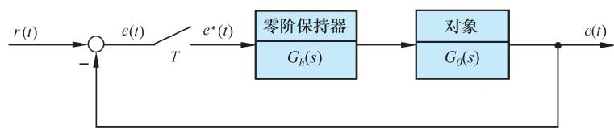  
图 7-48 闭环采样系统结构图

闭环特征方程为

$$
D (z) = z ^ {2} + z \left\{K [ T - T _ {1} (1 - E) ] - (1 + E) \right\} + K [ T _ {1} (1 - E) - T E ] + E = 0
$$

这是一个实系数的一元二次方程，由朱利稳定判据知，由于 $n { = } 2$ ，且

$$
a _ {0} = K \left[ T _ {1} (1 - E) - T E \right] + E, a _ {1} = K \left[ T - T _ {1} (1 - E) \right] - (1 + E), a _ {2} = 1
$$

故两个特征根都位于 $z$ 平面上单位圆内的充分必要条件为

$$
D (1) > 0, \quad D (- 1) > 0
$$

并满足约束条件 $\left| a _ { 0 } \right| < a _ { 2 }$ 。

当 $K { > } 0$ 及 $T { > } 0$ 时，可由 $\left| a _ { 0 } \right| < 1$ 及 $D ( - 1 ) { > } 0$ 导出上述二阶采样系统稳定性的等价必要条件

$$
K T _ {1} <   \frac {1 - E}{1 - E - \frac {T}{T _ {1}} E}
$$

以及 $K T _ { 1 } < \frac { 2 ( 1 + E ) } { \displaystyle \frac { T } { T _ { 1 } } ( 1 + E ) - 2 ( 1 - E ) }$ 1KT 

根据稳定性的必要条件，可以计算稳定系统所容许的最大增益。表 7-8 给出了 T/T1为不同取值时所对应的最大增益。由表 7-8 可见，当计算机具有足够的运算速度时，可

取 $T / T _ { 1 } { = } 0 . 1$ 。在此条件下，离散系统的增益上限取值较大，其系统特性与连续系统基本一致。

表 7-8 二阶采样系统的最大增益  

<table><tr><td>T/T1</td><td>0</td><td>0.01</td><td>0.1</td><td>0.5</td><td>1.0</td><td>2.0</td></tr><tr><td>E</td><td>1.0</td><td>0.990</td><td>0.905</td><td>0.607</td><td>0.368</td><td>0.135</td></tr><tr><td>(KT1)max</td><td>∞</td><td>100</td><td>21.11</td><td>4.39</td><td>2.39</td><td>1.45</td></tr></table>

当增益 $K$ 和采样周期 $T$ 发生变化时，二阶采样系统阶跃响应的最大超调量如图 7-49所示。

  
图 7-49 二阶采样系统阶跃响应的最大超调量

由 $G ( z )$ 表达式可见，本例为Ⅰ型系统，在单位斜坡输入作用下，其稳态跟踪误差 $e ( \infty )$ 可由式(7-81)算得

$$
e (\infty) = \frac {T}{K _ {v}}
$$

式中， $K _ { \nu }$ 可由式(7-82)确定为

$$
K _ {v} = \lim  _ {z \rightarrow 1} (z - 1) G (z)
$$

显然，对于给定的 $T / T _ { 1 }$ ，增大 $K T _ { 1 }$ 的取值，可以减小系统跟踪斜坡响应的稳态误差，但同时也会使系统阶跃响应的超调量增大，从而使调节时间加长。

现在设图 7-48采样系统中的被控对象为

$$
G _ {0} (s) = \frac {K}{s (0 . 1 s + 1) (0 . 0 0 5 s + 1)}
$$

要求确定增益 $K$ 和采样周期 $T$ 的合适取值，使采样系统阶跃响应的超调量不大于 $30 \%$ 。

解 由题可知， $T _ { 1 } { = } 0 . 1 { \ : } s$ ， $T _ { 2 } { = } 0 . 0 0 5 \mathrm { s }$ ， $T _ { 2 }$ 仅为 $T _ { 1 }$ 的 $5 \%$ ，其影响可略去，因此该系统可近似为二阶采样系统。

若取 $T / T _ { 1 } { = } 0 . 2 5$ ， $\sigma { = } 0 . 3$ ，则由图 7-49 可得 $K T _ { 1 } { = } 1 . 3 6$ 。因 $T _ { 1 } { = } 0 . 1 { \mathrm { s } }$ ，故求得 $K { = } 1 3 . 6$ ，$\scriptstyle { T = 0 . 0 2 5 \mathrm { s } }$ 。此时，系统需每秒采样 40 次。

根据 $K { = } 1 3 . 6$ ， $\scriptstyle { T = 0 . 0 2 5 \mathrm { s } }$ ，由式(7-82)算出 $K _ { \nu } { = } 0 . 3 4$ ；由式(7-81)求出

$$
e (\infty) = 0. 0 7 3 5
$$

如果改取 $T / T _ { 1 } { = } 0 . 1$ ，则可望进一步减小系统阶跃响应的超调量和斜坡响应的稳态误差。

MATLAB 验证：令采样周期 $\scriptstyle { T = 0 . 0 2 5 \mathrm { s } }$ ，增益 $K { = } 1 3 . 6$ ，对图 7-48 采样系统进行MATLAB 仿真，其中 $G _ { 0 } ( s ) { = } \frac { 1 3 . 6 } { s ( 0 . 1 s + 1 ) ( 0 . 0 0 5 s + 1 ) }$ ，得采样系统单位阶跃响应曲线及其相应的 MATLAB 程序，如图 7-50 所示，测得 $\sigma \% { = } 3 0 \%$ ， $t _ { p } { = } 0 . 3 \mathrm { s }$ ， $t _ { s } { = } 1 . 2 8 \mathrm { s } ( A { = } 2 \% )$ 。

若取 $T / T _ { 1 } { = } 0 . 1$ ，即 $T { = } 0 . 0 1 { \mathrm { s } }$ ， $K { = } 1 3 . 6$ ，则单位阶跃响应曲线及其相应的 MATLAB 程序，如图 7-51 所示，测得 $\sigma \% { = } 2 8 . 7 \%$ ， $t _ { p } { = } 0 . 3 \mathrm { s }$ ， $t _ { s } { = } 0 . 9 4 \mathrm { s } ( \varDelta { = } 2 \% )$ 。

$\mathrm{T = 0.025}$ . $\mathrm{T1 = 0.1}$ . $\mathrm{T2 = 0.005}$ . $\mathrm{K = 13.6}$ $\mathrm{G = zpk([,][0 - 1 / T1 - 1 / T2]),13.6 / (T1*T2))}$ $\mathrm{Gz = c2d(G,T,'zoh')}$ sys=feedback(Gz,1); $t = 0$ :T:2;step(sys,t);grid

  
(a) MATLAB 程序  
(b)单位阶跃响应

$\mathrm{T = 0.01}$ .T1=0.1; $\mathrm{T2 = 0.005}$ . $\mathrm{K} = 13.6$ $\mathrm{G = zpk([,][0 - 1 / T1 - 1 / T2]),13.6 / (T1*T2))}$ $\mathrm{Gz = c2d(G,T,'zoh')}$ sys=feedback(Gz,1); $\mathrm{t = 0:T:2;step~(sys,t)}$ ;grid

  
(a) MATLAB 程序  
(b)单位阶跃响应

图 7-50 当 $\scriptstyle { T = 0 . 0 2 5 s }$ ， $K { = } 1 3 . 6$ 时二阶采样系统的时间响应(MATLAB)

图 7-51 当 $T { = } 0 . 0 1 \mathrm { s }$ ， $K { = } 1 3 . 6$ 时二阶采样系统的时间响应(MATLAB)

# 例 7-32 工作台数字控制系统。

在制造业中，工作台运动控制系统是一个重要的定位系统，可以使工作台运动至指定的位置。工作台在每个轴上由电机和导引螺杆驱动，其中 $x$ 轴上的运动控制系统框图如图 7-52 所示。

现要求设计数字控制器 $D ( z )$ ，使系统满足如下性能：

1) 超调量不大于 $5 \%$ ；  
2) 具有较小的上升时间和调节时间 $( A { = } 2 \%$ )。

  
  
(b)系统结构图  
图 7-52 工作台控制系统

解 首先确定与图 7-52相应的连续系统控制模型，如图 7-53所示。以连续系统为基础，设计合适的控制器 $G _ { c } ( s )$ ，然后将 $G _ { c } ( s )$ 转换为要求的数字控制器 $D ( z )$ 。

  
图 7-53 工作台的支撑轮控制模型结构图

为了确定未校正系统的响应，先将控制器取为简单的增益 $K ^ { * }$ ，以 $K ^ { * }$ 为可变参数绘制系统的根轨迹，如图7-54所示，从中可得：当根轨迹增益 $K ^ { * } { = } 6 4 1$ ，即开环增益 $K { = } 3 . 2$ 时，系统主导极点 $s _ { 1 , 2 } { = } { - } 3 . 7 2 \pm \mathrm { j } 3 . 7 2$ 的阻尼比 $\zeta { = } 0 . 7 0 7$ 。经仿真可得系统单位阶跃响应的性能，如表 7-9中第一行所示。此时，系统的调节时间较长，系统时间响应及其相应的 MATLAB程序，如图7-55所示。

表 7-9 采用不同控制器时连续系统的响应性能  

<table><tr><td>控制器 Gc(s)</td><td>K*</td><td>超调量/%</td><td>调节时间/s</td><td>上升时间/s</td></tr><tr><td>K*</td><td>641</td><td>4.33</td><td>1.25</td><td>0.68</td></tr><tr><td>K*(s+11)/s+62</td><td>7800</td><td>4.33</td><td>0.58</td><td>0.32</td></tr></table>

  
图 7-54 $1 + \frac { K ^ { * } } { s ( s + 1 0 ) ( s + 2 0 ) } = 0$ 的根轨迹图(MATLAB)

G0=tf([641]，[1,30,200,0]);sys=feedback(G0,1)；

%建立闭环系统

t=0:0.01:2;step(sys,t);grid;%绘制阶跃响应曲线

(a) MATLAB 程序

  
(b)系统时间响应  
图 7-55 $G _ { c } ( s ) { = } K ^ { * }$ 时连续系统的单位阶跃响应(MATLAB)

其次，将控制器取为超前校正网络，即

$$
G _ {c} (s) = \frac {K ^ {*} (s + a)}{(s + b)}
$$

为了保证预期主导极点的主导特性，取 $a { = } 1 1$ ， $scriptstyle b = 6 2$ 。于是在根轨迹图 7-56 上可以确定阻尼比 $\zeta { = } 0 . 7 0 7$ 的主导极点为 $s _ { 1 , 2 } { = } { - } 7 . 1 6 \pm \mathrm { j } 7 . 1 6 $ 。

系统的根轨迹增益 $K ^ { * } { = } 7 8 0 0$ ，即系统开环增益 $K { = } 6 . 9 2$ ，系统的单位阶跃响应及其相应的 MATLAB 程序如图 7-57 所示。仿真表明，校正后系统具有满意的性能，其性能指标数值如表7-9中第二行所示。

确定合适的 $G _ { c } ( s )$ 后，还需要确定合适的采样周期 $T _ { c }$ 。为了得到与连续系统一致的预期响应，应该要求 $T \ll t _ { r }$ 。现在， $t _ { r } { = } 0 . 3 2 { \mathrm { s } }$ ，因此不妨取 $\scriptstyle { T = 0 . 0 1 \mathrm { s } }$ 。

  
图 7-56 $1 + { \frac { K ^ { * } ( s + 1 1 ) } { s ( s + 1 0 ) ( s + 2 0 ) ( s + 6 2 ) } } = 0$ 的局部根轨迹图(MATLAB)

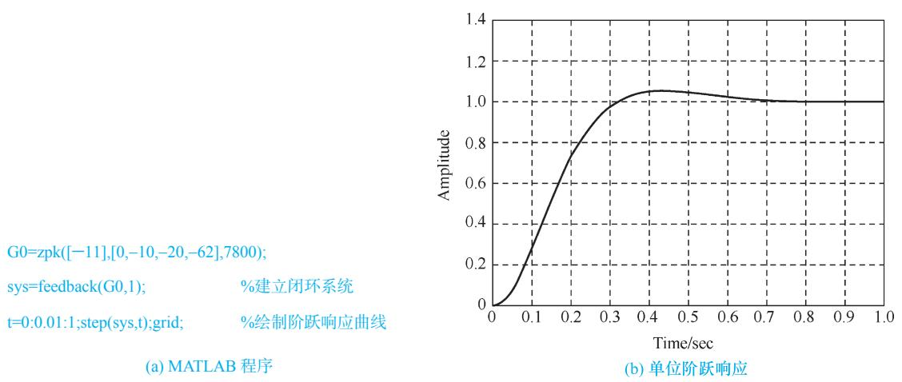  
图 7-57 超前校正连续系统的单位阶跃响应(MATLAB)

显然，求得的连续控制器

$$
G _ {c} (s) = \frac {K ^ {*} (s + a)}{s + b} = \frac {7 8 0 0 (s + 1 1)}{s + 6 2}
$$

需要转换为数字控制器

$$
D (z) = C \frac {z - A}{z - B}
$$

其中， $\scriptstyle A = \mathbf { e } ^ { - a T }$ ； $B { = } \mathrm { e } ^ { - b T }$ 。令

$$
\mathscr {X} \left[ G _ {c} (s) \right] = D (z)
$$

因为 $s { = } 0$ 时， ${ z } { = } \mathrm { e } ^ { s T } { = } 1$ ，所以应有

$$
C \frac {1 - A}{1 - B} = K ^ {*} \frac {a}{b}
$$

代入 $a { = } 1 1$ ， $scriptstyle b = 6 2$ ， $T { = } 0 . 0 1$ ， $K ^ { * } { = } 7 8 0 0$ ，得

$$
A = \mathrm {e} ^ {- 1 1 T} = 0. 8 9 5 8, \quad B = \mathrm {e} ^ {- 6 2 T} = 0. 5 3 7 9, \quad C = K ^ {*} \frac {a (1 - B)}{b (1 - A)} = 6 1 3 7. 1
$$

于是，所求的数字控制器为

$$
D (z) = \frac {6 1 3 7 . 1 (z - 0 . 8 9 5 8)}{z - 0 . 5 3 7 9}
$$

不难导出广义对象(含零阶保持器)的脉冲传递函数为

$$
G (z) = Z \left[ G _ {h} (s) G _ {0} (s) \right] = \frac {8 \times 1 0 ^ {- 7} (z - 0 . 0 7 5)}{(z - 1) (z - 0 . 9 0 5) (z - 0 . 8 1 9)}
$$

于是，利用 MATLAB 软件绘制数字控制系统的时间响应及其相应的 MATLAB 程序，如图 7-58 所示，其响应性能为 $\sigma \% { = } 4 \%$ ， $t _ { r } { = } 0 . 3 2$ ， $t _ { s } { = } 0 . 6 5 ( A { = } 2 \% )$ 。仿真结果表明，该数字控制系统具有与连续系统相近的响应性能。

T=0. 01; t=0:T:0. 8;

$$
\mathrm {G} 0 = \mathrm {z p k} ([ 0. 8 9 5 8 ], [ 0. 5 3 7 9, 1, 0. 9 0 5, 0. 8 1 9 ],
$$

0. 008*0. 61371,T);

sys=feedback(G0,1)； %建立闭环系统

step(sys,t);grid; %绘制单位阶跃响应曲线

(a) MATLAB 程序

  
(b)时间响应曲线  
图 7-58 超前校正数字控制系统的时间响应(MATLAB)

例 7-33 磁盘驱动读取系统(续)。

  
图 7-59 磁盘驱动采样读取系统结构图

对于图 3-46 所示的磁盘驱动读取系统，当磁盘旋转时，每读一组存储数据，磁头都会提取位置偏差信息。由于磁盘匀速运转，因此磁头以恒定的时间间隔逐次读取格式信息。通常，偏差信号的采样周期为 $1 0 0 \mu \mathrm { s } \{ \sim  1 \mathrm { m s }$ 。

设磁盘驱动采样读取系统结构图如图7-59所示。图中， $G ( z ) { = } \mathcal { X } \left[ G _ { h } ( z ) G _ { 0 } ( z ) \right]$ 为广义对象脉

冲传递函数， $G _ { h } ( s ) = \frac { 1 - { \mathrm e } ^ { - s T } } { s }$ 1 e sT  为零阶保持器， $G _ { 0 } ( s ) { = } \frac { 5 } { s ( s + 2 0 ) }$ 为被控对象， $D ( z )$ 为数字控制器。当 $T { = } 1 \mathrm { m s }$ 时，要求设计数字控制器 $D ( z )$ ，使图 7-59 系统具有满意的动态响应性能。

解 广义对象脉冲传递函数

$$
\begin{array}{l} G (z) = \mathcal {X} \left[ \frac {1 - e ^ {- T s}}{s} \cdot \frac {5}{s (s + 2 0)} \right] = (1 - z ^ {- 1}) \mathcal {X} \left[ \frac {5}{s ^ {2} (s + 2 0)} \right] \\ = (1 - z ^ {- 1}) \mathcal {X} \left[ \frac {0 . 2 5}{s ^ {2}} - \frac {0 . 0 1 2 5}{s} + \frac {0 . 0 1 2 5}{s + 2 0} \right] = (1 - z ^ {- 1}) \left[ \frac {0 . 2 5 T z}{(z - 1) ^ {2}} - \frac {0 . 0 1 2 5 z}{z - 1} + \frac {0 . 0 1 2 5 z}{z - e ^ {- 2 0 T}} \right] \\ \end{array}
$$

因为 $\scriptstyle { T = 0 . 0 0 1 \mathrm { s } }$ ， $z { - } \mathrm { e } ^ { - 2 0 T } { = } z { - } 0 . 9 8$ ，所以

$$
G (z) = \frac {5 \times 1 0 ^ {- 6}}{(z - 1) (z - 0 . 9 8)}
$$

为了快速读取磁盘信息，要求系统在单位阶跃输入下为一拍系统。查表 7-7 知，应有

$$
\Phi (z) = z ^ {- 1}, \quad \Phi_ {e} (z) = 1 - z ^ {- 1}
$$

故由

$$
D (z) = \frac {1 - \Phi_ {e} (z)}{G (z) \Phi_ {e} (z)} = \frac {\Phi (z)}{G (z) \Phi_ {e} (z)}
$$

求得数字控制器

$$
D (z) = 2 \times 1 0 ^ {5} (z - 0. 9 8)
$$

利用 MATLAB 软件进行仿真验证，其单位阶跃响应及相应的 MATLAB 程序如图 7-60 所示。由图可见，超调量为零，调节时间为 1ms，系统具有稳定且快速的响应。

T=0. 001; t=0:T:0. 01;

Gz=zpk([],[1 0. 98],5*10^-6,T);

%开环离散系统的传递函数

Dz=zpk([0. 98],[],2*10^5,T);

% 数字控制器

G=series(Gz,Dz);sys=feedback(G,1);

% 闭环离散系统的传递函数

step(sys,t);grid;

% 闭环系统的单位阶跃响应

(a) MATLAB 程序

  
  
图 7-60 磁盘驱动读取采样系统的单位阶跃响应(MATLAB)

# 习 题

7-1 试根据定义

$$
E ^ {*} (s) = \sum_ {n = 0} ^ {\infty} e (n T) \mathrm {e} ^ {- n s T}
$$

确定下列函数的 $E ^ { * } ( s )$ 和闭合形式的 $E ( z )$ ：

(1) $e ( t ) = \sin \omega t \ ;$

(2) $E ( s ) = { \frac { 1 } { ( s + a ) ( s + b ) ( s + c ) } } \circ$

7-2 试求下列函数的 $z$ 变换：

(1) $e ( t ) = a ^ { n }$ ；  
(2)   
(3) $e ( t ) = \frac { 1 } { 3 ! } t ^ { 3 } ;$   
(4) $\begin{array} { l } { { e ( t ) = t ^ { 2 } \mathrm { e } ^ { - 3 t } \ ; } } \\ { { { } } } \\ { { E ( s ) = \displaystyle \frac { s + 1 } { s ^ { 2 } } \ ; } } \end{array}$ 2s   
(5) $E ( s ) = { \frac { 1 - \mathsf { e } ^ { - s } } { s ^ { 2 } ( s + 1 ) } } \circ$

7-3 试用部分分式法、幂级数法和反演积分法，求下列函数的 $z$ 反变换：

(1) $E ( z ) = \frac { 1 0 z } { ( z - 1 ) ( z - 2 ) } ;$   
(2) $E ( z ) = { \frac { - 3 + z ^ { - 1 } } { 1 - 2 z ^ { - 1 } + z ^ { - 2 } } } \ \circ$

7-4 试求下列函数的脉冲序列 $e ^ { * } ( t )$ ：

(1) $E ( z ) = \frac { z } { ( z + 1 ) ( 3 z ^ { 2 } + 1 ) } \ ;$

(2) $E ( z ) = \frac { z } { ( z - 1 ) ( z + 0 . 5 ) ^ { 2 } } \circ$

7-5 试确定下列函数的终值：

(1) $E ( z ) = \frac { T z ^ { - 1 } } { ( 1 - z ^ { - 1 } ) ^ { 2 } } ~ ;$ 1 2 (1 )   z ；

(2) $E ( z ) = \frac { z ^ { 2 } } { ( z - 0 . 8 ) ( z - 0 . 1 ) } \circ$

7-6 已知 $E ( z ) { = } \mathcal { Z } [ e ( t ) ]$ ，试证明下列关系式成立：

(1) ${ \mathcal { X } } \left[ a ^ { n } e ( t ) \right] = E \left[ { \frac { z } { a } } \right] ;$

(2) $\mathcal { Z } \Big [ t e ( t ) \Big ] = - T z \frac { \mathrm { d } E ( z ) } { \mathrm { d } z }$ d ( ) E z z ，T 为采样周期。 $T$

7-7 已知差分方程为

$$
c (k) - 4 c (k + 1) + c (k + 2) = 0
$$

初始条件： $c ( 0 ) { = } 0$ ， $c ( 1 ) { = } 1$ 。试用迭代法求输出序列 $c ( k )$ ， $k { = } 0$ ，1，2，3，4。

7-8 试用 $z$ 变换法求解下列差分方程：

(1) $c ^ { * } ( t + 2 T ) - 6 c ^ { * } ( t + T ) + 8 c ^ { * } ( t ) = r ^ { * } ( t ) ~ , ~ r ( t ) = 1 ( t ) , ~ c ^ { * } ( 0 ) = c ^ { * } ( T ) = 0 ~ ;$   
(2) $c ^ { * } \left( t + 2 T \right) + 2 c ^ { * } \left( t + T \right) + c ^ { * } \left( t \right) = r ^ { * } \left( t \right) , c \left( 0 \right) = c ( T ) = 0 , r ( n T ) = n ( n = 0 , 1 , 2 , \cdots , 0  n ) .$ ) ；  
(3) $c ( k + 3 ) + 6 c ( k + 2 ) + 1 1 c ( k + 1 ) + 6 c ( k ) = 0 ~ , ~ c ( 0 ) = c ( 1 ) = 1 , ~ c ( 2 ) = 0 ~ ;$   
(4) $c ( k + 2 ) + 5 c ( k + 1 ) + 6 c ( k ) = \cos k \frac { \pi } { 2 } ~ , ~ c ( 0 ) = c ( 1 ) = 0 ~ _ { \circ }$

7-9 设开环离散系统如图 7-61 所示，试求开环脉冲传递函数 $G ( z )$ 。  
7-10 试求图 7-62 闭环离散系统的脉冲传递函数 $\phi ( z )$ 或输出 $z$ 变换 $C ( z )$ 。  
7-11 已知脉冲传递函数

$$
G (z) = \frac {C (z)}{R (z)} = \frac {0 . 5 3 + 0 . 1 z ^ {- 1}}{1 - 0 . 3 7 z ^ {- 1}}
$$

其中 $R ( z ) { = } z / ( z { - } 1 )$ ，试求 $c ( n T )$ 。

  
(a)

  
  
图 7-61 开环离散系统结构图  
图 7-62 题 7-10 的闭环离散系统结构图

# 7-12 设有单位反馈误差采样的离散系统，连续部分传递函数为

$$
G (s) = \frac {1}{s ^ {2} (s + 5)}
$$

输入 ${ \boldsymbol { r } } ( t ) { = } 1 ( t )$ ，采样周期 $T { = } 1 \mathrm { s }$ 。试求：

(1) 输出 $z$ 变换 $C ( z )$ ；  
(2) 采样瞬时的输出响应 $c ^ { * } ( t )$ ；  
(3) 输出响应的终值 $c ( \infty )$ 。

# 7-13 试判断下列系统的稳定性：

(1) 已知闭环离散系统的特征方程为

$$
D (z) = (z + 1) (z + 0. 5) (z + 2) = 0
$$

(2) 已知闭环离散系统的特征方程为

$$
D (z) = z ^ {4} + 0. 2 z ^ {3} + z ^ {2} + 0. 3 6 z + 0. 8 = 0
$$

(注：要求用朱利判据。)

(3) 已知误差采样的单位反馈离散系统，采样周期 T=1s，开环传递函数

$$
G (s) = \frac {2 2 . 5 7}{s ^ {2} (s + 1)}
$$

7-14 设离散系统如图 7-63 所示，采样周期 $T { = } 1 \mathrm { s }$ ， $G _ { h } ( s )$ 为零阶保持器，

$$
G _ {0} (s) = \frac {K}{s (0 . 2 s + 1)}
$$

  
图 7-63 题 7-14 的闭环离散系统结构图

要求：

(1) 当 $K { = } 5$ 时，分别在 $z$ 域和 $w$ 域中分析系统的稳定性；  
(2) 确定使系统稳定的 $K$ 值范围。

7-15 设离散系统如图 7-64 所示，其中采样周期 ${ \cal T } { = } 0 . 2$ ， $K { = } 1 0$ ， $r ( t ) { = } 1 { + } t { + } t ^ { 2 } / 2$ ，试用终值定理法计算系统的稳态误差 $e ( \infty )$ 。

  
图 7-64 题 7-15 的闭环离散系统结构图

7-16 设离散系统如图 7-65 所示，其中 $T { = } 0 . 1$ ， $K { = } 1$ ， $r ( t ) { = } t$ ，试求静态误差系数 $K _ { p }$ ， $K _ { \nu }$ ， $K _ { a }$ ，并求系统稳态误差 e(∞)。

  
图 7-65 题 7-16 的闭环离散系统结构图

7-17 已知离散系统如图 7-66 所示，其中 ZOH 为零阶保持器， $\scriptstyle { T = 0 . 2 5 }$ 。当 ${ \boldsymbol { r } } ( t ) { = } 2 { + } t$ 时，欲使稳态误差小于0.1，试求 $K$ 值。

7-18 试分别求出图 7-64 和图 7-65 系统的单位阶跃响应 c(nT)。

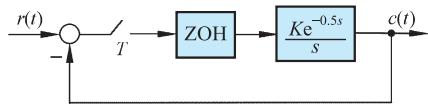  
图 7-66 题7-17的闭环离散系统结构图

7-19 已知离散系统如图7-67所示，其中采样周期 $T { = } 1$ ，连续部分传递函数

$$
G _ {0} (s) = \frac {1}{s (s + 1)}
$$

试求当 ${ \boldsymbol { r } } ( t ) { = } 1 ( t )$ 时，系统无稳态误差、过渡过程在最少拍内结束的数字控制器 $D ( z )$ 。

7-20 设离散系统如图 7-68 所示，其中采样周期 $T { = } 1$ ，试求当 $\scriptstyle { r ( t ) = R _ { 0 } 1 ( t ) + R _ { 1 } t }$ 时，系统无稳态误差、过渡过程在最少拍内结束的 $D ( z )$ 。

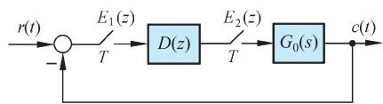  
图 7-67 题7-19的闭环离散系统结构图

  
图 7-68 题7-20的闭环离散系统结构图

7-21 试按无纹波最少拍系统设计方法，分别算出题 7-19 和题 7-20 的 $D ( z )$ 。  
7-22 用来直播职业足球赛的新型可遥控摄像系统如图7-69所示。摄像机可在运动场上方上下移动。每个滑轮上的电机控制系统如图7-70所示，其中被控对象

$$
G _ {0} (s) = \frac {1 0}{s (s + 1) (0 . 1 s + 1)}
$$

要求：

(1) 设计合适的连续控制器 $G _ { c } ( s ) = \frac { s + a } { s + b }$ ，使系统的相角裕度 $\gamma \geqslant 4 5 ^ { \circ }$ ；  
(2) 选择采样周期 $\scriptstyle { T = 0 . 0 1 s }$ ，采用 $G _ { c } ( s ) - D ( z )$ 变换方法，求出相应的数字控制器 $D ( z )$ 。

  
图 7-69 足球场上的移动摄像机示意图

  
图 7-70 滑轮上的电机控制系统结构图

7-23 设数字控制系统如图 7-71 所示，其中 $G ( z )$ 包括了零阶保持器和被控对象。已知被控对象

$$
G _ {0} (s) = \frac {1}{s (s + 1 0)}
$$

若采样周期 $T { = } 0 . 1 { \mathrm { s } }$ ，要求：

(1) 当 $D ( z ) { = } K$ 时，计算脉冲传递函数 $G ( z ) D ( z )$ ；  
(2) 求闭环系统的 $z$ 特征方程；  
(3) 计算使系统稳定的 $K$ 的最大值；  
(4) 确定 $K$ 的合适值，使系统的超调量不大于 $30 \%$ ；  
(5) 采用(4)中得到的增益 $K$ ，计算闭环脉冲传递函数 $\phi ( z )$ ，并绘出系统的单位阶跃响应曲线；  
(6) 取 $K { = } 0 . 5 K _ { \operatorname* { m a x } }$ ，求系统闭环极点及超调量；  
(7) 在(6)所给出的条件下，画出系统的单位阶跃响应曲线。

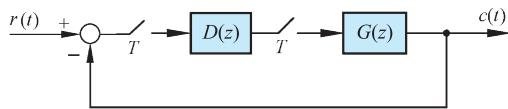  
图 7-71 数字控制系统结构图

7-24 设连续的、未经采样的控制系统如图7-72所示，其中被控对象

$$
G _ {0} (s) = \frac {1}{s (s + 1 0)}
$$

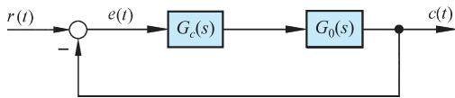  
图 7-72 控制系统结构图

要求：

(1) 设计滞后校正网络

$$
G _ {c} (s) = K \frac {s + a}{s + b} \quad (a > b)
$$

使系统在单位阶跃输入时的超调量 $\sigma \% \leqslant 3 0 \%$ ，且在单位斜坡输入时的稳态误差 $e ( \infty ) { \leqslant } 0 . 0 1$ ；

(2) 若为该系统增配一套采样器和零阶保持器，并选采样周期 $T { = } 0 . 1 { \mathrm { s } }$ ，试采用 $G _ { c } ( s ) \ – D ( z )$ 变换方法，设计合适的数字控制器 $D ( z )$ ；  
(3) 分别画出(1)及(2)中连续系统和离散系统的单位阶跃响应曲线，并比较两者的结果；  
(4) 另选采样周期 $\scriptstyle { T = 0 . 0 1 s }$ ，重新完成(2)和(3)的工作；  
(5) 对于(2)中得到的 $D ( z )$ ，画出离散系统的单位斜坡响应，并与连续系统的单位斜坡响应进行比较。

7-25 设闭环离散系统如图 7-73 所示，若采样周期在 $0 \leqslant T \leqslant 1 . 2 \mathrm { s }$ 范围内变化，试在 $T$ 每增加 0.2s之后，绘出系统的单位阶跃输入响应，要求列表记录相应的 $\sigma \%$ 和 $t _ { s } ( A = 2 \% )$ 。

  
图 7-73 题 7-25 的闭环离散系统结构图

7-26 设具有采样器、零阶保持器的闭环离散系统如图 7-74 所示，当采样周期 $T { = } 0 . 1 { \mathrm { s } }$ ，输入信号为单位阶跃信号时，试计算系统的输出 $C ( z )$ 。

  
图 7-74 题7-26的闭环离散系统结构图